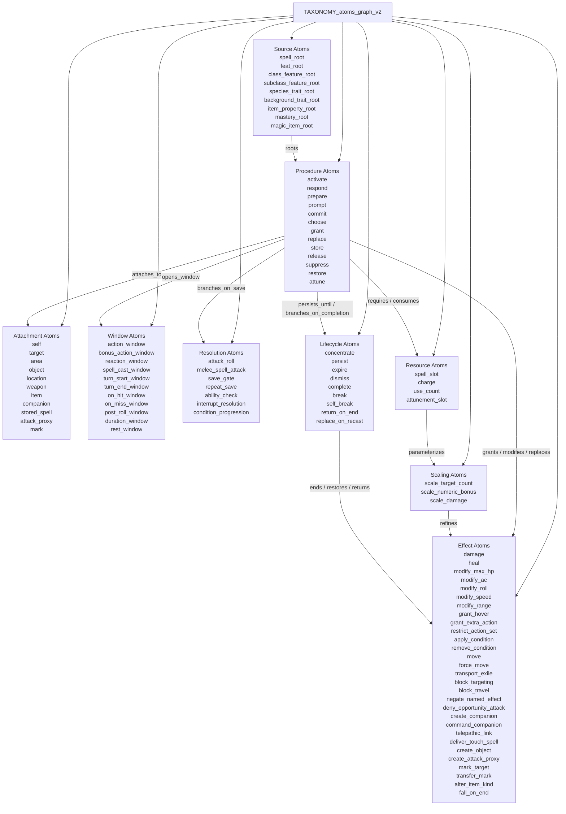
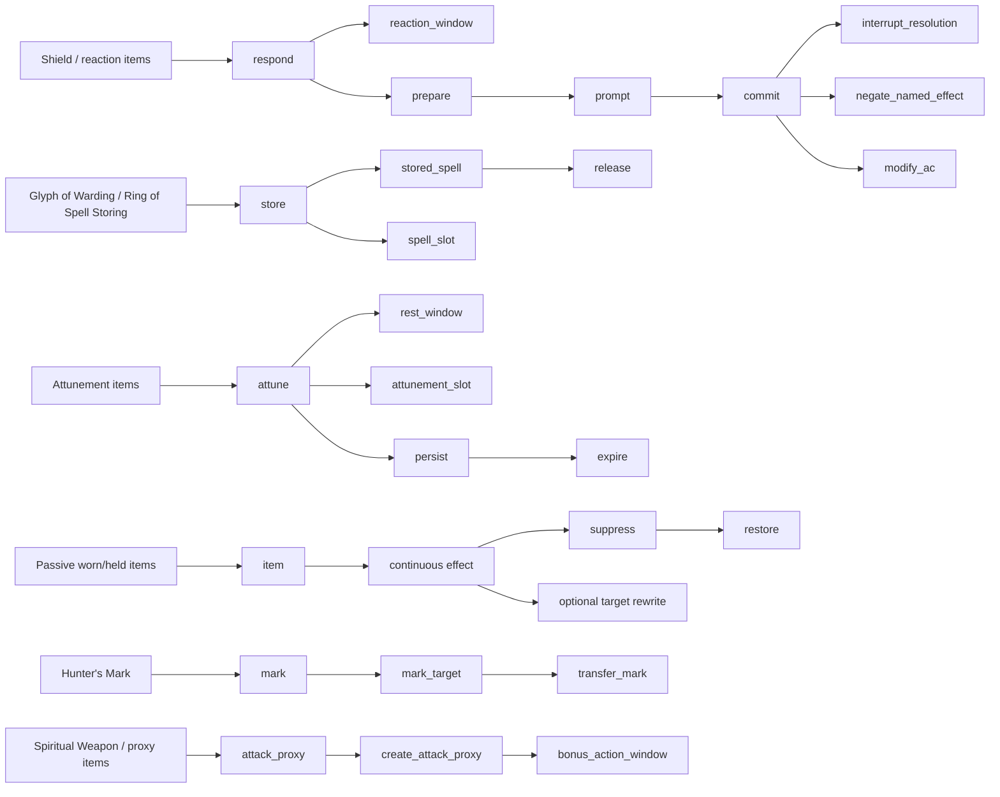

# Taxonomy: Atoms Graph v2

Purpose:

- revise `v1` after the second validation round;
- keep the gains from round 2;
- add only the narrower atoms and relations still clearly forced by the 20-spell sample.

## Architecture Reminder

Read this file under the repo boundary from `ARCHITECTURE.md`:

- the core models mechanical rules with deterministic outcomes;
- DM rulings, agenda decisions, notification surfaces, and other caller-owned facts are **not** core-mechanics atoms.

So every atom here must justify itself as a reusable mechanics concern:

- owned state
- reusable transition shape
- deterministic trigger/evaluation boundary
- deterministic effect / cleanup / projection boundary

If a candidate is only:

- a wording distinction;
- a communication label;
- a narrative description;
- a UI-facing summary;

then it should be demoted, removed, or kept outside the core atom inventory.

## 1. Source Atoms

- `spell_root`
- `feat_root`
- `class_feature_root`
- `subclass_feature_root`
- `species_trait_root`
- `background_trait_root`
- `item_property_root`
- `mastery_root`
- `magic_item_root`

## 2. Procedure Atoms

- `activate`
- `respond`
- `prepare`
- `prompt`
- `commit`
- `choose`
- `grant`
- `replace`
- `store`
- `release`
- `suppress`
- `restore`
- `attune`

## 3. Attachment Atoms

- `self`
- `target`
- `area`
- `object`
- `location`
- `weapon`
- `item`
- `companion`
- `stored_spell`
- `attack_proxy`
- `mark`

## 4. Window Atoms

- `action_window`
- `bonus_action_window`
- `reaction_window`
- `spell_cast_window`
- `turn_start_window`
- `turn_end_window`
- `on_hit_window`
- `on_miss_window`
- `post_roll_window`
- `duration_window`
- `rest_window`

## 5. Resolution Atoms

- `attack_roll`
- `melee_spell_attack`
- `save_gate`
- `repeat_save`
- `ability_check`
- `interrupt_resolution`
- `condition_progression`

## 6. Lifecycle Atoms

- `concentrate`
- `persist`
- `expire`
- `dismiss`
- `complete`
- `break`
- `self_break`
- `return_on_end`
- `replace_on_recast`

## 7. Resource Atoms

- `spell_slot`
- `charge`
- `use_count`
- `attunement_slot`

## 8. Scaling Atoms

- `scale_target_count`
- `scale_numeric_bonus`
- `scale_damage`

## 9. Effect Atoms

- `damage`
- `heal`
- `modify_max_hp`
- `modify_ac`
- `modify_roll`
- `modify_speed`
- `modify_range`
- `grant_hover`
- `grant_extra_action`
- `restrict_action_set`
- `apply_condition`
- `remove_condition`
- `move`
- `force_move`
- `transport_exile`
- `block_targeting`
- `block_travel`
- `negate_named_effect`
- `deny_opportunity_attack`
- `create_companion`
- `command_companion`
- `telepathic_link`
- `deliver_touch_spell`
- `create_object`
- `create_attack_proxy`
- `mark_target`
- `transfer_mark`
- `alter_item_kind`
- `fall_on_end`

## 10. Relation Types

- `roots`
- `opens_window`
- `requires`
- `attaches_to`
- `stores`
- `releases`
- `grants`
- `consumes`
- `suppresses`
- `replaces`
- `modifies`
- `persists_until`
- `branches_on_completion`
- `branches_on_save`
- `prepares`
- `prompts`
- `commits`
- `transfers_to`
- `returns_to`

## 11. Mermaid Views

### A. Taxonomy Overview

### B. Common Pressure Patterns

## 12. Current Working Reads

### A. Legality is still emergent

No round so far has justified restoring a standalone legality bucket.

### A1. Architecture bar over wording pressure

This file is a working inventory, not a sanctified ontology.

Any candidate that is only an outcome/notification label rather than an owned mechanical structure should stay out of the core inventory.

### B. Alarm-like triggers and storage wards are explicitly separated

- `Alarm` pressures anchored trigger/evaluation/outcome structure
- `Glyph of Warding` pressures `store` / `release`

### C. Scaling must stay typed

Round 2 showed that slot scaling is not one phenomenon.

At minimum the taxonomy must distinguish:

- target-count scaling
- numeric-bonus scaling
- damage scaling

### D. Outcome typing matters

Spells like `Banishment` show that:

- transport,
- persistence,
- return,
- completion-sensitive branch
must not be compressed into one vague completion relation.

### E. Item-side ownership survived first widening

The first item validation pass did not force a new top-level node or edge family.

What it strengthened instead was ownership and resource-shape distinctions:

- attunement capacity is creature-side;
- occupancy / wear state is wearer-side;
- charges, daily uses, stored spells, and absorbed spell energy can be item-side;
- item-rooted casting must stay distinct from stored-spell payload ownership.

## 13. Known Remaining Weak Spots

Even `v2` may still be too weak on:

- multi-creature or target-priority selection logic;
- full proxy attack loop semantics;
- exact named-effect negation boundaries beyond the current sample.
- finer item-resource typing:
  - stored payload metadata
  - absorbed spell-energy reservoirs
  - per-spell daily reuse
  - recharge cadence

### Narrowed after mastery Round 1

Exact attack-roll rider composition is no longer the blocker it was before the mastery pass. The mastery round validated that `on_hit_window`, `on_miss_window`, `attack_roll`, `target`, and the relevant effect atoms carry the full 2024 mastery catalog, plus `save_gate` with an attack-rooted DC. What remains after that pass is a handful of narrower observations, recorded here so they are not lost between validation streams:

- `modify_roll` currently carries both numeric bonuses and advantage/disadvantage, which are mechanically distinct; subtype refinement is deferred;
- one-shot rider expiry with mixed terminating conditions (first-of-two-events shape) is legal composition today but is not named as a pattern;
- non-stacking / capped-aggregate effect policy (Slow-style "multiple instances merge, not stack") has no atom today and is expected to recur in conditions, buffs, and concentration handling;
- scoped damage-modifier suppression (Cleave's "don't add your ability modifier") and scaling-lock constraints (Graze's "can be increased only by increasing the ability modifier") both read as subtype or policy parameters on existing effect atoms rather than new atoms;
- save DC source variation (caster-rooted vs attack-rooted vs item-rooted) is a typed property of the initiating resolution, not a missing atom;
- cross-rule window reassignment (Nick rewriting Light's bonus-action extra attack into the action) is a composition pattern that uses existing `replace` / `replaces` atoms but is not yet visualized.

None of these justify a `v3` draft on their own. They are grouped here as a single residue so that future widening passes (feats, class features) can confirm whether any of them repeats strongly enough to become a first-class atom.
