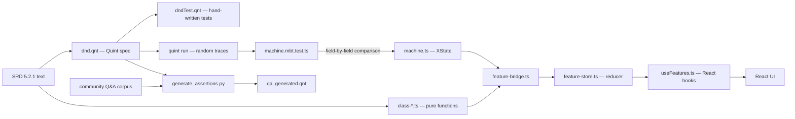
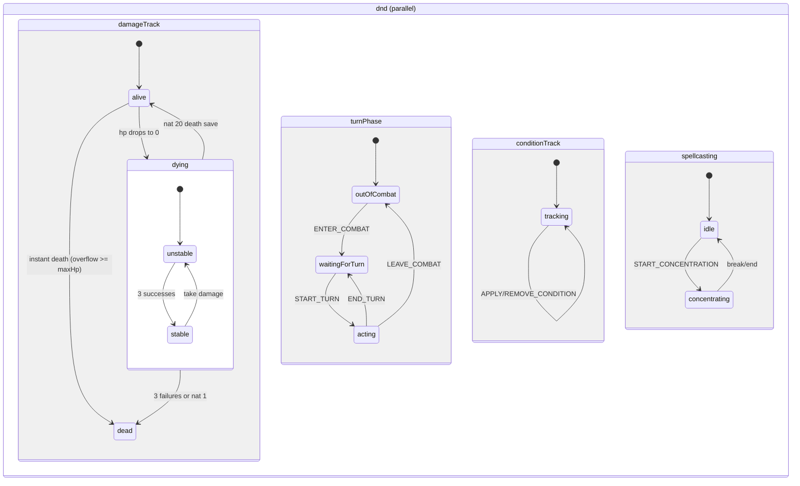
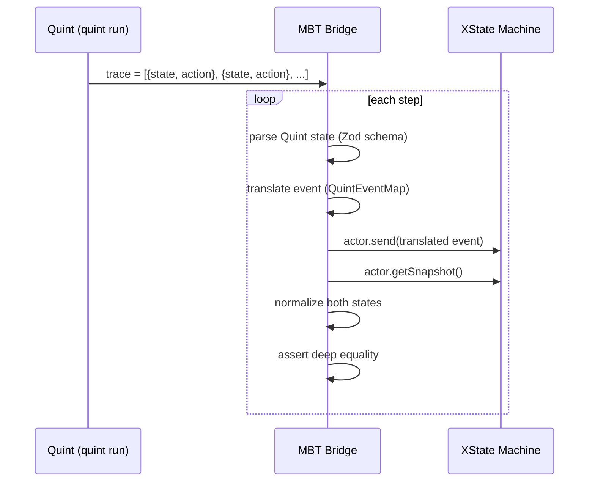
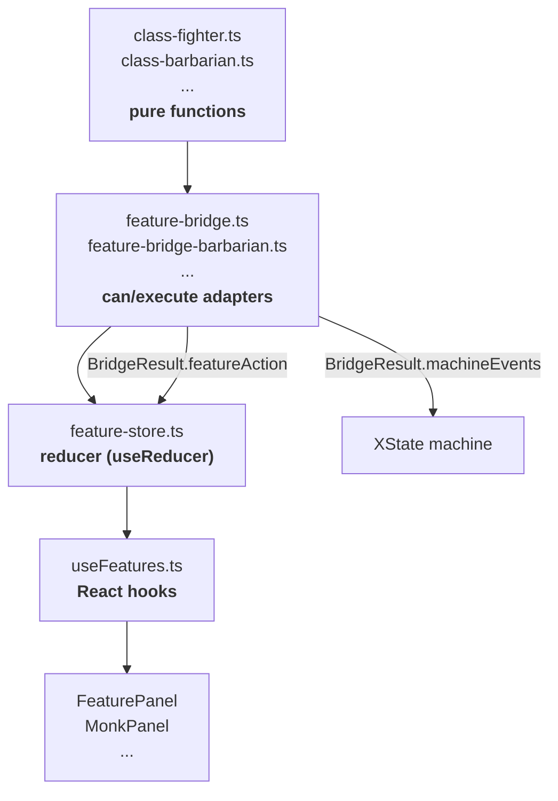
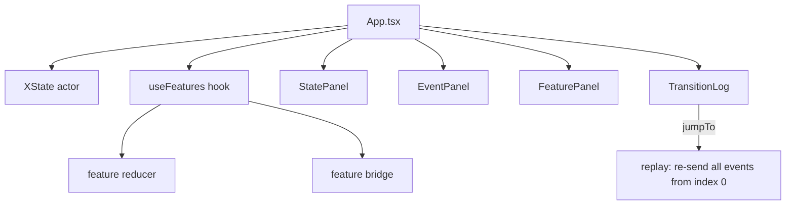
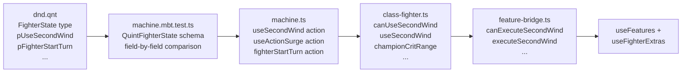

# Architecture Guide

Quick-reference for understanding the codebase, the verification pipeline, and how the pieces fit.

## The big picture



Three verification layers catch bugs at different stages:
1. **Quint typechecker** catches bad spec code (including LLM-generated assertions)
2. **MBT traces** catch XState divergence from spec
3. **QA assertions** catch spec bugs against community rulings

---

## Layer 1: Quint spec (`dnd.qnt`)

The source of truth. Pure functions modeling D&D 5e core combat rules.

### Key types

```quint
type CreatureState = {
  hp: int, maxHp: int, tempHp: int,
  deathSaves: { successes: int, failures: int },
  stable: bool, dead: bool,
  exhaustion: int,
  // 14 condition booleans
  blinded: bool, charmed: bool, ..., unconscious: bool,
  incapacitatedSources: Set[IncapSource],
  activeEffects: List[ActiveEffect],
  prone: bool, grappled: bool, ...
}

type TurnState = {
  movementRemaining: int, effectiveSpeed: int,
  actionsRemaining: int, bonusActionUsed: bool,
  reactionAvailable: bool, extraAttacksRemaining: int,
  disengaged: bool, dodging: bool, readiedAction: bool,
  // spell-turn flags
  bonusActionSpellCast: bool, nonCantripActionSpellCast: bool,
  attackActionUsed: bool, freeInteractionUsed: bool
}

type FighterState = {
  secondWindCharges: int, secondWindMax: int,
  actionSurgeCharges: int, actionSurgeMax: int,
  actionSurgeUsedThisTurn: bool,
  indomitableCharges: int, indomitableMax: int,
  heroicInspiration: bool
}
```

### How the spec reads

Most logic is pure functions prefixed `p` (for "pure"):

```quint
// stand from prone: costs half your speed
pure def pStandFromProne(t: TurnState): TurnState = {
  val cost = t.effectiveSpeed / 2
  if (t.movementRemaining >= cost and cost > 0)
    t.with("movementRemaining", t.movementRemaining - cost)
     .with("prone", false)  // not in TurnState, simplified here
  else t
}

// movement cost per foot — climb/swim costs extra without matching speed
pure def pMovementCost(isDifficultTerrain: bool, isCrawling: bool,
                        isClimbingOrSwimming: bool, hasRelevantSpeed: bool): int = {
  val base = 1
  val terrainExtra = if (isDifficultTerrain) 1 else 0
  val crawlExtra = if (isCrawling) 1 else 0
  val climbSwimExtra = if (isClimbingOrSwimming and not(hasRelevantSpeed)) 1 else 0
  base + terrainExtra + crawlExtra + climbSwimExtra
}
```

Fighter features live in the same file (section 17.6), e.g.:

```quint
pure def pUseSecondWind(f: FighterState, d10Roll: int, fighterLevel: int): FighterState = {
  f.with("secondWindCharges", f.secondWindCharges - 1)
}

pure def pFighterStartTurn(f: FighterState, championLevel: int): FighterState = {
  val withInspiration =
    if (championLevel >= 10 and not(f.heroicInspiration))
      f.with("heroicInspiration", true)
    else f
  withInspiration.with("actionSurgeUsedThisTurn", false)
}
```

### Spec organization

The file is ~3000 lines, organized by SRD chapter:
- Sections 1-5: types, ability checks, d20 resolution
- Sections 6-10: conditions, action economy, attack resolution
- Sections 11-14: grapple/shove, spellcasting, HP/death, rest
- Sections 15-17: character construction, combat mode, Fighter features
- Section 18: state machine transitions (`do*` actions)
- Section 19: invariants for Apalache model checker

---

## Layer 2: XState machine (`machine.ts`)

Mirrors the Quint spec as a parallel-region XState machine. Four independent tracks:



### File split

`machine.ts` is capped at 420 lines (eslint). Logic lives in satellite files:

| File | What it does |
|------|-------------|
| `machine-types.ts` | `DndContext`, `DndEvent` (50+ event variants), branded types |
| `machine-states.ts` | State configs for all 4 parallel regions |
| `machine-guards.ts` | Boolean predicates (`canStandFromProne`, `instantDeathFromAlive`, ...) |
| `machine-helpers.ts` | Pure math: damage modifiers, death saves, speed calc, exhaustion |
| `machine-combat.ts` | Attack rolls, AC calc, grapple/shove resolution |
| `machine-damage.ts` | Damage/death-save resolver composition |
| `machine-startturn.ts` | START_TURN processing: speed, effect expiry, Heroic Rally |
| `machine-endturn.ts` | END_TURN processing: saves, damage, effect expiry |
| `machine-spells.ts` | Slot expenditure, long rest recovery, pact magic |
| `machine-queries.ts` | Derived state predicates (`isIncapacitated`) |

### Context shape (abbreviated)

```typescript
interface DndContext {
  // HP
  hp: HP, maxHp: HP, tempHp: TempHP,
  deathSaves: { successes: DeathSaveCount, failures: DeathSaveCount },
  stable: boolean, dead: boolean, exhaustion: ExhaustionLevel,

  // 14 conditions (boolean each)
  blinded, charmed, deafened, frightened, grappled, incapacitated,
  invisible, paralyzed, petrified, poisoned, prone, restrained,
  stunned, unconscious,
  incapacitatedSources: Set<IncapSource>,

  // action economy
  actionsRemaining: number, bonusActionUsed: boolean,
  reactionAvailable: boolean, movementRemaining: MovementFeet,
  effectiveSpeed: number, extraAttacksRemaining: number,

  // spells
  slotsMax: number[], slotsCurrent: number[],
  concentrationSpellId: string, activeEffects: ActiveEffect[],

  // fighter (MBT-bridged fields)
  secondWindCharges: number, actionSurgeCharges: number,
  actionSurgeUsedThisTurn: boolean, indomitableCharges: number,
  fighterLevel: number, heroicInspiration: boolean,
}
```

### Branded types

`types.ts` uses branded types for runtime validation:

```typescript
type HP = number & { readonly HP: unique symbol }
type D20Roll = 1 | 2 | ... | 20
type DeathSaveCount = 0 | 1 | 2 | 3
type ExhaustionLevel = 0 | 1 | 2 | 3 | 4 | 5 | 6
```

---

## Layer 3: MBT bridge (`machine.mbt.test.ts`)

The correctness proof. Quint generates random traces, the bridge replays them against XState.



### What gets compared

Every field of `CreatureState`, `TurnState`, and `FighterState` is compared after each step. The bridge translates Quint enums to TS strings:

```typescript
const QUINT_CONDITION_MAP = {
  CBlinded: "blinded", CCharmed: "charmed", ...
}
const QUINT_DAMAGE_TYPE_MAP = {
  Acid: "acid", Fire: "fire", ...
}
```

A single field mismatch fails the test. This is what keeps the two implementations in sync.

---

## Layer 4: QA pipeline (`scripts/qa/`)

Community Q&A from Reddit and Stack Exchange, turned into Quint test assertions by LLM.


### How it works

1. **Classify**: Haiku reads each Q&A, decides if it's a testable RAW mechanics question
2. **Generate**: Sonnet gets the full `dnd.qnt` spec as context, writes `run qa_*` blocks
3. **Typecheck**: every fragment wrapped in a temp module and typechecked before caching
4. **Cache**: results stored by content hash; reruns skip cached entries
5. **Assemble**: `--rebuild` stitches cached fragments into `qa_generated.qnt`

The LLM has zero tool access. Output is validated mechanically. A high generation failure rate is expected and fine; the pipeline retries.

### What a generated test looks like

```quint
// Source: https://reddit.com/r/onednd/comments/1esxwou/
run qa_prone_and_grappled_cannot_stand = {
  val target = freshCreature(30)
  val grappled = pGrapple(Medium, Medium, target, true, true).targetState
  val grappledAndProne = pApplyCondition(grappled, CProne)
  val t = pStartTurn(TEST_CONFIG, grappledAndProne, Unarmored, 0, false, false)
  val tAfterStandAttempt = pStandFromProne(t)
  assert(
    grappledAndProne.prone and grappledAndProne.grappled and
    t.effectiveSpeed == 0 and
    tAfterStandAttempt.movementRemaining == t.movementRemaining
  )
}
```

---

## Layer 5: Feature system (`app/src/features/`)

Class abilities as pure TypeScript functions, separate from the formally-specified core.

### Three sub-layers



### Pure functions (`class-fighter.ts`)

Every feature follows the same pattern: separate precondition check + execution.

```typescript
export function canUseSecondWind(state: SecondWindState): boolean {
  return state.secondWindCharges > 0 && !state.bonusActionUsed
}

export function useSecondWind(
  state: SecondWindState,
  config: SecondWindConfig,
  effectiveSpeed: number
): SecondWindResult {
  const healAmount = config.d10Roll + config.fighterLevel
  return {
    hp: Math.min(state.hp + healAmount, state.maxHp),
    secondWindCharges: state.secondWindCharges - 1,
    bonusActionUsed: true,
    healAmount,
    tacticalShiftDistance: config.fighterLevel >= 5
      ? Math.floor(effectiveSpeed / 2) : 0
  }
}
```

Rules: no XState imports, no side effects, no new Quint state. Input in, output out.

### Bridge (`feature-bridge.ts`)

Adapts pure functions to the dual-state system. Returns a `BridgeResult`:

```typescript
interface BridgeResult {
  readonly featureAction: FeatureAction       // -> feature reducer
  readonly machineEvents: ReadonlyArray<DndEvent>  // -> XState actor
}

function executeSecondWind(featureState, ctx, d10Roll, fighterLevel): BridgeResult {
  const result = applySecondWind(/* extract fields from featureState + ctx */)
  return {
    featureAction: { type: "FIGHTER_USE_SECOND_WIND" },
    machineEvents: [
      { type: "USE_BONUS_ACTION" },
      { type: "HEAL", amount: healAmount(result.healAmount) }
    ]
  }
}
```

Two tracks of state update from a single user action. Feature state and machine state stay in sync without tight coupling.

### Reducer (`feature-store.ts`)

Standard `useReducer` pattern. Each class gets its own sub-reducer:

```typescript
function featureReducer(state: FeatureState, action: FeatureAction, config): FeatureState {
  let result = state
  result = reduceFighter(result, action, config)
  result = reduceBarbarian(result, action, config)
  result = reduceMonk(result, action, config)
  result = reducePaladin(result, action, config)
  result = reduceRogue(result, action, config)
  return result
}
```

Feature state includes per-class charge tracking:

```typescript
interface FighterFeatureState {
  secondWindCharges: number, secondWindMax: number,
  actionSurgeCharges: number, actionSurgeMax: number,
  actionSurgeUsedThisTurn: boolean,
  indomitableCharges: number, indomitableMax: number,
}

interface BarbarianFeatureState {
  raging: boolean, rageCharges: number,
  rageTurnsRemaining: number,
  recklessThisTurn: boolean, frenzyUsedThisTurn: boolean,
  relentlessRageTimesUsed: number, ...
}
```

Machine events like `SHORT_REST`, `LONG_REST`, `START_TURN` get forwarded to the reducer via `NOTIFY_*` actions so feature state stays in sync with combat phases.

---

## React UI



The UI is a debugging/exploration tool. You send events to the machine and watch state update. Key feature: **time travel** via event log replay. Jumping to an earlier point stops the actor, creates a fresh one, replays events up to that index, and resyncs feature state in lockstep.

---

## Fighter: the showcase class

Fighter is the only class that spans all layers. It demonstrates the full pipeline depth.



**Implemented (L1-L18, Champion subclass):**
- Second Wind (L1), Tactical Mind (L2), Tactical Shift (L5)
- Action Surge (L2), Extra Attack (L5/L11/L20)
- Indomitable (L9)
- Improved Critical (L3), Remarkable Athlete (L3)
- Heroic Warrior (L10), Superior Critical (L15)
- Survivor / Defy Death (L18)

All formally specified in Quint, MBT-verified, and wired through the full stack.

---

## Key patterns to know

**Guard-action**: XState transitions check a guard predicate, then run assign actions. Guards in `machine-guards.ts`, actions in `machine.ts`.

**Condition implication**: applying Paralyzed also implies Incapacitated. `incapacitatedSources` is a set tracking *why* a creature is incapacitated, so removing Paralyzed only removes incapacitation if no other source remains.

**`always` transitions**: damageTrack uses `always` guards to enforce invariants. If `hp === 0 && !dead`, the machine transitions to `dying` without any event.

**Branded types**: `HP`, `TempHP`, `D20Roll` are branded numbers. Factory functions (`hp()`, `d20Roll()`) clamp/validate at creation time. Prevents passing raw numbers where validated ones are expected.

**`p`-prefix convention**: Quint pure functions use `p` prefix (`pStartTurn`, `pUseMovement`, `pGrapple`). `do`-prefix for state machine actions that compose multiple `p`-functions.

---

## Running things

```bash
# Quint spec tests
quint test dndTest.qnt
quint test qa_generated.qnt

# XState + MBT tests (needs Quint Rust evaluator)
cd app && npm test

# React UI
cd app && npm run dev

# QA pipeline (needs API keys)
python3 scripts/qa/generate_assertions.py --agent claude --limit 50
python3 scripts/qa/generate_assertions.py --rebuild
```
