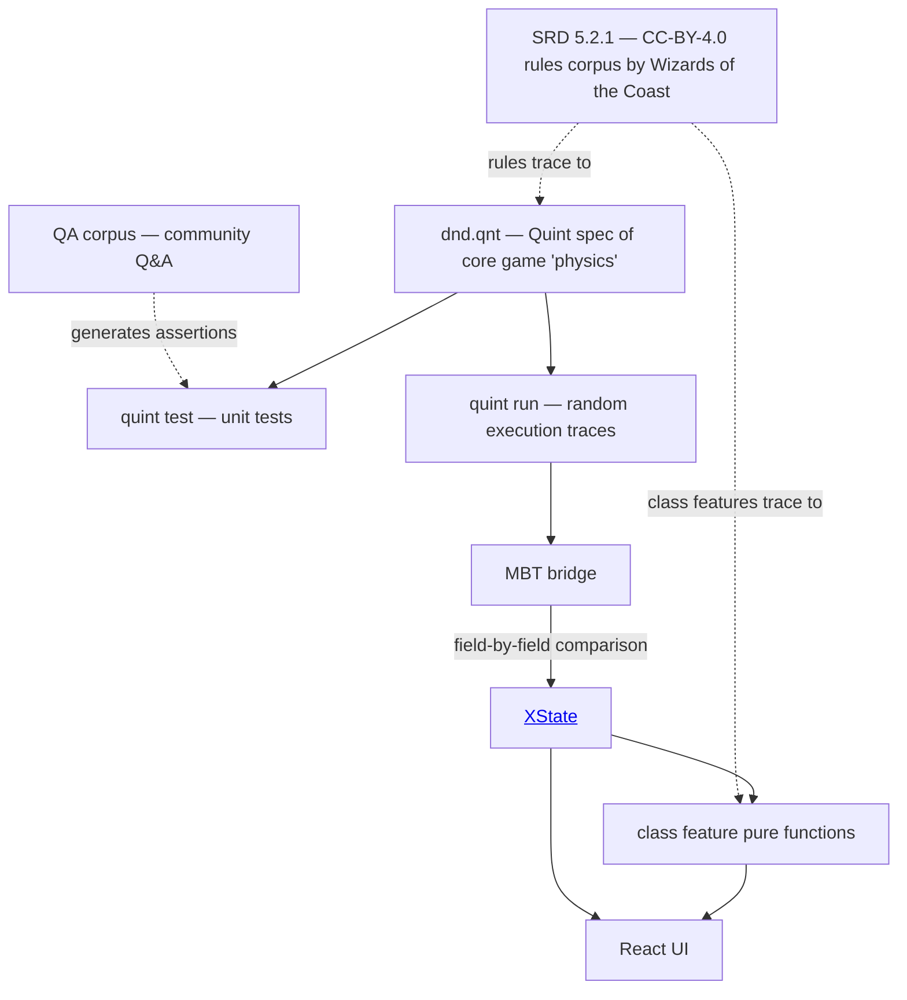

# D&D 5e in Quint

Formal specification of D&D 5e (SRD 5.2.1) combat and character mechanics in [Quint](https://github.com/informalsystems/quint), with a verified [XState](https://xstate.js.org/) implementation and a React frontend.

## What this is

The core combat rules of D&D 5e — conditions, action economy, spellcasting, attack resolution, death saves, grappling, mounted combat, resting, and more — written as a Quint specification. The spec is the source of truth. An XState state machine mirrors it exactly, and model-based testing proves they stay in sync.



Core game "physics" — the foundation everything else builds on: action economy, combat mode, d20 resolution, conditions, HP and death saves, spell slots and concentration, rest and recovery, movement, attack resolution, grapple and shove.

> **Rules Aren't Physics.** The rules of the game are meant to provide a fun game experience, not to describe the laws of physics in the worlds of D&D, let alone the real world. Don't let players argue that a bucket brigade of ordinary people can accelerate a spear to light speed by all using the Ready action to pass the spear to the next person in line. The Ready action facilitates heroic action; it doesn't define the physical limitations of what can happen in a 6-second combat round.
>
> — *Dungeon Master's Guide*

## What's covered

**Core (formally specified in Quint + XState):**

- d20 resolution, advantage/disadvantage, proficiency
- Conditions and exhaustion
- Action economy: action, bonus action, reaction, movement, free interaction, extra attack
- Attack resolution: crits, cover, underwater combat, squeezing
- Grapple and shove (SRD 5.2.1 save-based)
- Two-weapon fighting, mounted combat
- Spellcasting: slots, concentration, ritual casting, multiclass slot calculation, pact magic
- Active effect lifecycle with start-of-turn / end-of-turn expiry
- HP, temp HP, death saves, stabilization, knock out
- Short and long rest, hit dice recovery
- Character construction, leveling, multiclass prerequisites
- Combat mode separation (in-combat / out-of-combat state gating)

**Class features (TypeScript, composing on core):**

Pure-function implementations for Barbarian, Fighter, Rogue, Monk, Paladin, Druid, and Sorcerer. These don't touch the Quint spec — they call core primitives and produce results that the caller feeds back into the state machine.

See `app/src/features/` for details.

**Also:**

- Weapon mastery effects (all 8: Cleave, Graze, Nick, Push, Sap, Slow, Topple, Vex)
- Spell effect patterns (damage, defense buffs, condition debuffs)
- Grappler feat
- QA corpus: community Q&A from RPG Stack Exchange and Reddit, turned into Quint test assertions. See [`scripts/qa/QA_README.md`](scripts/qa/QA_README.md).

## Model-based testing

Quint generates random execution traces (sequences of actions like "start turn, use action, take damage, end turn, short rest..."). The bridge replays each trace against the XState machine and compares every field of the resulting state. If the XState machine disagrees with the Quint spec on any field, the test fails.

Refactors, new features, and bug fixes in the TypeScript code are checked against the formal spec automatically. If the implementation diverges from the spec, you'll know.

The bridge uses [`@firfi/quint-connect`](https://github.com/nicothin/quint-connect) to parse Quint traces and map them to XState events.

## Running it

**Quint tests:**

```sh
quint test dndTest.qnt
```

**XState + MBT tests:**

```sh
cd app
npm install
npm test
```

Note: MBT tests require the Quint Rust evaluator.

**React UI:**

```sh
cd app
npm run dev
```

Opens a browser UI where you can send events to the state machine and see the state update in real time. Undo/redo via event log replay. Class features (Fighter, Barbarian) are wired into a separate panel.

## SRD parity

The spec formalizes the SRD and nothing else. Core rules trace to specific SRD passages. There's no homebrew or licensed Player's Handbook or other books content. The spec also contains class-specific lookup tables (hit dice, multiclass prerequisites) as convenience — these are "fluff tables," not core rules. Where the formalization requires choices the SRD doesn't prescribe (turn boundaries, implied constraints), those are documented in [`ASSUMPTIONS.md`](ASSUMPTIONS.md).

## License

Licensed under the [Apache License 2.0](LICENSE).

This project formalizes mechanics from the [System Reference Document 5.2.1](https://www.dndbeyond.com/resources/1781-systems-reference-document-srd), &copy; Wizards of the Coast LLC, available under [CC BY 4.0](https://creativecommons.org/licenses/by/4.0/). See [NOTICE](NOTICE) for full attribution.

The `.references/srd/` directory contains SRD text in Markdown from [DND.SRD.Wiki](https://github.com/OldManUmby/DND.SRD.Wiki) by OldManUmby, also under [CC BY 4.0](https://creativecommons.org/licenses/by/4.0/), from a previous iteration over the 5e 2014 rule corpus. See [`.references/srd/ATTRIBUTION.md`](.references/srd/ATTRIBUTION.md).
