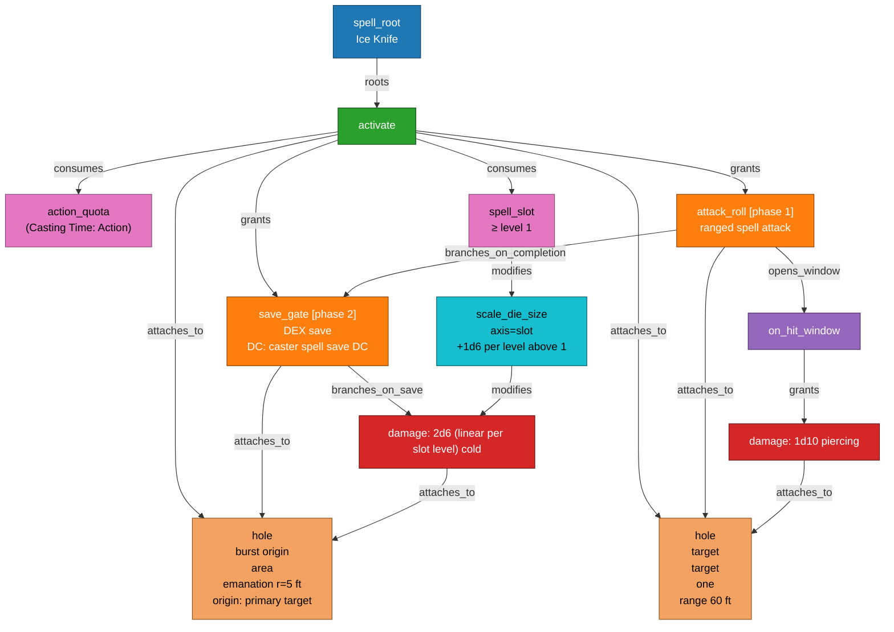

# D&D 5e Rules SDK

An executable, formally specified implementation of D&D 5e SRD 5.2.1 rules
for character creation, progression, character sheets, and combat.

Supports every SRD class and its abilities through
[level 10](plans/unit-profile-coverage/LEVEL1_10_FULL_SUPPORT.md), within the
documented runtime and table-adjudication boundaries.

The [shipped SRD catalog](plans/unit-profile-coverage/README.md#collection-boundaries)
contains only SRD 5.2.1 content. Closed-license content is not included; the
architecture separates authored content from reusable rule procedures so that
separately supplied closed-license content can build on the same foundation.
The current public catalog builders accept SRD collections; additional mechanics
must pass the owning runtime's admission boundary or receive new procedure
support. See [content architecture](ARCHITECTURE.md#content-scope-and-licensing).

## How it works

Rules have formal models in [Quint](https://quint.sh/) and are executed by
[TypeScript reducers](ARCHITECTURE.md).

The engine tells your application what it needs next: character choices,
available Battle Acts, or a missing input such as a target or roll result.
When a rule depends on a player choice or table observation, the runtime returns
a question to fill. Answering one question can reveal the next.

The core runtime does not roll dice or infer battlefield geometry. Callers provide
those facts as witnesses through the API.

A required input is a **Hole**; its answer is a **Fill**. In Battle, callers
discover **Acts**, select one, and answer the questions needed to resolve it.
See the [creation workflow](packages/character-creation-runtime/README.md#runtime-flow)
and [Battle protocol](packages/battle-runtime/README.md#runtime-protocol).

## Use it

Use the SDK as the rules engine for a game, a character builder, or tools for
running encounters. Your application supplies player decisions and table facts;
the runtime applies supported mechanics and returns the next state and inputs.
Work toward implementations in other languages is in progress through the
[conformance tooling](packages/opaque-oracle/README.md), with language-neutral contracts,
formal models, and conformance tools. Availability in arbitrary languages is a
goal, not a shipped SDK promise.

The [MCP server](packages/mcp/README.md) exposes these workflows to an agent,
including Play Sessions that can recover across HTTP server restarts. For
example, an illustrative interaction during an existing battle:

> **Player:** What can my fighter do?
>
> **Agent:** You can attack with your weapon. Which target?
>
> **Player:** The goblin. I'll roll at the table.
>
> **Agent:** Tell me the attack result.
>
> **Player:** 17.
>
> **Agent:** That hits. What did you roll for damage?
>
> **Player:** 8.
>
> **Agent:** The hit deals 8 damage. Here is what you can do next.

The agent discovers Acts and answers the runtime's questions through tools;
the particular choices and outcomes depend on the battle state. See
[MCP usage](packages/mcp/README.md#play-through-an-agent) for the tool-level flow.
For a browser view, run the [character creation UI and battle visualizer](packages/app/README.md#run-locally).

## SDK example

_Programmatic usage_

Conceptual pseudocode; the public API exposes each discovery and fill step:

```ts
let creation = beginCharacter();

creation = fill(creation, {
  class: "fighter",
  background: "soldier",
  species: "human",
  size: "medium",
  humanSkill: "perception",
  originFeat: "alert",
  fighterSkills: ["acrobatics", "survival"],
  fightingStyle: "defense",
});

const fighter1 = finishCharacter(creation);
const fighter2 = levelUp(fighter1);
const fighter3 = levelUp(fighter2, { subclass: "champion" });
const fighterSheet = createCharacterSheet(fighter3);

const encounter = startBattle(fighterSheet, srd.monsters.goblinWarrior, {
  witnesses: { fighterInitiative: 17, goblinInitiative: 12 },
});
let battle = encounter.battle;
const fighter = encounter.character;
const goblin = encounter.opponent;

battle = attack(battle, {
  target: goblin,
  witnesses: { distance: 5, attackRoll: 17, damageRoll: 8 },
});

battle = takeDamage(battle, {
  target: fighter,
  witnesses: { damage: 7 },
});

battle = secondWind(battle, {
  witnesses: { healingRoll: 6 },
});

battle = actionSurge(battle);
battle = attack(battle, {
  target: goblin,
  witnesses: { distance: 5, attackRoll: 16, damageRoll: 7 },
});

const fighterAfterBattle = handoff(battle, fighterSheet);
```

## Inspect the content

Abilities are authored as Dhall data. Ice Knife, an SRD spell, composes an
attack phase and a saving-throw phase. This dependency trace is generated from
its [compiled JSON](packages/surface/content/ice_knife.json), authored in
[Dhall](packages/surface/content/ice_knife.dhall). Colors distinguish costs,
input holes, resolution, effects, and scaling:


```mermaid
flowchart TD
  classDef source fill:#1f77b4,color:#fff,stroke:#0d3c61
  classDef procedure fill:#2ca02c,color:#fff,stroke:#185018
  classDef window fill:#9467bd,color:#fff,stroke:#4a2b66
  classDef hole fill:#f4a261,color:#000,stroke:#8a4f12
  classDef attachment fill:#ffcc00,color:#000,stroke:#8a6d00
  classDef resolution fill:#ff7f0e,color:#fff,stroke:#8a4308
  classDef lifecycle fill:#7f7f7f,color:#fff,stroke:#333
  classDef resource fill:#e377c2,color:#000,stroke:#8a457a
  classDef scaling fill:#17becf,color:#000,stroke:#0a5f6a
  classDef effect fill:#d62728,color:#fff,stroke:#6a1414
  classDef statBlock fill:#111827,color:#fff,stroke:#f59e0b,stroke-width:4px
  root1["spell_root<br/>Ice Knife"]:::source
  act2["activate"]:::procedure
  q3["action_quota<br/>(Casting Time: Action)"]:::resource
  slot4["spell_slot<br/>≥ level 1"]:::resource
  att5["hole<br/>target<br/>target<br/>one<br/>range 60 ft"]:::hole
  res6["attack_roll [phase 1]<br/>ranged spell attack"]:::resolution
  dmg7["damage: 1d10 piercing"]:::effect
  win8["on_hit_window"]:::window
  att9["hole<br/>burst origin<br/>area<br/>emanation r=5 ft<br/>origin: primary target"]:::hole
  res10["save_gate [phase 2]<br/>DEX save<br/>DC: caster spell save DC"]:::resolution
  dmg11["damage: 2d6 (linear per slot level) cold"]:::effect
  sc12["scale_die_size<br/>axis=slot<br/>+1d6 per level above 1"]:::scaling
  act2 -- consumes --> q3
  act2 -- consumes --> slot4
  act2 -- attaches_to --> att5
  act2 -- grants --> res6
  res6 -- attaches_to --> att5
  res6 -- opens_window --> win8
  win8 -- grants --> dmg7
  dmg7 -- attaches_to --> att5
  act2 -- attaches_to --> att9
  act2 -- grants --> res10
  res10 -- attaches_to --> att9
  res10 -- branches_on_save --> dmg11
  dmg11 -- attaches_to --> att9
  sc12 -- modifies --> dmg11
  slot4 -- modifies --> sc12
  res6 -- branches_on_completion --> res10
  root1 -- roots --> act2
```

Another authored record can reuse implemented mechanical procedures without a
handler keyed to its name. New procedure shapes need runtime support. The
[Surface authoring guide](packages/surface/README.md#authoring-format-dhall--json)
shows how to compile, validate, and generate a full review trace;
[architecture](ARCHITECTURE.md#authored-content) explains the content boundary.

## Explore

| Build or inspect                               | Start here                                                            |
| ---------------------------------------------- | --------------------------------------------------------------------- |
| Character creation and progression             | [Creation runtime](packages/character-creation-runtime/README.md)     |
| Persistent character state and rests           | [Character Sheet runtime](packages/character-sheet-runtime/README.md) |
| Battle Acts, fills, and interrupts             | [Battle runtime](packages/battle-runtime/README.md)                   |
| Tool-driven play with recoverable sessions     | [MCP](packages/mcp/README.md)                                         |
| Character creation UI and battle visualization | [Website](packages/app/README.md)                                     |
| Package ownership and verification design      | [Architecture](ARCHITECTURE.md)                                       |

## License

Code is licensed under [Apache 2.0](LICENSE). SRD 5.2.1 content is available
under [CC BY 4.0](https://creativecommons.org/licenses/by/4.0/); see
[NOTICE](NOTICE) for attribution.
