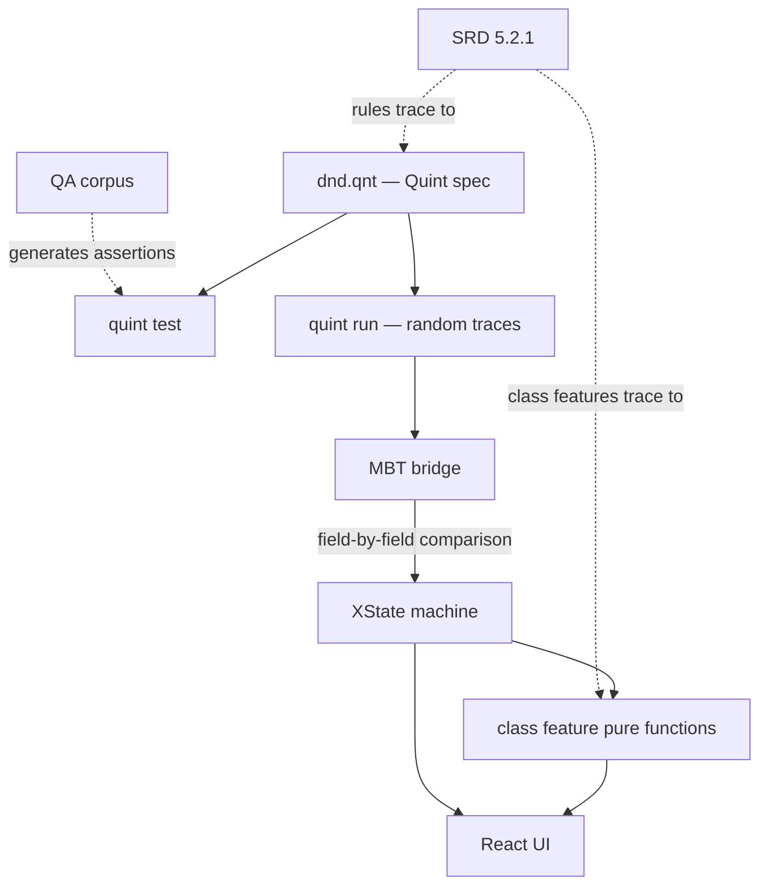

# D&D 5e in Quint

Formal specification of D&D 5e (SRD 5.2.1) combat and character mechanics in [Quint](https://github.com/informalsystems/quint), with a verified [XState](https://xstate.js.org/) implementation and a React frontend.

## What this is

A **rules engine for a single actor**. Core combat rules of D&D 5e — conditions, action economy, spellcasting, attack resolution, death saves, grappling, mounted combat, resting — written as a Quint specification. An XState state machine mirrors it exactly, and model-based testing proves they stay in sync.


```mermaid
graph TD
    SRD["SRD 5.2.1"] -.->|rules trace to| SPEC
    SRD -.->|class features trace to| FEATURES
    QA[QA corpus] -.->|generates assertions| TEST
    SPEC["dnd.qnt — Quint spec"] --> TEST[quint test]
    SPEC --> TRACES[quint run — random traces]
    TRACES --> MBT["MBT bridge"]
    MBT -->|field-by-field comparison| XSTATE["XState machine"]
    XSTATE --> FEATURES[class feature pure functions]
    XSTATE --> UI[React UI]
    FEATURES --> UI
```

Each actor is an independent XState machine tracking its own HP, conditions, action economy, death saves, spell concentration, and class resource charges. The `DndEvent` union (`USE_ACTION`, `TAKE_DAMAGE`, `USE_SECOND_WIND`, ...) is the actor's API.

> **Rules Aren't Physics.** The rules of the game are meant to provide a fun game experience, not to describe the laws of physics in the worlds of D&D. — *Dungeon Master's Guide*

## What a game would add

The engine handles rules for one actor. A game needs an **orchestration layer** on top:

| Engine (exists) | Orchestrator (doesn't exist yet) |
|---|---|
| Action economy, HP, death saves, conditions | Multiple combatants: N machines, route events between them |
| Class features (Second Wind, Rage, ...) | Initiative: sort actors, cycle turns |
| Accepts dice rolls as event fields | Targeting: map/grid, route `TAKE_DAMAGE` to target's machine |
| Spell slots, concentration, effect lifecycle | Attack resolution: d20 vs AC, compute damage |

The React UI is a debugging tool — you send events by hand. A game would send the same events with real dice, real targets, and turn sequencing.

## What's covered

**Core (Quint + XState):** d20 resolution, advantage/disadvantage, conditions, exhaustion, action economy, attack resolution (crits, cover, underwater), grapple/shove, two-weapon fighting, mounted combat, spellcasting (slots, concentration, ritual, multiclass, pact magic), active effect lifecycle, HP/temp HP/death saves, short and long rest, character construction, combat mode gating.

**Class features (TypeScript):** Pure functions for Barbarian, Cleric, Druid, Fighter, Monk, Paladin, Rogue, Sorcerer. Fighter (Champion L1-L18) is also in Quint and MBT-verified. See `app/src/features/`.

**Also:** Weapon mastery (all 8), spell effect patterns, Grappler feat, QA corpus ([`scripts/qa/QA_README.md`](scripts/qa/QA_README.md)).

## How the layers work

**Quint spec** (`dnd.qnt`) — source of truth. Pure functions (`pUseAction`, `pTakeDamage`, ...) model every rule. `do*` actions compose them with nondeterministic inputs for model checking.

**XState machine** (`machine.ts` + satellite files) — parallel-region machine with four tracks: damageTrack, turnPhase, conditionTrack, spellcasting. Direct transliteration of the Quint spec.

**Feature system** (`app/src/features/`) — class abilities as pure functions (`class-fighter.ts`, `class-barbarian.ts`, ...) adapted to XState via a bridge layer. One user action produces a `BridgeResult`: a `featureAction` for the feature reducer + `machineEvents` for XState.

**MBT bridge** (`machine.mbt.test.ts`) — correctness proof. Replays 50 Quint traces (30 steps each) against XState, compares every field after each step. Uses [`@firfi/quint-connect`](https://github.com/dearlordylord/quint-connect-ts).

**QA pipeline** (`scripts/qa/`) — community Q&A turned into Quint test assertions by LLM. See [`scripts/qa/QA_README.md`](scripts/qa/QA_README.md).

## Running it

```sh
quint test dndTest.qnt          # Quint spec tests
cd app && npm install && npm test  # XState + MBT tests (needs Quint Rust evaluator)
cd app && npm run dev              # React UI
```

## SRD parity

The spec formalizes the SRD and nothing else — no homebrew, no licensed content. Where the formalization requires choices the SRD doesn't prescribe, those are documented in [`ASSUMPTIONS.md`](ASSUMPTIONS.md).

## License

Licensed under the [Apache License 2.0](LICENSE).

This project formalizes mechanics from the [System Reference Document 5.2.1](https://www.dndbeyond.com/resources/1781-systems-reference-document-srd), &copy; Wizards of the Coast LLC, available under [CC BY 4.0](https://creativecommons.org/licenses/by/4.0/). See [NOTICE](NOTICE) for full attribution.

The `.references/srd/` directory contains SRD text in Markdown from [DND.SRD.Wiki](https://github.com/OldManUmby/DND.SRD.Wiki) by OldManUmby, also under [CC BY 4.0](https://creativecommons.org/licenses/by/4.0/). See [`.references/srd/ATTRIBUTION.md`](.references/srd/ATTRIBUTION.md).
