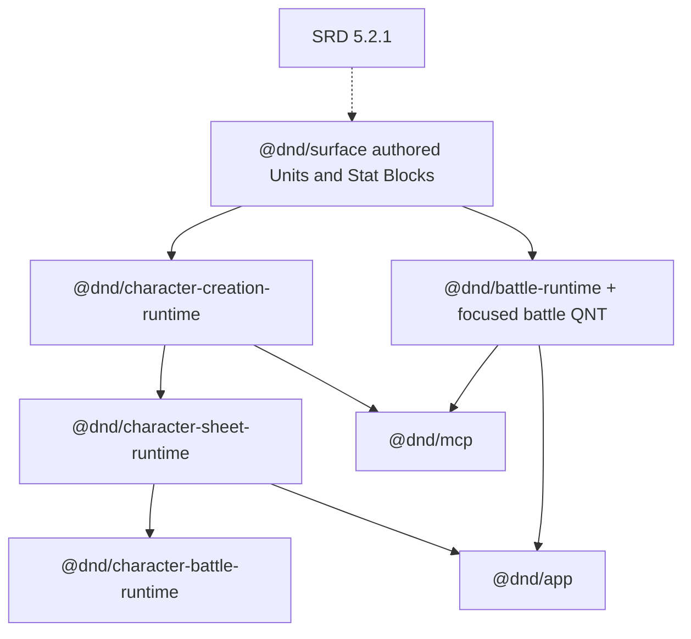

# D&D 5e SRD Runtime Workspace

D&D 5e SRD 5.2.1 runtime packages, Surface-authored content, MCP tools, and a
React frontend.

## What this is

A package workspace for the active runtimes:


```mermaid
graph TD
    SRD["SRD 5.2.1"] -.-> SURFACE["@dnd/surface authored Units and Stat Blocks"]
    SURFACE --> CCR["@dnd/character-creation-runtime"]
    SURFACE --> BR["@dnd/battle-runtime + focused battle QNT"]
    CCR --> CSR["@dnd/character-sheet-runtime"]
    CSR --> CBR["@dnd/character-battle-runtime"]
    BR --> MCP["@dnd/mcp"]
    CCR --> MCP
    CSR --> APP["@dnd/app"]
    BR --> APP
```

## What's covered

**Battle runtime:** Unit/StatBlock-backed action resources, attack
flows, selected spells, Death Saving Throws, Knock Out lifecycle, battle
snapshots, and caller-owned hole/fill replay.

**Character runtimes:** character-creation choices, progression, sheet-session
projection, and character battle-entry projection.

**Also:** Surface-authored content records, shared reducer algebras, MCP
session workflows, React app routes, and research-only community Q&A
classification tooling
([`scripts/qa/QA_README.md`](scripts/qa/QA_README.md)).

## Content Provenance

Published content is redistributable SRD material or original synthetic content;
non-SRD official identity and book text are not published here. The authoritative
boundaries are the [content architecture](ARCHITECTURE.md#content-scope-and-licensing),
[Mushroom authoring policy](docs/mushroom-playbook/AUTHORING.md), and
[agent implementation rules](AGENTS.md#authored-identity-and-phb-content).

## How the layers work

**Surface** (`packages/surface`) — source-authored records and projection
contracts for Units, Stat Blocks, spells, class features, and related content.

**Battle runtime** (`packages/battle-runtime`) — Unit/StatBlock-backed battle
reducer behavior. Battle QNT authority is distributed across shared rule-core
slices, focused runtime slices, and focused MBT/proof witnesses.

**Character runtimes** (`packages/character-creation-runtime`,
`packages/character-sheet-runtime`, `packages/character-battle-runtime`) —
package-owned character build, sheet-session, and battle-entry projections.

**MCP and app** (`packages/mcp`, `packages/app`) — user-facing workflows over
the runtime packages.

**Q&A research tooling** (`scripts/qa/`) — optional corpus download,
classification, and research support. It is not a rules or verification source;
see [`scripts/qa/QA_README.md`](scripts/qa/QA_README.md).

**Rules kernel coverage** (`plans/rules-kernel-coverage/`) — semantic
obligation manifest for TS-current reducer behavior. New reducer semantics are
QNT-first and must connect back to production runtime behavior through a focused
random MBT witness or deterministic QNT replay witness according to the lane's
witness-mode rules.

**Unit profile coverage** (`plans/unit-profile-coverage/`) — authored-content
support breadth for Surface Units. Its generated reports include the
rules-kernel join, so a supported Unit can be read through to reducer-semantic
coverage without merging the two denominators.

## Running It

```sh
pnpm quality                    # coverage, lint, complexity, circular, tests, and typecheck
pnpm proof:qnt                  # conscious QNT proof lanes: inventory, closure, run-block proofs, and QNT slice parity
pnpm test                       # workspace package tests
pnpm dev                        # React UI
```

`pnpm check:complexity` applies classic cyclomatic complexity with a maximum of
8 to production-package source. Existing violations are recorded by stable,
syntax-derived function identity and measured value, so a new violation, an
increase in an existing function, or an obsolete baseline entry fails the gate.
Tests, generated files, test support, and throwaway prototypes are excluded.
Inline ESLint configuration is disabled for this analysis; complexity
exceptions cannot be hidden in source.
After reducing existing debt, run `pnpm check:complexity:prune` to ratchet the
baseline downward. That command refuses to record regressions.

## SRD parity

The spec formalizes the SRD and nothing else — no homebrew, no licensed content. Where the formalization requires choices the SRD doesn't prescribe, those are documented in [`ASSUMPTIONS.md`](ASSUMPTIONS.md).

## License

Licensed under the [Apache License 2.0](LICENSE).

This project formalizes mechanics from the [System Reference Document 5.2.1](https://www.dndbeyond.com/srd), &copy; Wizards of the Coast LLC, available under [CC BY 4.0](https://creativecommons.org/licenses/by/4.0/). See [NOTICE](NOTICE) and [the local SRD 5.2.1 corpus attribution](.references/srd-5.2.1/ATTRIBUTION.md) for full attribution.
