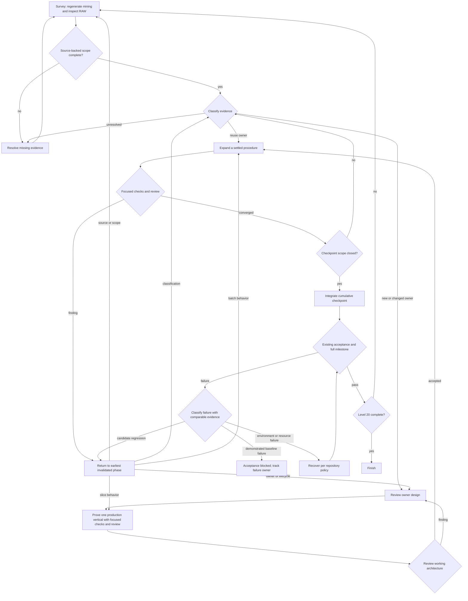

# Level 20 Factory Preparation Guideline

This is the working guideline for preparing a factory pilot. The
[orchestrator guide](level-20-orchestrator-guide.md) gives the operational
procedure. Neither is an executable runner, new acceptance gate, or
issue-status ledger. They coordinate existing issues, coverage artifacts,
reviewers, and repository verification.
Its goal is cumulative SRD character-level-20 support: every relevant option
through direct creation, one-level advancement, all RAW-legal multiclass paths,
and legal battle casting. Table-adjudicated effects remain table work, while
RAW casting costs and effects on later battle state reach their owning runtimes.
Earlier "full support" labels do not establish this stronger goal.

## Preparation dependencies

```text
Thread 2: SRD mining automation ------------------------- done
                     |
                     v
Thread 1: factory workflow draft
                     |
                     +--> Astra review: step size, return paths,
                     |    and bounded parallelism -------- done
                     |                 |
                     +-----------------+--> concise orchestrator guide -- done
                                             |
Verification baseline ------------------------+
  Re-run on a pinned base revision; classify   |
  failures and focused checks for the pilot    |
                                             v
                                  Define one pilot slice and its
                                  owners, evidence, review, and
                                  stop conditions
                                             |
                                             v
                                  Run the factory pilot
                                             |
                               findings -----+----> revise guide
                                             |
                                         clean run
                                             v
                                  Factory ready to repeat
```

Work in that order. The pilot must exercise a reviewer finding that returns to
an earlier phase. The earlier milestone log is candidate-specific and does not
prove failures pre-existed this work; obtain a comparable base run before
classification. A focused pass cannot stand in for the full milestone.

## State and routing

Keep one small run record: accepted scope/spec references, checkpoint target and
candidate revision, per-work-item phase, dependency and owner references, ready
work, active assignments, returned evidence, open findings, earliest invalidated
phase, and configured parallelism/assignment bounds. Refer to canonical issues
and coverage artifacts; do not copy their statuses into another durable registry.
A subagent may classify evidence only with RAW/code anchors and an owner; the
orchestrator checks those anchors before applying the transition. Missing or
conflicting anchors route to `unresolved`, never to supported.
Reuse an owner only when the source spans fit its existing Surface shape,
production owner, state lifetime, admission contract, and verification witnesses
without changing those contracts. Changed ownership, lifecycle, sequencing,
support, or state representation routes to owner design.



**Survey is part of every frontier's automated flow.** First reconcile levels
1–10 against the stronger runtime goal. Refresh the existing SRD inventory and
mining audit, then delegate bounded RAW completeness and interaction review.
The [mining research and Survey contract](../research/level-20-mining-automation.md)
records the source checks and agent classification boundary.
The generator now reads local SRD material and produces source-checked mining
audits through level 20. The agent review checks omissions, choices,
replacements, spell access, multiclass interactions, and owner pressure against
local RAW. Survey also checks level-gated cross-chapter options through their
RAW coverage owner instead of duplicating class rows. It exits only when the
intended frontier has source-backed rows and its class, spell-access, and linked
cross-chapter scope has been cross-checked. Missing or
ambiguous evidence returns to Survey or targeted research; an inventory row
alone never advances a runtime-support claim. Initial research defines this
mining contract and calibrates the parser; it is not a permanent manual
prerequisite to each iteration.

**Implementation tasks** cover one usable production behavior, across packages
when needed. Split when a second independent lifecycle, owner decision, or
dependency appears. New procedure families get an owner/state review before
exactly one production vertical and a working-architecture review before content
expansion. Reused procedures admit coherent record batches only when shape,
lifetime, and review scope match. Each slice gets focused checks and
reviewer-loop convergence on changed RAW, domain language,
architecture/connascence, and code. A wider architecture review reopens when
Surface cannot express RAW, ownership or lifecycle changes, multiclass exposes
a counterexample, or a fix needs duplicate state or authored-identity dispatch.
Return only to the earliest invalidated phase and recheck the affected delta.

**Pilot assignment bounds:** at most three active children total, including
descendants, with one implementation assignment at a time. A child may spawn
only within an allocated slot. Dispatch only dependency-ready tasks with
disjoint write ownership; serialize shared artifact regeneration, integration,
and heavy verification through the existing repository locks. Give each
assignment one bounded work item, expected evidence, and at most two returned
attempts; then the orchestrator splits, reclassifies, or redesigns the item.
This limit never accepts unresolved findings. Detail only the next ready tasks
in accepted issues/specifications: behavior and limits, RAW anchors,
owners/write set, dependencies/base revision, success and rejection witnesses,
affected QNT/parity owners, focused commands, and design-reopening trigger.

**Checkpoints** are cumulative and provisional at levels 12, 16, and 20;
adjust them after early slices reveal actual dependencies. Support every legal
path with generic rules and verify representative and boundary cases rather
than enumerate builds. Scope closes only when every relevant option works at
its applicable creation, sheet, and battle owners; table-detached effects need
an explicit disposition and legal casts still apply their RAW consequences.
Review the integrated revision, then run the existing
full milestone once on that stable candidate; changed candidates require a
fresh full run. Keep delivery evidence in the accepted issue/spec and existing
coverage owners, not in this preparation document.

**Pilot contract:** select one source-backed unresolved behavior inside a
supported creation frontier that exercises creation or advancement, durable
projection, and a battle consequence where applicable. Reuse an owner only when
its existing contracts fit; otherwise review owner design and prove exactly one
production vertical before expansion. Pin its RAW spans, owner, base and
candidate revisions, positive and rejection witnesses, and one interaction
witness. Run Survey, classification, implementation, independent review, and
integration. Exercise a return route by replaying a documented finding or by
a labelled disposable evidence exercise; do not introduce a production defect.
Record which branches ran. This pilot tests routing, not a level checkpoint.
Before it starts, record a comparable full-milestone
baseline with command, revision, result, log, and failure owner. After a stable
integration run, compare failure signatures: candidate regressions return to
their earliest affected phase; demonstrated baseline failures leave acceptance
blocked; environment and resource failures follow repository recovery policy.
The factory is ready to repeat only after routing and review work and required
acceptance passes on the candidate.
