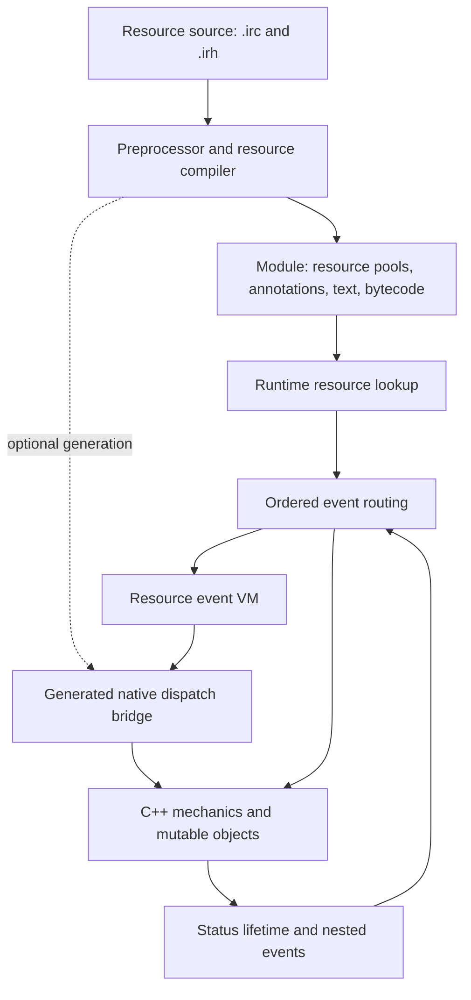

# Incursion ruleset architecture: inspiration assessment

Incursion implements its rules through a **hybrid of C++ mechanics, compiled resource data, and event scripts**. Its strongest architectural idea is a reusable vocabulary of effect operations with explicit lifecycle hooks. Its weakest fit for this repository is the way those hooks can freely mutate a shared event and depend on authored identities. This is architecture inspiration, not a competitor assessment or a proposal to adopt its rules.

Analysis date: 2026-09-10. Source: [networkingguru/incursion-roguelike](https://github.com/networkingguru/incursion-roguelike), pinned to commit `e24fb8526c9e238ccc8d50e0c5ea073c906ee5c7`, checked out at `.references/competitors/incursion-roguelike`. All upstream links below use that revision. Evidence is static source inspection; no build, game session, or upstream test was run. The report examines engine contracts without reproducing authored catalog entries.

This report owns observations about the external project. Local architectural authority remains [ARCHITECTURE.md](../../ARCHITECTURE.md), with package detail in the [battle runtime README](../../packages/battle-runtime/README.md). Incursion is not RAW evidence for our SRD 5.2.1 formalization. Its [LICENSE](https://github.com/networkingguru/incursion-roguelike/blob/e24fb8526c9e238ccc8d50e0c5ea073c906ee5c7/LICENSE#L1-L52) describes several license regimes and qualifies its summary of the original release statement; this report makes no blanket claim that its data is suitable for our public corpus.

## 1. Where the rules live

There are three cooperating mechanisms:

| Mechanism              | Responsibility                                                          | Extension cost                                                                              |
| ---------------------- | ----------------------------------------------------------------------- | ------------------------------------------------------------------------------------------- |
| Resource records       | Numeric facts, flags, references, effect segments and attached events   | Existing shapes can be authored and compiled                                                |
| C++ mechanics          | Target handling, resolution algorithms, object behavior, state mutation | A new mechanic can require native code changes                                              |
| Resource event scripts | Conditional behavior and overrides at selected event hooks              | Existing exposed operations can be composed; new native capabilities require bridge changes |

`Resource` supplies the common identity/text fields, resource kind, annotation chain and event mask. Specialized records include `TEffect`, whose fields combine casting metadata, flags and an initial `EffectValues`. Annotations hold additional effects, event code locations, lists, abilities and other extensions. These are tagged C++ records with unions, not a fully validated algebra that excludes every invalid combination. [Resource schema](https://github.com/networkingguru/incursion-roguelike/blob/e24fb8526c9e238ccc8d50e0c5ea073c906ee5c7/inc/Res.h#L155-L286), [effect schema](https://github.com/networkingguru/incursion-roguelike/blob/e24fb8526c9e238ccc8d50e0c5ea073c906ee5c7/inc/Res.h#L477-L498).

This division explains both its breadth and its complexity: authored data need not implement ordinary mechanics repeatedly, but understanding a behavior may require following a record, a script, the router and native code.

## 2. Authoring, compilation and module format

The authoring language supports domain declarations and imperative event bodies. Its grammar recognizes effect declarations, named numeric fields, flags and `AND` segments. Creating a subsequent segment copies the preceding `EffectValues` before changing its operation kind and applying its fields. Consequently, omitted fields inherit values: composition is partly an authoring-time copying convention. `ON EVENT` attaches either text or compiled code; event bodies receive a code location and terminate with a VM instruction. [Effect grammar](https://github.com/networkingguru/incursion-roguelike/blob/e24fb8526c9e238ccc8d50e0c5ea073c906ee5c7/lang/Grammar.acc#L642-L710), [event grammar](https://github.com/networkingguru/incursion-roguelike/blob/e24fb8526c9e238ccc8d50e0c5ea073c906ee5c7/lang/Grammar.acc#L346-L382).

`Game::ResourceCompiler` preprocesses the source, counts and names resources, initializes resource pools, parses the source, assembles the code segment, reports unresolved references and conditionally writes the module. It can also generate the C++ dispatch bridge from symbol bindings on its conditional generation/save path. This is a build-time language/toolchain boundary, not JSON interpreted directly by each game action. The compiler's save decision also checks particular authored resources: even infrastructure contains content-specific assumptions. [Compiler pipeline](https://github.com/networkingguru/incursion-roguelike/blob/e24fb8526c9e238ccc8d50e0c5ea073c906ee5c7/src/RComp.cpp#L82-L230), [bridge generation](https://github.com/networkingguru/incursion-roguelike/blob/e24fb8526c9e238ccc8d50e0c5ea073c906ee5c7/src/RComp.cpp#L570-L612).

A `Module` contains resource pools, annotations, symbols, text and VM code. Resource IDs depend on pool order and counts. Loading scans `.Mod` files and assigns fixed or available module slots, checking fixed-slot collisions. Module persistence retains the raw serialization path; the newer save schema does not make modules independent of native layouts. [Module structure](https://github.com/networkingguru/incursion-roguelike/blob/e24fb8526c9e238ccc8d50e0c5ea073c906ee5c7/inc/Res.h#L803-L957), [save/load](https://github.com/networkingguru/incursion-roguelike/blob/e24fb8526c9e238ccc8d50e0c5ea073c906ee5c7/src/Registry.cpp#L1438-L1535).

The build script explicitly distinguishes ABI compatibility from content freshness: a matching layout digest cannot detect stale scripts. Ordinary developer builds therefore recompile the module every time; instrumented and cross builds follow different paths. **Transferable lesson:** any derived execution artifact must account for changes to both input content and the compiler/projection logic. **Do not transfer:** positional resource identity or raw object-layout persistence. [Build policy](https://github.com/networkingguru/incursion-roguelike/blob/e24fb8526c9e238ccc8d50e0c5ea073c906ee5c7/build_macos.sh#L334-L362).

## 3. The effect vocabulary is the reusable rules layer

`EffectValues` separates an operation kind (`eval`) from range, area, targeting, prompting, saving and power fields. Its remaining slots have meanings determined by the operation: `rval` can be a resource or flags; `xval` can be a status kind or damage type; `yval` supplies another operation-specific value. `Magic::MagicHit` switches on `eval` and calls native operation handlers. `TEffect::Vals` retrieves the first segment from the record and subsequent segments from annotations. [Effect fields](https://github.com/networkingguru/incursion-roguelike/blob/e24fb8526c9e238ccc8d50e0c5ea073c906ee5c7/inc/Res.h#L125-L142), [segment lookup](https://github.com/networkingguru/incursion-roguelike/blob/e24fb8526c9e238ccc8d50e0c5ea073c906ee5c7/src/Magic.cpp#L254-L266), [operation dispatch](https://github.com/networkingguru/incursion-roguelike/blob/e24fb8526c9e238ccc8d50e0c5ea073c906ee5c7/src/Magic.cpp#L1238-L1268).

This is the most relevant inspiration: many authored records reduce to combinations of a smaller mechanic vocabulary. But it is not evidence that all rules are data driven. The operation handlers contain additional branches, and the prerequisite evaluator has explicit content-specific cases. A record can also inject imperative event code.

For our project, the corresponding direction is to sharpen existing parsed Surface shapes and typed procedure families. Represent operation-specific payloads as discriminated branches; do not reproduce `xval`/`yval` slot conventions. A support profile should retain evidence that a procedure applies to the parsed shape. It should not become a second executable language alongside the existing runtime and Quint owners.

## 4. Event order is part of the semantics

`RealThrow` runs a three-phase protocol:

1. Run `PRE(event)`.
2. Run the main event unless the result is `ABORT` or `DONE`.
3. Run `POST(event)` unless the result is `ABORT`.

A `DONE` pre-handler therefore suppresses the main action but still permits post processing. The post-handler return value is ignored. This is not a generic subscriber broadcast: ordering and return values determine what happens next. [Phase protocol](https://github.com/networkingguru/incursion-roguelike/blob/e24fb8526c9e238ccc8d50e0c5ea073c906ee5c7/src/Event.cpp#L437-L466).

Within a phase, `ThrowEvent` considers environmental resources, a field or effect, conduct watchers, the map and participating objects. It visits the four participant slots from index 3 down to 0; status-based event traps are consulted before each object's handler. `ThrowTo` walks native object behavior from derived classes toward base classes. `DONE` and `ABORT` stop routing; `NOMSG` changes message behavior. [Router order](https://github.com/networkingguru/incursion-roguelike/blob/e24fb8526c9e238ccc8d50e0c5ea073c906ee5c7/src/Event.cpp#L152-L412).

`Resource::Event` uses a coarse mask to avoid unnecessary annotation scans, matches the actual event number, and executes the attached code through the VM. `ReThrow` copies the event onto a nested stack, executes it, then copies the resulting context back with selected fields restored. Thus nested resolution can affect its caller through much more than the return value. [Resource dispatch](https://github.com/networkingguru/incursion-roguelike/blob/e24fb8526c9e238ccc8d50e0c5ea073c906ee5c7/src/Annot.cpp#L1098-L1138), [nested dispatch](https://github.com/networkingguru/incursion-roguelike/blob/e24fb8526c9e238ccc8d50e0c5ea073c906ee5c7/src/Event.cpp#L468-L485).

**Inference for our design:** make ordering, cancellation, completion and nested results explicit in procedure contracts. Incursion's universal mutable `EventInfo` makes unrelated facts travel together; its copy routine even depends on memory layout and contiguous string members. Our battle holes, fills and continuations need narrow payloads and declared state transitions instead of this shared event bag. [Context copying](https://github.com/networkingguru/incursion-roguelike/blob/e24fb8526c9e238ccc8d50e0c5ea073c906ee5c7/inc/Events.h#L132-L165).

## 5. VM flexibility comes with a large native boundary

The VM has integer and string registers, a stack, memory, object handles and an event context. Instructions include control flow, returns and native member access; generated dispatch translates numeric function/member bindings into C++ operations. This enables resource scripts to inspect and change game objects rather than merely return declarative modifiers. [VM interface](https://github.com/networkingguru/incursion-roguelike/blob/e24fb8526c9e238ccc8d50e0c5ea073c906ee5c7/inc/Res.h#L61-L100), [instruction execution](https://github.com/networkingguru/incursion-roguelike/blob/e24fb8526c9e238ccc8d50e0c5ea073c906ee5c7/src/VMachine.cpp#L460-L553).

Adding an entirely new capability can therefore involve grammar, symbol bindings, generated dispatch, native semantics and content together. Static register and stack storage also means this is not an example of independently isolated concurrent rule evaluation. This inspection does not establish a security sandbox or termination guarantee. The useful question is which native semantic operations authors need, not whether this project should acquire a VM.

## 6. A technical execution trace and status ownership

Consider a synthetic field whose effect segment uses `EA_GRANT`, followed through field entry and departure; no real catalog identity is needed to follow its contract:

1. The grammar stores the segment's fields and optional event code.
2. Effect execution obtains segments through `Vals`, calls `CalcEffect`, and evaluates activation, periodic and lifecycle gates.
3. On reaching a target, `MagicHit` selects `Grant` from the segment operation.
4. On field entry, `Grant` creates a temporary status using the segment's status kind, parameter and magnitude, together with its effect reference and the entering event's creator (`EActor`).
5. Leaving the contributing field removes statuses scoped to that effect **and creator**, preventing another contributor's matching effect from being removed.

This traces the field-entry branch, not all grants: ordinary grant branches can use a null contributor. Nor does every segment reach every step: intervening gates and handlers may stop execution. [Segment execution](https://github.com/networkingguru/incursion-roguelike/blob/e24fb8526c9e238ccc8d50e0c5ea073c906ee5c7/src/Magic.cpp#L736-L770), [grant and removal](https://github.com/networkingguru/incursion-roguelike/blob/e24fb8526c9e238ccc8d50e0c5ea073c906ee5c7/src/Effects.cpp#L469-L505).

A `Status` stores kind, duration, parameter, magnitude, source category, effect reference and object handle. Here **source category means runtime cause, not canonical rules provenance**. `UpdateStati` advances eligible durations and dispatches expiry behavior. The collection tracks nested iteration, pending additions and removals; fixup is deferred until iteration can safely reconcile them. [Status fields](https://github.com/networkingguru/incursion-roguelike/blob/e24fb8526c9e238ccc8d50e0c5ea073c906ee5c7/inc/Res.h#L316-L334), [duration handling](https://github.com/networkingguru/incursion-roguelike/blob/e24fb8526c9e238ccc8d50e0c5ea073c906ee5c7/src/Status.cpp#L40-L83), [iteration lifecycle](https://github.com/networkingguru/incursion-roguelike/blob/e24fb8526c9e238ccc8d50e0c5ea073c906ee5c7/inc/Map.h#L786-L816).

The important transferable invariant is that an effect definition and an application instance are different things. Removal, expiry and overlap must track the actual contributor/application. Before introducing state locally, search and thread the canonical application owner already present; do not create a parallel status registry.

## 7. Prerequisites and verification

Prerequisites are another small declarative algebra: `FeatPrereq` is an OR of AND groups, each containing a predicate kind, argument and value. `Character::FeatPrereq` evaluates those against the character, but surrounds that generic evaluator with special cases and eligibility gates. Thus the predicate representation is reusable; the overall system is not identity-neutral. [Predicate structure](https://github.com/networkingguru/incursion-roguelike/blob/e24fb8526c9e238ccc8d50e0c5ea073c906ee5c7/inc/Creature.h#L115-L133), [evaluation](https://github.com/networkingguru/incursion-roguelike/blob/e24fb8526c9e238ccc8d50e0c5ea073c906ee5c7/src/Create.cpp#L3593-L3695).

The inspected checks combine source-structure assertions with headless behavioral scenarios. One removal check explicitly distinguishes its structural guarantee from separate behavioral oracles. The overlap scenario runs with a fixed seed, inspects resulting state/logs, checks contributor counts and distinguishes incomplete execution from failure. The headless harness also requires explicit settings and isolates each run directory: reproducibility needs more than a random seed. [Run setup](https://github.com/networkingguru/incursion-roguelike/blob/e24fb8526c9e238ccc8d50e0c5ea073c906ee5c7/tools/headless.sh#L91-L118), [seed derivation](https://github.com/networkingguru/incursion-roguelike/blob/e24fb8526c9e238ccc8d50e0c5ea073c906ee5c7/src/Main.cpp#L47-L54). These are useful evidence practices, but reading the scripts does not establish that they currently pass or provide complete rules coverage. [Structural check](https://github.com/networkingguru/incursion-roguelike/blob/e24fb8526c9e238ccc8d50e0c5ea073c906ee5c7/tools/check_cleanup_removal_event.sh#L1-L45), [behavioral check](https://github.com/networkingguru/incursion-roguelike/blob/e24fb8526c9e238ccc8d50e0c5ea073c906ee5c7/tools/check_overlapping_modifier_fields.sh#L1-L55).

## Architectural priorities suggested by this study

1. **Strengthen procedure-family vocabulary.** Use existing Surface parsing and typed facts to express reusable mechanics; keep authored identity at its established boundaries.
2. **Specify composition and lifecycle explicitly.** Make segment order, interruption results, duration and contributor-scoped removal visible in runtime contracts and their focused Quint owners.
3. **Trace semantic decisions.** Record which procedure, gate, application and continuation produced a result, deriving these from canonical facts rather than storing duplicate explanations.
4. **Verify interactions, not just individual records.** Synthetic overlap, cancellation and nested-resolution cases are more informative than catalog examples alone. Preserve the local RAW and parity gates.
5. **Keep the existing architectural owners.** Do not import the imperative DSL, numeric dispatch bridge, raw module ABI, identity branches or universal mutable event context. The inspiration is the decomposition of mechanics and the concrete failure modes, not a new parallel execution stack.
