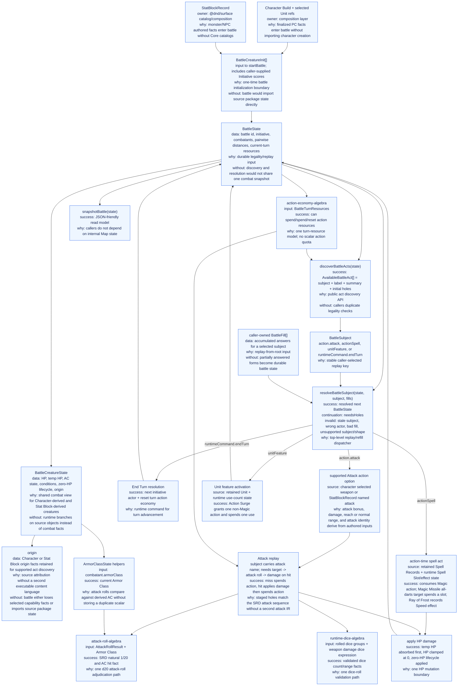
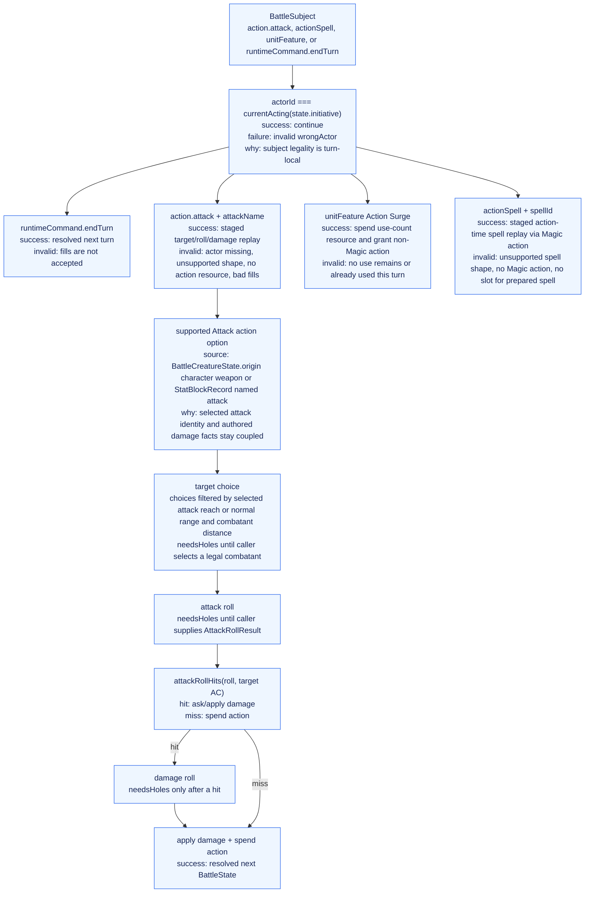

# Battle Runtime Architecture Graph

This is a data-flow map of the `@dnd/battle-runtime` reducer. It owns the
battle protocol for package callers: initialize combatants, discover battle
subjects, replay caller fills, resolve state transitions, and expose snapshots.

The promoted `@dnd/battle-runtime` is the active semantic authority for new
Unit/StatBlock-backed battle behavior. The legacy Correction graph, old root
`battle.qnt`, and Core battle MBT remain useful breadth/proof source material
until BA reconciliation classifies or restores them.

## System Graph

## Interpretation Graph

## Implemented Slice Boundaries

- Public subjects are `action.attack` with an authored `attackName`,
  `actionSpell` with a retained Spell Record id, `unitFeature` with a
  retained Unit id, and `runtimeCommand.endTurn`.
- Fills are caller/session state, not durable `BattleState`.
- Initiative scores are caller-supplied in `BattleCreatureInit`; this runtime
  orders turns from those scores but does not derive them from Stat Blocks.
- Attack replay uses target, attack-roll, and on-hit damage holes. Target
  choices are filtered from the selected attack's melee reach or normal range
  and the battle's pairwise combatant distances.
- Stat Block-derived creatures can be initialized, damaged, and use supported
  named attacks derived from `StatBlockRecord.actions.attacks`.
- Character-derived attacks come from a supported weapon Attack action option
  assembled at the composition boundary.
- Character-derived Action Surge comes from a retained Unit plus
  runtime use-count state. It grants a Unit-sourced action resource carrying
  the authored non-Magic restriction.
- Character-derived Wizard action-time spell acts come from retained Spell Records
  plus runtime Spell Slot and active-effect state. Prepared level-1 spells spend
  slots; cantrips do not. `magic_missile` is narrowed by a support gate to all
  repeated darts at one target. `ray_of_frost` requires both its Cold damage and
  Speed-reduction rider before discovery.
- Stat Block damage vulnerabilities, resistances, and immunities are read from
  the retained `StatBlockRecord` at the HP mutation boundary.
- Unsupported Stat Block attack branches such as Multiattack and unsupported
  conditional on-hit riders are filtered by support gates and are not copied
  into MCP state.
- Bonus-action availability can be represented in turn resources, but no
  bonus-action subject is exposed yet.
- The package-local QNT slice constrains this implemented subset. Old
  `battle.qnt` remains broad legacy proof/reference material until
  reconciliation, not the target for new promoted behavior.

## Relationship To Surface Runtime Correction

`packages/surface-runtime-correction/ARCHITECTURE_GRAPH.md` documents a broader
Correction reducer: Unit subjects, cantrip discovery, save-gate effects,
healing, extra-action grants, spell-slot/use-count gates, and other Unit
activation machinery. Those concepts are source material for future battle
runtime width/restoration, not evidence that legacy Correction or Core remains
canonical for promoted battle behavior.
