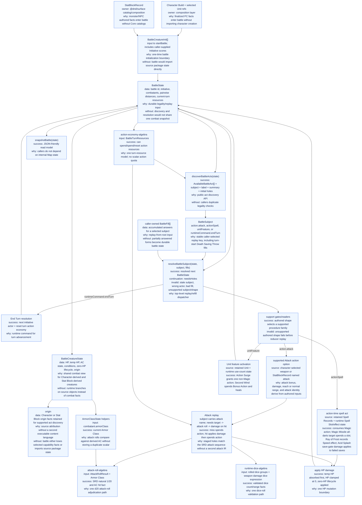
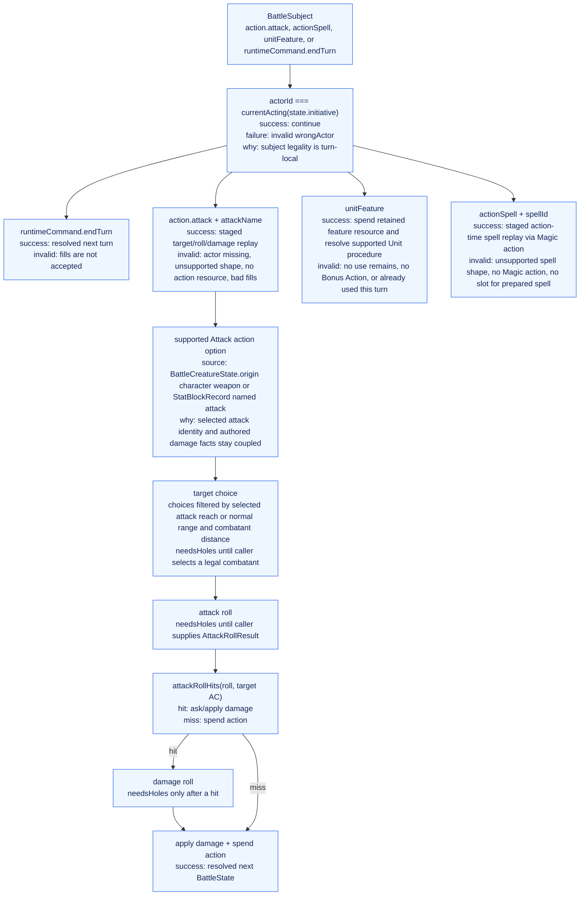

# Battle Runtime Architecture Graph

This is a data-flow map of the `@dnd/battle-runtime` reducer. It owns the
battle protocol for package callers: initialize combatants, discover battle
subjects, replay caller fills, resolve state transitions, and expose snapshots.

The promoted `@dnd/battle-runtime` is the active semantic authority for new
Unit/StatBlock-backed battle behavior. `battle-runtime.qnt` is its canonical
package-local spec. The legacy Correction graph, old root `battle.qnt`, and Core
battle MBT remain useful breadth/proof source material, not active promoted
runtime authorities.

The promoted MBT strategy is selective. Shared reducer algebras remain covered
by modular MBT, broad Surface/Unit/StatBlock catalog coverage defaults to
table-driven contract tests, and integrated battle-runtime MBT is reserved for
high-risk public reducer verticals. Surface projection MBT is a separate
decision. The first selected integrated candidate is Fighter weapon Attack
against a Skeleton Stat Block target through `discoverBattleActs`,
`resolveBattleSubject`, and `snapshotBattle`.

Reducer extension follows SRD procedure families, not authored names. Surface
records and retained origin data select supported procedures; support gates
reject unsupported authored shapes before reducer replay. Add reducer state or a
new `BattleSubject` only for a reusable procedure family such as a timing
window, resource protocol, target/save flow, interrupt/Reaction flow, persistent
effect, movement procedure, or other durable transition. Do not add one branch
per Unit, spell, feature, monster action, or slug, and do not reintroduce
projected executable vocabulary.

## System Graph

## Interpretation Graph

## Implemented Slice Boundaries

- Public subjects are `action.attack` with an authored `attackName`,
  `actionSpell` with a retained Spell Record id, `unitFeature` with a
  retained Unit id, and `runtimeCommand.endTurn`. They select reusable runtime
  procedures; they are not a projected executable taxonomy and are not one
  reducer branch per authored slug.
- Fills are caller/session state, not durable `BattleState`.
- Reaction decisions are durable state transitions. A `needsHoles` result may
  return a `BattleState` with an `interruptStack`; MCP and other callers must
  store that state before filling the `reactionDecision` hole or any holes for
  the selected reaction procedure. The frame carries its own interrupted
  continuation so callers do not manually resume attacks, spells, saves, or
  after-damage procedures.
- Initiative scores are caller-supplied in `BattleCreatureInit`; this runtime
  orders turns from those scores but does not derive them from Stat Blocks.
- Attack replay uses target, attack-roll, and on-hit damage holes. Target
  choices are filtered from the selected attack's melee reach or normal range
  and the battle's pairwise combatant distances.
- Stat Block-derived creatures can be initialized, damaged, and use supported
  named attacks derived from `StatBlockRecord.actions.attacks`.
- Character-derived attacks come from a supported weapon Attack action option
  assembled at the composition boundary.
- Character-derived Action Surge comes from a retained Unit admitted by the
  shared Action Surge support parser plus runtime use-count state. It grants a
  Unit-sourced action resource carrying the authored non-Magic restriction.
- Character-derived Second Wind comes from a retained Unit admitted by the
  support parser for direct self-healing Bonus Action features. It asks for the
  healing roll, spends the turn Bonus Action and retained use-count resource,
  and applies HP healing through the battle HP boundary.
- Character-derived Wizard action-time spell acts come from retained Spell Records
  plus runtime Spell Slot and active-effect state. Prepared level-1 spells spend
  slots; cantrips do not. `magic_missile` is narrowed by a support gate to all
  repeated darts at one target. `ray_of_frost` requires both its Cold damage and
  Speed-reduction rider before discovery. Save-gate damage cantrips such as
  `acid_splash` use a Saving Throw outcome hole that selects in-range targets;
  damage is requested and applied only for failed outcomes.
- Stat Block damage vulnerabilities, resistances, and immunities are read from
  the retained `StatBlockRecord` at the HP mutation boundary.
- Unsupported Stat Block attack branches such as Multiattack and unsupported
  conditional on-hit riders are filtered by support gates and are not copied
  into MCP state.
- New authored abilities are data-only when they fit these implemented
  procedure families. Widen readers or support gates when the authored shape is
  legal but unsupported. Add reducer state or QNT/MBT behavior only for a
  reusable SRD procedure family, not for catalog breadth.
- Bonus-action availability is represented in turn resources. Second Wind is
  the first promoted bonus-action Unit feature subject; broader bonus-action
  spell, monster, and generic subjects remain future width.
- The package-local `battle-runtime.qnt` spec constrains this implemented
  subset. Old root `battle.qnt` remains broad legacy/Core proof and restore
  source material, not the target for new promoted behavior.
- The first integrated promoted MBT is
  `src/battle-runtime.mbt.test.ts` plus `battle-runtime.mbt.qnt`. It targets the
  public weapon Attack reducer path against Skeleton, is intentionally narrower
  than the old Core MBT, and does not require MBT for every authored Unit or
  Stat Block.

## Relationship To Surface Runtime Correction

`packages/surface-runtime-correction/ARCHITECTURE_GRAPH.md` documents a broader
Correction reducer: Unit subjects, cantrip discovery, save-gate effects,
healing, extra-action grants, spell-slot/use-count gates, and other Unit
activation machinery. Those concepts are source material for future battle
runtime width/restoration, not evidence that legacy Correction or Core remains
canonical for promoted battle behavior.
