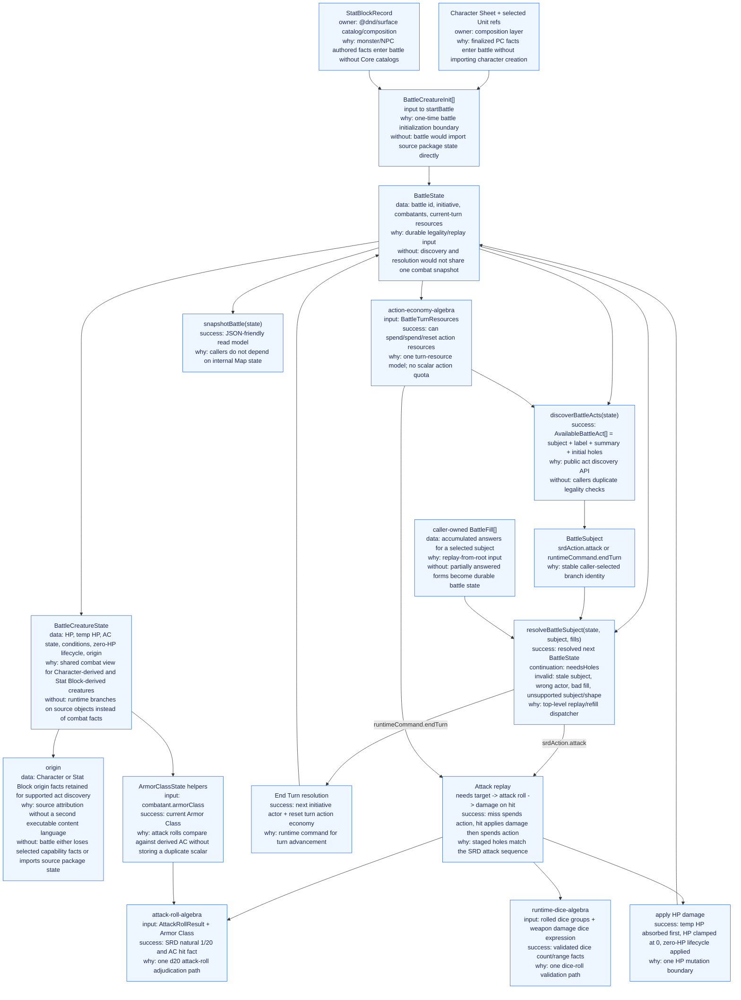
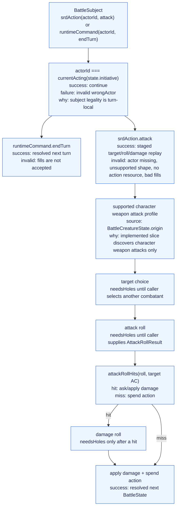

# Battle Runtime Architecture Graph

This is a data-flow map of the `@dnd/battle-runtime` reducer. It owns the
battle protocol for package callers: initialize combatants, discover battle
subjects, replay caller fills, resolve state transitions, and expose snapshots.

The legacy Correction graph remains useful source material for future Unit
activation work, but this graph is the package-owned map for battle runtime
behavior.

## System Graph

## Interpretation Graph

## Implemented Slice Boundaries

- Public subjects are `srdAction.attack` and `runtimeCommand.endTurn`.
- Fills are caller/session state, not durable `BattleState`.
- Attack replay uses target, attack-roll, and on-hit damage holes.
- Stat Block-derived creatures can be initialized and damaged, but Stat Block
  attack actions are not implemented yet.
- Character-derived attacks come from a supported weapon attack profile
  assembled at the composition boundary.
- Bonus-action availability can be represented in turn resources, but no
  bonus-action subject is exposed yet.
- The package-local QNT slice constrains this implemented subset; `battle.qnt`
  remains the broad combat authority until reconciliation.

## Relationship To Surface Runtime Correction

`packages/surface-runtime-correction/ARCHITECTURE_GRAPH.md` documents a broader
Correction reducer: Unit subjects, cantrip discovery, save-gate effects,
healing, extra-action grants, spell-slot/use-count gates, and other Unit
activation machinery. Those concepts are source material for future battle
runtime growth, not current `@dnd/battle-runtime` architecture.
