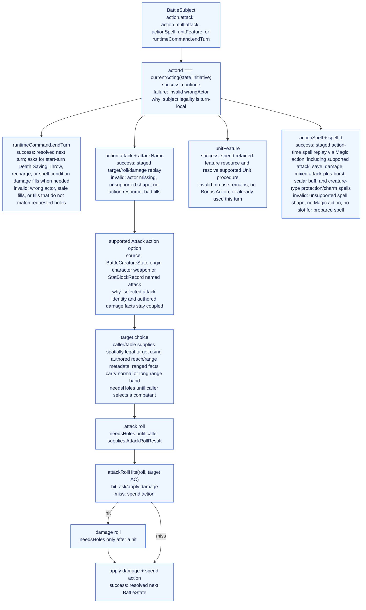

# Battle Runtime Architecture Graph

This is a data-flow map of the `@dnd/battle-runtime` reducer. It owns the
battle protocol for package callers: initialize combatants, discover battle
subjects, replay caller fills, resolve state transitions, and expose snapshots.

`@dnd/battle-runtime` is the semantic authority for Unit/StatBlock-backed battle
behavior. `battle-runtime.qnt` is its canonical package-local integration spec:
it owns BattleState projection, holes/replay, interrupt windows, effect cleanup
hooks, and compatibility wrappers. Generic SRD procedure semantics that are not
specific to the reducer protocol should live in shared rule-core QNT algebras
and be projected into the package-local spec.

The promoted MBT strategy is selective. MBT proves reducer facts after Surface
decode/projection; it must not enumerate all Surface-authored content multiplied
by all battle states. Shared reducer algebras remain covered by modular MBT,
broad Surface/Unit/StatBlock catalog coverage defaults to table-driven contract
tests, and integrated battle-runtime MBT is reserved for small semantic
algebras and selected high-risk public reducer verticals. The first selected
integrated candidate is Fighter weapon Attack against a Skeleton Stat Block
target through `discoverBattleActs`, `resolveBattleSubject`, and
`snapshotBattle`.

Reducer extension follows SRD procedure families, not authored names. Surface
records and retained origin data select supported procedures; support gates
reject unsupported authored shapes before reducer replay. Production support
gates must classify Surface mechanics, not hard-code concrete Unit ids, Spell
ids, Stat Block ids, feature names, monster names, or authored slugs as semantic
switches. Add reducer state or a new `BattleSubject` only for a reusable
procedure family such as a timing window, resource protocol, target/save flow,
interrupt/Reaction flow, persistent effect, movement procedure, or other durable
transition. Do not add one branch per Unit, spell, feature, monster action, or
slug, and do not reintroduce projected executable vocabulary.

## System Graph

```mermaid
flowchart TD
  CharacterBuild["Character Build + selected Unit refs<br/>owner: composition layer<br/>why: finalized PC facts enter battle without importing character creation"]
  StatBlock["StatBlockRecord<br/>owner: @dnd/surface catalog/composition<br/>why: monster/NPC authored facts enter battle without Core catalogs"]
  Init["BattleCreatureInit[]<br/>input to startBattle; includes caller-supplied Initiative scores<br/>why: one-time battle initialization boundary<br/>without: battle would import source package state directly"]
  State["BattleState<br/>data: battle id, initiative, combatants, current-turn resources<br/>why: durable non-spatial legality/replay input<br/>without: discovery and resolution would not share one combat snapshot"]
  Creature["BattleCreatureState<br/>data: HP, temp HP, AC state, conditions, zero-HP lifecycle, origin<br/>why: shared combat view for Character-derived and Stat Block-derived creatures<br/>without: runtime branches on source objects instead of combat facts"]
  Origin["origin<br/>data: Character or Stat Block origin facts retained for supported act discovery<br/>why: source attribution without a second executable content language<br/>without: battle either loses selected capability facts or imports source package state"]
  MonsterResources["StatBlockMutableResourceState<br/>source: mutable execution facts for authored StatBlockRecord controls<br/>data: remaining X/Day uses, unavailable Recharge parts, Legendary Action uses remaining<br/>why: monster resources are execution state, not Unit facts"]
  ArmorClass["ArmorClassState helpers<br/>input: combatant.armorClass<br/>success: current Armor Class<br/>why: attack rolls compare against derived AC without storing a duplicate scalar"]
  ActionEconomy["action-economy-algebra<br/>input: BattleTurnResources<br/>success: can spend/spend/reset action resources<br/>why: one turn-resource model; no scalar action quota"]
  AttackRoll["attack-roll-algebra<br/>input: AttackRollResult + Armor Class<br/>success: SRD natural 1/20 and AC hit fact<br/>why: one d20 attack-roll adjudication path"]
  RuntimeDice["runtime-dice-algebra<br/>input: rolled dice groups + weapon damage dice expression<br/>success: validated dice count/range facts<br/>why: one dice-roll validation path"]
  Discover["discoverBattleActs(state)<br/>success: AvailableBattleAct[] = subject + label + summary + initial holes<br/>why: public act discovery API<br/>without: callers duplicate legality checks"]
  Subject["BattleSubject<br/>action.attack, action.multiattack, generic combat actions, actionSpell, unitFeature, or runtimeCommand movement/turn/reaction commands<br/>why: stable caller-selected replay key, including turn-start Death Saving Throw fills"]
  FillSession["caller-owned BattleFill[]<br/>data: accumulated answers for a selected subject<br/>why: replay-from-root input<br/>without: partially answered forms become durable battle state"]
  Resolve["resolveBattleSubject(state, subject, fills)<br/>success: resolved next BattleState<br/>continuation: needsHoles<br/>invalid: stale subject, wrong actor, bad fill, unsupported subject/shape<br/>why: top-level replay/refill dispatcher"]
  EndTurn["End Turn resolution<br/>success: next initiative actor + reset turn action economy<br/>why: runtime command for turn advancement"]
  Support["support gates/readers<br/>success: authored shape selects a supported procedure family<br/>invalid: unsupported authored shape fails before reducer replay"]
  AttackOption["supported Attack action option<br/>source: character selected weapon or StatBlockRecord named attack<br/>why: attack bonus, damage, reach, normal/long range, and attack identity derive from authored inputs"]
  MonsterControl["monster control resources<br/>success: spend X/Day or Recharge; discover Legendary Actions after another turn; refresh Legendary Actions and recharge rolls at start turn; pending Multiattack dispatches expose matching dispatch attacks, Movement, and End Turn<br/>why: reusable Stat Block limited-use protocol"]
  UnitFeature["Unit feature activation/passive support<br/>source: retained Unit + runtime use-count, turn-resource, or support-profile state<br/>success: Action Surge grants one non-Magic action; Second Wind spends Bonus Action and heals; Defense admits a passive Armor Class bonus profile; Savage Attacker chooses weapon damage dice"]
  SpellAct["spell act<br/>source: retained Spell Records + runtime Spell Slot/effect state<br/>success: action-time spells consume Magic action; Magic Missile allocates darts and spends the selected slot; direct healing spells restore selected targets, including Mass Cure Wounds point-origin Sphere choices; Shield and Hellish Rebuke spend Reaction + slot from trigger windows; Ray of Frost records Speed effect; Shocking Grasp denies Opportunity Attacks; True Strike hosts proficient weapon attack replay with spellcasting ability and Radiant cantrip damage; Guiding Bolt, Ray of Sickness, and Vicious Mockery record source-owned timed attack-roll/condition riders; Animal Friendship, Ensnaring Strike, and Protection from Evil and Good record source-owned condition/protection effects; Searing Smite records source-owned timed burn damage plus Constitution save-to-end; Poison Spray, Starry Wisp, damage-only Chill Touch, Sacred Flame, Acid Splash, and Inflict Wounds apply admitted spell damage; creature-or-object spell attacks consume caller-supplied object range, Armor Class, and damage disposition facts"]
  AttackReplay["Attack replay<br/>subject carries attack name; needs target -> attack roll -> damage on hit<br/>success: miss spends action, hit applies damage then spends action<br/>why: staged holes match the SRD attack sequence without a second attack IR"]
  Damage["apply HP damage<br/>success: temp HP absorbed first, HP clamped at 0, zero-HP lifecycle or melee Knock Out applied<br/>why: one HP mutation boundary"]
  Hidden["Hidden state<br/>source: Hide/Search procedure<br/>data: discovery DC<br/>why: battle-owned execution fact for Invisible projection, Search, and reveal triggers"]
  Snapshot["snapshotBattle(state)<br/>success: JSON-friendly read model<br/>why: callers do not depend on internal Map state"]

  CharacterBuild --> Init
  StatBlock --> Init
  Init --> State --> Creature
  Creature --> Origin
  Origin --> MonsterResources
  Creature --> ArmorClass
  State --> ActionEconomy
  State --> Discover --> Subject
  State --> Snapshot
  State --> Resolve
  Subject --> Resolve
  FillSession --> Resolve
  Resolve -->|runtimeCommand.endTurn| EndTurn --> State
  Resolve --> Support
  Support -->|action.attack| AttackOption --> AttackReplay
  MonsterResources --> MonsterControl --> AttackReplay
  Support -->|unitFeature| UnitFeature --> State
  Support -->|actionSpell| SpellAct --> Damage
  AttackReplay --> AttackRoll
  AttackReplay --> RuntimeDice
  AttackReplay --> Damage --> State
  Resolve -->|action.hide / action.search / bonusAction.hide| Hidden --> State
  ArmorClass --> AttackRoll
  ActionEconomy --> Discover
  ActionEconomy --> AttackReplay

  classDef implemented fill:#eef6ff,stroke:#2563eb,color:#172554;
  class CharacterBuild,StatBlock,Init,State,Creature,Origin,MonsterResources,ArmorClass,ActionEconomy,AttackRoll,RuntimeDice,Discover,Subject,FillSession,Resolve,EndTurn,Support,AttackOption,MonsterControl,AttackReplay,UnitFeature,SpellAct,Damage,Snapshot implemented;
```

## Interpretation Graph

## Implemented Slice Boundaries

- Public subjects include `action.attack` with an authored `attackName`,
  `action.multiattack`, `actionSpell` with a retained Spell Record id,
  `unitFeature` with a retained Unit id, and runtime commands such as
  `runtimeCommand.endTurn`. They select reusable runtime procedures; they are
  not a projected executable taxonomy and are not one reducer branch per
  authored slug.
- Fills are caller/session state, not durable `BattleState`.
- Reaction decisions are durable state transitions. A `needsHoles` result may
  return a `BattleState` with an `interruptStack`; MCP and other callers must
  store that state before filling the `reactionDecision` hole or any holes for
  the selected reaction procedure. The frame carries its own interrupted
  continuation so callers do not manually resume attacks, spells, saves, or
  after-damage procedures.
- Initiative scores are caller-supplied in `BattleCreatureInit`; this runtime
  orders turns from those scores but does not derive them from Stat Blocks.
- Attack replay uses target, attack-roll, and on-hit damage holes. Authored
  reach/range remains content metadata; the caller/table supplies spatially
  legal targets and the runtime does not store pairwise distances. Ranged target
  facts carry a single selected range band; long range feeds the shared
  Advantage/Disadvantage roll-mode path. Ensnaring Strike helper escapes use a
  table-supplied actor-within-restrained-target-reach fact on the escape check.
- Hide/Search replay is gated by battle-owned Hide prerequisite state: the GM
  adjudicated that the actor is Heavily Obscured or behind enough cover and out
  of enemy line of sight. Successful Hide then records one executable fact, the
  Hide check total as the Search DC. Snapshots project Invisible from that
  state. Search, making an attack roll, and casting a spell with a Verbal
  component clear it.
- Stat Block-derived creatures can be initialized, damaged, and use supported
  named attacks derived from authored `StatBlockRecord` action sections.
- Stat Block-derived control resources are initialized from
  `StatBlockRecord` limited-use and Legendary Action fields. Mutable X/Day,
  Recharge, and Legendary Action execution facts live in
  `StatBlockMutableResourceState`; authored limits and thresholds are derived
  from the retained `StatBlockRecord` when needed. No monster control resource
  is inferred from UnitRecord facts.
- Character-derived attacks come from a supported weapon Attack action option
  assembled at the composition boundary.
- Supported melee attack damage can carry the attacker's Knock Out choice into
  the HP mutation boundary. The choice leaves the target at 1 HP with
  Unconscious and explicit Knocked Out state when the damage would otherwise
  reduce positive HP to 0 without Massive Damage; it is not a zero-HP lifecycle
  state.
- Character-derived Action Surge comes from a retained Unit admitted by the
  shared Action Surge support parser plus runtime use-count state. It grants a
  Unit-sourced action resource carrying the authored non-Magic restriction.
- Character-derived Second Wind comes from a retained Unit admitted by the
  support parser for direct self-healing Bonus Action features. It asks for the
  healing roll, spends the turn Bonus Action and retained use-count resource,
  and applies HP healing through the battle HP boundary.
- Character-derived Wizard action-time spell acts come from retained Spell Records
  plus runtime Spell Slot and active-effect state. Prepared spells spend the
  selected slot; cantrips do not. `magic_missile` derives dart count from slot
  level and uses a spell target allocation fill for one or several table-legal
  targets. `ray_of_frost` requires both its Cold damage and Speed-reduction
  rider before discovery. `shocking_grasp`, `guiding_bolt`, and
  `ray_of_sickness` use the same spell attack damage path with typed
  source-owned post-damage effects for Opportunity Attack denial, next attack
  roll Advantage against the target, and Poisoned. Save-gate damage spells
  either ask for one creature
  target first, as with `sacred_flame` and `inflict_wounds`, or use a
  table-supplied affected-target outcome hole for admitted areas such as
  `acid_splash`, `burning_hands`, and `color_spray`; damage is requested only
  for targets whose Saving Throw outcome and admitted replacement riders still
  produce damage. `burning_hands` is the self-origin Cone save-for-half branch;
  `color_spray` is the self-origin Cone save-gated condition branch. The table
  supplies affected targets rather than the reducer deriving grid geometry.
  `faerie_fire` uses a non-excluding point-origin Cube affected-target outcome
  hole and stores concentration-owned sight-gated attack-roll Advantage on
  failed-save creatures; object outline, light, and Invisible benefit denial
  remain outside this runtime subset.
  `chromatic_orb` is a separate chained spell attack profile with one
  cast-local damage-type choice, step-scoped target/attack/damage holes,
  duplicate-d8 leap gating, target uniqueness, and previous-target range facts.
  `vicious_mockery` adds an attack-roll-only Disadvantage effect on failed
  saves.
  `sleep` has a separate admission profile for caller-supplied point-origin
  5-foot-radius Sphere targets. It asks for Wisdom Saving Throw outcomes only
  for selected creatures that are not automatic successes, derives
  Exhaustion-immunity automatic success from retained Stat Block condition
  immunities, rejects non-sleeper facts until executable support lands, and
  spends the Magic action plus Spell Slot without applying the pending
  repeat-save lifecycle.
  `animal_friendship` and `charm_person` add the same save-gated condition
  procedure for Beast-target and Humanoid-target Charmed effects. Charm Person
  annotates hostile targets' Wisdom saves with Advantage, and both Charmed
  effects end when the caster or an ally damages the target.
  `protection_from_evil_and_good` adds a concentration protection active effect
  whose attacker creature-type filter feeds attack-roll Disadvantage;
  possession, condition-immunity, and already-applied-effect save-Advantage
  clauses stay unsupported.
- Stat Block damage vulnerabilities, resistances, and immunities are read from
  the retained `StatBlockRecord` at the HP mutation boundary.
- Optional attack damage riders are retained feature profiles, not named
  reducer branches. The Attack replay exposes eligible rider choices on the
  damage hole and stores once-per-turn rider use in turn resources; Sneak Attack
  is the first admitted profile.
- Optional weapon damage dice choices are retained Unit support profiles, not
  named reducer branches. The Attack replay exposes eligible choices on weapon
  hit damage holes and stores once-per-turn choice use in turn resources; Savage
  Attacker is the first admitted profile.
- Save damage replacement riders are retained feature profiles, not named
  reducer branches. Save-gate damage replay derives the final full, half, or no
  damage result from the single Saving Throw outcome and the admitted profile.
- Supported Stat Block Multiattack entries spend the Attack action, consume the
  first listed attack dispatch, and grant remaining named dispatch attacks from
  the Actions section. While any dispatch remains pending, discovery and replay
  allow only matching dispatch attacks, Movement, and End Turn, which closes
  unspent dispatches. Unsupported conditional on-hit riders are filtered by
  support gates and are not copied into MCP state.
- New authored abilities are data-only when they fit these implemented
  procedure families. Widen readers or support gates when the authored shape is
  legal but unsupported. Add reducer state or QNT/MBT behavior only for a
  reusable SRD procedure family, not for catalog breadth.
- Bonus-action availability is represented in turn resources. Off-Hand Attack,
  prepared Bonus Action healing spells, Second Wind, support-profile-backed
  Cunning Action Dash/Disengage/Hide, and admitted Stat Block Bonus Action
  options spend the same Bonus Action resource while reusing package-owned
  procedures. Slot-spent
  spell procedures also share a turn-resource fact for the SRD one-Spell-Slot
  per-turn rule. Divine Smite is admitted from an already-hit melee weapon or
  Unarmed Strike window and threads its added damage through the interrupted
  attack continuation. Ensnaring Strike is admitted from an already-hit weapon
  attack window, gates Restrained behind the target Strength save, records
  spell-owned turn-start Piercing damage, and uses the shared spell-restraint
  escape action for the target or a table-positioned helper. Searing Smite is
  admitted from an already-hit melee weapon or Unarmed Strike window, threads
  immediate Fire damage through the interrupted attack continuation, records
  timed turn-start Fire damage, and ends that spell effect on the target's
  successful Constitution save. True Strike is admitted from an existing
  character proficient weapon attack option, consumes the Magic action, and
  reuses the attack replay lane with spellcasting ability replacement plus
  Radiant cantrip-scaling damage. Off-Hand Attack
  uses the shared attack host Reaction windows before the Bonus Action resource
  is committed for damage replay. Broader generic Bonus Action subjects remain
  future width.
- The package-local `battle-runtime.qnt` spec constrains this implemented
  subset. Old root `battle.qnt` remains broad legacy/Core proof and restore
  source material, not the target for new runtime behavior.
- The first integrated promoted MBT is
  `src/battle-runtime.mbt.test.ts` plus `battle-runtime.mbt.qnt`. It targets the
  public weapon Attack reducer path against Skeleton and does not require MBT
  for every authored Unit or Stat Block.
- Focused rule-core MBT lanes use one small `.mbt.qnt` spec and one matching
  driver per QCORE family. They project scalar QCORE-observable facts and call
  production reducer entrypoints instead of duplicating reducer logic. The first
  focused lane is `rule-core-movement.mbt.qnt` plus
  `src/rule-core-movement.mbt.test.ts`, covering QCORE7 Movement, Dash,
  Disengage, Stand from Prone, Grapple/Escape/Release, and decline-only
  Opportunity Attack resume against `resolveBattleSubject` and
  `resolveBattleReaction`.

## Relationship To Deleted Correction

Deleted `packages/surface-runtime-correction` material represented earlier
Surface/Unit reducer mechanics. Its remaining facts are preserved here as
restoration pressure, not as active package architecture:

- generic Unit activation for `spell | class_feature` activations with exactly
  one `attack_roll`, `save_gate`, or `direct` phase;
- generic UnitRecord resolution for cantrip attack/save-gate effects, direct
  `heal_hp` with action cost and target-list bounds, and `grant_extra_action`;
- spell-slot and use-count gates;
- generic Surface attachment projection and damage-type hole projection,
  including temporary attachment and damage-type reference fills;
- broader save-gate spell support outside the admitted one-creature,
  point-origin Sphere, self-origin Cone, and primary-target-origin Emanation
  damage profiles.

Future restorations belong in `@dnd/battle-runtime` implementation,
package-local deterministic tests, and `battle-runtime.qnt`. Restore SRD
procedure families through battle subjects, support gates, battle-owned
holes/fills, reducer state, and package-local specs. Do not revive Correction as
the promoted owner, keep a parallel Correction reducer, or reintroduce projected
executable vocabulary.
