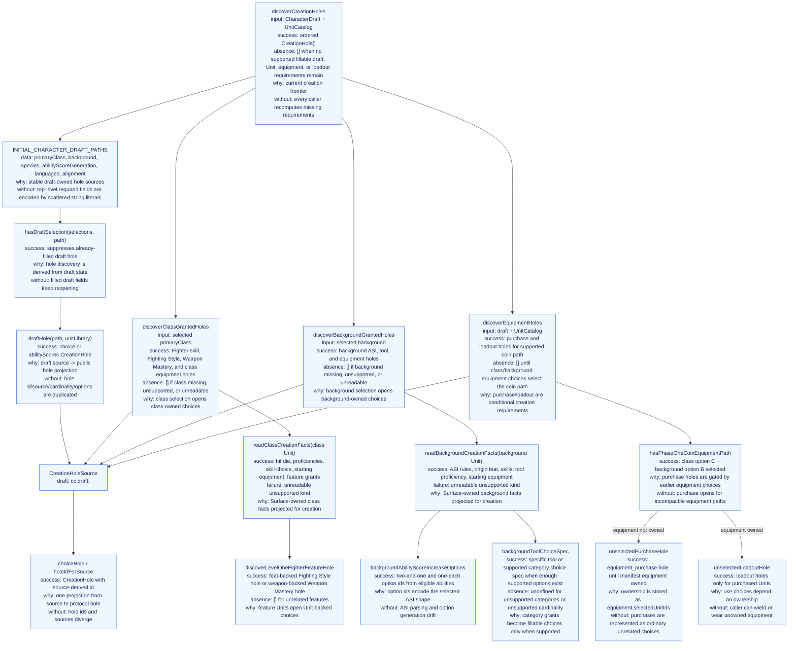

# Character Creation Runtime Architecture

This is a data-flow map of the character-creation reducer architecture. Return
labels name the concrete success, absence, continuation, and invalid payloads.
Each major node also states what would happen if it did not exist.

This is intentionally a representative graph, not a full Surface vocabulary
mirror and not a list of every creation case. The Orc Soldier Fighter path is
shown where it reinforces the architecture: authored Unit records open draft and
Unit-backed holes, fills are applied atomically, and a complete legal draft
finalizes into a Character Sheet. Add branches when they explain a runtime
boundary or implemented vertical, not just because another SRD option exists.

## System Graph

```mermaid
flowchart TD
  Content["Authored Unit JSON<br/>input: packages/surface/content/*.json<br/>output: raw Unit JSON<br/>why: SRD-authored creation choices<br/>without: runtime has no legal class/background/species/equipment records"]
  Decode["decodeUnitRecordSync(raw)<br/>input: parsed JSON<br/>success: UnitRecord<br/>failure: schema/decode throw<br/>why: parse at Surface boundary<br/>without: invalid authored shape enters creation runtime"]
  Collection["srdUnitCollection<br/>data: SRD 5.2.1 Unit records with collection-level provenance<br/>why: SRD-only creation content boundary<br/>without: the SRD collection can contain non-SRD records"]
  Catalog["buildUnitCatalog(collections)<br/>success: provenance-erased UnitCatalog<br/>failure: duplicate id, malformed SRD collection, or unknown starting-equipment refs<br/>why: one Unit lookup/list boundary<br/>without: hole discovery duplicates content lookup and collection checks"]

  Create["createCharacterDraft({ unitLibrary, draftId? })<br/>success: revision-0 CharacterDraft<br/>note: unitLibrary is accepted by the public protocol but not read by current implementation<br/>why: canonical empty draft constructor<br/>without: callers invent partial draft shapes"]
  Draft["CharacterDraft<br/>data: draftId, selections, revision<br/>why: mutable session-owned creation state<br/>without: holes/fills have no durable subject"]
  Session["application/session store<br/>stores: CharacterDraft and finalized CharacterSheet<br/>why: persistence belongs outside the reducer<br/>without: runtime package would own application session state"]

  Discover["discoverCreationHoles({ draft, unitLibrary })<br/>success: CreationHole[]<br/>absence: [] when no supported fillable requirements remain<br/>why: one source for current fillable requirements<br/>without: callers/finalization drift on missing choices"]
  InitialHoles["initial draft holes<br/>opens: class, background, species, ability scores, languages, alignment<br/>example options: Fighter, Soldier, Orc<br/>why: top-level SRD creation requirements<br/>without: required draft structure is implicit in callers"]
  UnitGrantedHoles["Unit-granted holes<br/>opens after selections: Fighter skills/style/mastery/equipment; Soldier ASI/tool/equipment<br/>why: authored Units can require more creation choices<br/>without: selected content cannot drive follow-up requirements"]
  EquipmentHoles["equipment and loadout holes<br/>opens after supported coin-equipment path<br/>example: buy Chain Mail, Shield, Longsword, then choose worn/wielded loadout<br/>why: loadout depends on owned equipment, not on an independent preset<br/>without: equipment ownership and use diverge"]
  Readers["Surface creation readers<br/>readClassCreationFacts / readBackgroundCreationFacts / readSpeciesCreationFacts<br/>success: creation-facing facts<br/>failure: unreadable unsupported kind<br/>why: project authored Units without importing Core or execution vocabulary<br/>without: creation runtime reads broad Unit variants directly everywhere"]

  Fill["fillCreationHoles({ draft, fills, expectedRevision, unitLibrary })<br/>accepted: new draft + rediscovered holes + finalization<br/>rejected: original draft + original holes + issues + finalization<br/>why: atomic batch fill API<br/>without: partial invalid batches corrupt draft state"]
  CallerFills["caller-submitted CreationFill[]<br/>input: answers for discovered hole ids + expected draft revision<br/>why: public refill protocol<br/>without: discovery cannot be driven forward"]
  CurrentFrontier["internal current-frontier rediscovery<br/>calls discoverCreationHoles(input draft) before validation<br/>why: fill does not trust caller's previous discovery result<br/>without: stale discovered holes can mutate the draft"]
  Issues["creationFillIssues<br/>checks: staleRevision, duplicateFill, unknownHole, wrongFillKind, invalidChoice, tooFew/tooMany, unsupportedChoice<br/>why: diagnose the whole batch before mutation<br/>without: mutation and validation order becomes caller-visible"]
  SupportGate["package-private support gates<br/>example: only the Orc Soldier Fighter manifest options are executable in this slice<br/>why: separate valid SRD choices from supported runtime choices<br/>without: valid-but-unsupported choices can masquerade as complete runtime support"]
  Apply["applyCreationFills<br/>success: updated selections + revision + 1<br/>precondition: batch has no issues<br/>why: one mutation boundary for draft selections<br/>without: draft update logic scatters across hole families"]
  Rediscover["rediscover holes after accepted batch<br/>success: next CreationHole[]<br/>why: later holes depend on earlier selections<br/>without: callers reuse stale hole sets"]
  RefillLoop["refill loop<br/>accepted result returns next holes; caller submits another batch until finalization is ready<br/>why: creation is staged by derived holes, not by a fixed step sequence<br/>without: later Unit-backed holes are invisible or guessed by caller"]

  Finalize["finalizeCharacterDraft({ draft, unitLibrary })<br/>ready: CharacterSheet<br/>incomplete: open holes<br/>invalid: finalization issues<br/>why: single draft-to-sheet boundary<br/>without: consumers decide independently when a draft is usable"]
  Complete["finalizedSelections(draft)<br/>success: FinalizedCharacterSelections<br/>absence: undefined when required typed selections are missing<br/>why: narrow partial draft to complete selection type<br/>without: sheet building handles optional fields defensively"]
  Legality["finalizedSelectionIssues<br/>success: no issues for the supported manifest<br/>invalid: illegalFinalization issues<br/>why: complete does not automatically mean supported/legal<br/>without: contradictory complete drafts can finalize"]
  SheetBuild["buildCharacterSheet<br/>input: complete legal selections + Surface facts<br/>success: CharacterSheet with Unit refs, abilities, HP, proficiencies, features, resources, equipment/loadout<br/>why: one runtime projection from accepted draft and authored Units<br/>without: callers would rederive character facts"]
  Sheet["CharacterSheet<br/>finalized player-character boundary<br/>not: Unit, Stat Block, or execution state<br/>why: character creation owns sheet facts and exports a stable boundary<br/>without: runtime initialization can become the character-creation source of truth"]

  Content --> Decode --> Collection --> Catalog
  Catalog -. protocol input .-> Create
  Create --> Draft --> Session
  Draft --> Discover
  Catalog --> Discover
  Discover --> InitialHoles
  Discover --> Readers --> UnitGrantedHoles
  Discover --> EquipmentHoles
  Readers --> SheetBuild

  Discover --> CallerFills --> Fill
  Draft --> Fill
  Catalog --> Fill
  Fill --> CurrentFrontier --> Issues
  SupportGate --> Issues
  CurrentFrontier -. uses .-> Discover
  Issues -->|no issues| Apply --> Rediscover --> RefillLoop --> CallerFills
  Issues -->|issues| Rejected["return rejected<br/>draft unchanged"]
  Fill --> Finalize

  Draft --> Finalize
  Catalog --> Finalize
  Finalize --> Discover
  Finalize --> Complete
  Complete -->|missing selections| InvalidFinalization["return invalid<br/>illegalFinalization"]
  Complete -->|complete selections| Legality --> SheetBuild --> Sheet --> Session

  classDef invalid fill:#fff7ed,stroke:#f97316,color:#7c2d12;
  classDef implemented fill:#eef6ff,stroke:#2563eb,color:#172554;
  class Rejected,InvalidFinalization invalid;
  class Content,Decode,Collection,Catalog,Create,Draft,Session,Discover,InitialHoles,UnitGrantedHoles,EquipmentHoles,Readers,Fill,CallerFills,CurrentFrontier,Issues,SupportGate,Apply,Rediscover,RefillLoop,Finalize,Complete,Legality,SheetBuild,Sheet implemented;
```

## Hole Discovery Graph

## Fill And Finalization Graph

```mermaid
flowchart TD
  Fill["fillCreationHoles<br/>input: draft, fills, expectedRevision, unitLibrary<br/>returns: accepted or rejected CreationBatchFillResult"]
  PriorDiscovery["prior caller discovery<br/>output: CreationHole[] shown to the caller<br/>why: caller learns which holes can be answered<br/>without: caller guesses hole ids and option payloads"]
  SubmittedFills["submitted CreationFill[]<br/>input: answers for previously discovered holes<br/>why: caller attempts to advance the draft<br/>without: reducer has no refill input"]
  CurrentHoles["current-frontier rediscovery<br/>calls discoverCreationHoles(draft) inside fillCreationHoles<br/>success: current CreationHole[]<br/>why: fills are validated against the draft as submitted now, not trusted prior discovery<br/>without: stale or forged fills can target inactive holes"]
  FinalizationBefore["finalizeCharacterDraft(draft)<br/>success: current finalization status for rejected result<br/>why: rejected batches report the unmodified draft status<br/>without: callers must make another request after rejection"]
  BatchIssue["revision diagnostic<br/>success: no batch issue when expectedRevision === draft.revision<br/>failure: staleRevision illegalBatch<br/>why: optimistic concurrency token<br/>without: concurrent stale caller writes silently overwrite"]
  Duplicate["duplicate-fill diagnostic<br/>success: one fill per hole per batch<br/>failure: duplicateFill<br/>why: one batch cannot answer one hole twice<br/>without: apply order determines semantics"]
  HoleLookup["hole lookup diagnostic<br/>success: matching current CreationHole<br/>failure: unknownHole<br/>why: only currently open holes can be filled<br/>without: old/future holes mutate the draft"]
  Kind["fill-kind diagnostic<br/>success: choice, abilityScores, or text matches hole kind<br/>failure: wrongFillKind<br/>why: parse the fill protocol before applying it<br/>without: mutation functions need defensive union checks"]
  ChoiceValidation["choice-fill diagnostics<br/>checks: cardinality, duplicate option ids, option exists, option is supported<br/>failure: invalidChoice, tooFewChoices, tooManyChoices, unsupportedChoice<br/>why: distinguish illegal SRD choice from valid-but-unsupported slice choice"]
  AbilityValidation["abilityScoreFillIssues<br/>checks: supported method + shared ability-score algebra<br/>failure: invalidChoice<br/>why: ability-score rules live in shared algebra<br/>without: creation duplicates Standard Array and Point Buy validation"]
  SupportGate["package-private support gates<br/>input: current hole + selected option ids<br/>success: supported or unrestricted choice<br/>failure: unsupportedChoice diagnostic<br/>why: valid SRD choices can still be outside this runtime slice"]
  Issues["CreationBatchFillIssue[] aggregate<br/>success path: []<br/>failure path: stale revision plus every diagnosable fill issue<br/>why: all-or-nothing acceptance decision without short-circuiting"]

  Rejected["rejected result<br/>draft: original draft<br/>holes: original holes<br/>issues: CreationBatchFillIssue[]<br/>finalization: status of original draft<br/>why: rejected batches are atomic"]
  Apply["applyCreationFills<br/>precondition: no issues<br/>success: CharacterDraftSelections updated by all fills<br/>why: mutation only runs after complete validation"]
  DraftApply["applyDraftFill<br/>updates: primary class + level-1 advancement, background, species, ability scores, languages, alignment<br/>why: draft-owned holes update typed draft fields"]
  UnitApply["applyUnitFill<br/>updates: background ASI, equipment selectedUnitIds, or CharacterChoiceSelection[]<br/>why: Unit-backed holes preserve their source and selected Unit refs"]
  Revision["revision + 1<br/>why: accepted batch advances optimistic concurrency token<br/>without: later stale writes cannot be detected"]
  Accepted["accepted result<br/>draft: new draft<br/>holes: rediscovered next holes<br/>finalization: status of new draft<br/>why: caller receives the next frontier immediately"]

  Finalize["finalizeCharacterDraft<br/>input: draft + UnitCatalog<br/>returns: ready, incomplete, or invalid"]
  OpenHoles["open holes check<br/>if holes remain: incomplete with holes<br/>why: finalization cannot skip required choices"]
  Narrow["finalizedSelections<br/>success: all required selections present<br/>absence: undefined when required selections are missing despite no open holes<br/>why: convert partial draft into complete selection type"]
  ManifestLegality["finalizedSelectionIssues<br/>checks: supported manifest values, valid ability scores, exact choices, exact owned equipment<br/>failure: illegalFinalization issues<br/>why: complete draft must still match executable support"]
  Build["buildCharacterSheet<br/>derives: Unit refs, final ability scores, HP/Hit Dice, proficiencies, features, resources, equipment loadout<br/>why: one projection from creation choices to character boundary"]
  Ready["ready result<br/>sheet: CharacterSheet<br/>why: finalized player-character handoff"]

  PriorDiscovery --> SubmittedFills --> Fill
  Fill --> CurrentHoles
  Fill --> FinalizationBefore
  CurrentHoles --> BatchIssue --> Issues
  CurrentHoles --> Duplicate --> Issues
  CurrentHoles --> HoleLookup --> Kind
  Kind --> ChoiceValidation --> Issues
  Kind --> AbilityValidation --> Issues
  SupportGate --> ChoiceValidation
  Issues -->|non-empty| Rejected
  FinalizationBefore --> Rejected
  Issues -->|empty| Apply
  Apply --> DraftApply --> Revision
  Apply --> UnitApply --> Revision
  Revision --> Accepted
  Accepted --> NextHoles["next-frontier rediscovery<br/>calls discoverCreationHoles(new draft)<br/>success: holes opened by the accepted selections<br/>why: accepted response gives the caller the next refill surface"]
  NextHoles --> Refill["caller refill loop<br/>submit another batch against returned draft revision<br/>continues until finalization is ready"]
  Refill --> SubmittedFills
  Accepted --> Finalize

  Finalize --> OpenHoles
  OpenHoles -->|holes remain| Incomplete["incomplete result"]
  OpenHoles -->|no holes| Narrow
  Narrow -->|selections missing| Invalid
  Narrow -->|selections present| ManifestLegality --> Build --> Ready
  ManifestLegality -->|issues| Invalid["invalid result"]

  classDef invalid fill:#fff7ed,stroke:#f97316,color:#7c2d12;
  classDef implemented fill:#eef6ff,stroke:#2563eb,color:#172554;
  class Rejected,Incomplete,Invalid invalid;
  class Fill,PriorDiscovery,SubmittedFills,CurrentHoles,FinalizationBefore,BatchIssue,Duplicate,HoleLookup,Kind,ChoiceValidation,AbilityValidation,SupportGate,Issues,Apply,DraftApply,UnitApply,Revision,Accepted,NextHoles,Refill,Finalize,OpenHoles,Narrow,ManifestLegality,Build,Ready implemented;
```

## Function Contracts

| Function or type              | Input                                         | Success / continuation payload                                                                 | Failure / absence payload                                                | Why                                                           | Without this                                                  |
| ----------------------------- | --------------------------------------------- | ---------------------------------------------------------------------------------------------- | ------------------------------------------------------------------------ | ------------------------------------------------------------- | ------------------------------------------------------------- |
| `UnitCatalog`                 | SRD Unit collections                          | Provenance-erased `getUnit`, `listUnits`, `requireUnit` over decoded `UnitRecord`s             | Catalog build issues                                                     | Single authored Unit lookup boundary                          | Creation code duplicates content lookup and collection checks |
| `CharacterDraft`              | n/a                                           | Draft identity, typed partial selections, revision                                             | n/a                                                                      | Durable mutable creation state                                | Holes and fills have no owned subject                         |
| `createCharacterDraft`        | `UnitLibrary`, optional `draftId`             | Revision-0 `CharacterDraft`                                                                    | n/a                                                                      | Canonical empty draft constructor                             | Callers invent incompatible partial drafts                    |
| `discoverCreationHoles`       | `CharacterDraft`, `UnitLibrary`               | Current `CreationHole[]`                                                                       | `[]` when no supported fillable requirements remain                      | Current fillable frontier                                     | Callers and finalization rediscover different holes           |
| `CreationHoleSource`          | n/a                                           | Draft source or Unit source                                                                    | n/a                                                                      | Semantic address for hole identity                            | Hole ids become detached protocol strings                     |
| `holeIdForSource`             | `CreationHoleSource`                          | `cc:draft:<path>` or `cc:unit:<unit id>:<choice key>`                                          | n/a                                                                      | One source-to-id projection                                   | Hole ids and sources drift                                    |
| `readClassCreationFacts`      | `UnitRecord`                                  | Class creation facts                                                                           | `unreadable` for unsupported kind                                        | Surface-owned projection for class choices                    | Runtime pattern-matches broad Unit shapes everywhere          |
| `readBackgroundCreationFacts` | `UnitRecord`                                  | Background creation facts                                                                      | `unreadable` for unsupported kind                                        | Surface-owned projection for background choices               | Runtime duplicates background field access                    |
| `readSpeciesCreationFacts`    | `UnitRecord`                                  | Species creation facts                                                                         | `unreadable` for unsupported kind                                        | Surface-owned projection for species facts                    | Sheet finalization reaches through broad Unit variants        |
| `fillCreationHoles`           | Draft, fills, expected revision, Unit library | `accepted` with new draft, rediscovered holes, finalization                                    | `rejected` with original draft, original holes, issues, finalization     | Atomic batch fill reducer                                     | Invalid batches can partially mutate state                    |
| `creationFillIssues`          | Batch input, current holes                    | `[]` when batch is fully acceptable                                                            | Batch/fill issues with real `fillIndex` where applicable                 | Diagnose before mutation                                      | Validation order becomes mutation order                       |
| `supportedHoleOptionIds`      | `CreationHole`                                | Supported option ids or unrestricted `undefined` for holes without a package-private narrowing | `[]` for unsupported Unit choice keys                                    | Separate SRD-valid options from implemented runtime support   | Valid-but-unsupported choices are accepted as executable      |
| `applyCreationFills`          | Draft, current holes, accepted fills          | New draft selections and `revision + 1`                                                        | Throws only if accepted-fill invariant is broken                         | One mutation boundary after validation                        | Every hole family owns its own mutation protocol              |
| `finalizeCharacterDraft`      | Draft, Unit library                           | `ready` with `CharacterSheet`                                                                  | `incomplete` with holes, or `invalid` with finalization issues           | Single draft-to-sheet boundary                                | Consumers decide independently when a draft is usable         |
| `finalizedSelections`         | `CharacterDraft`                              | `FinalizedCharacterSelections`                                                                 | `undefined` when required fields are missing                             | Narrows optional draft state before sheet projection          | Sheet building handles optional fields defensively            |
| `finalizedSelectionIssues`    | Complete selections, Unit library             | `[]` for legal supported manifest                                                              | `illegalFinalization` issues                                             | Complete draft still must satisfy executable support          | Contradictory complete drafts finalize                        |
| `buildCharacterSheet`         | Complete legal selections, Unit library       | `CharacterSheet`                                                                               | Throws if required Surface facts are unreadable                          | One projection from choices and authored facts to sheet facts | Callers rederive character facts                              |
| `CharacterSheet`              | n/a                                           | Finalized Unit refs, abilities, HP, proficiencies, features, resources, equipment/loadout      | n/a                                                                      | Player-character boundary after creation                      | Consumer initialization becomes the source of creation truth  |

## Runtime Boundary Notes

- `CharacterDraft` is not authored content, not a Unit, not a Stat Block, and
  not execution state.
- `CreationHole` is a runtime fill requirement derived from draft state and
  authored Units. Hole ids are stable protocol ids, not SRD terms.
- Unit-backed selections preserve accepted option metadata from the hole option.
  `unitRef` is optional; the submitted option id is a protocol choice, not
  always a durable authored identity.
- `UnitCatalog` intentionally erases SRD-specific collection typing. Runtime
  behavior branches on Unit structure and package support gates, not on
  provenance. The current concrete collection is SRD-only; a later PHB,
  Xanathar, or mixed licensed/private content lane should enter through an
  explicitly named collection/distribution boundary rather than through
  `srdUnitCollection`.
- Support gates are package-private runtime narrowings. They are not Surface
  provenance, not SRD source truth, and not public content metadata.
- `character-creation-runtime-slice.qnt` is a compact parity model for the
  supported manifest path and fill rejection algebra. Hydrated malformed-draft
  repairability depends on accepted option metadata and is covered by focused
  TypeScript runtime tests.
- `CharacterSheet` is the finalized character boundary. Any consumer-specific
  input derived from it is a downstream projection owned outside this package.
