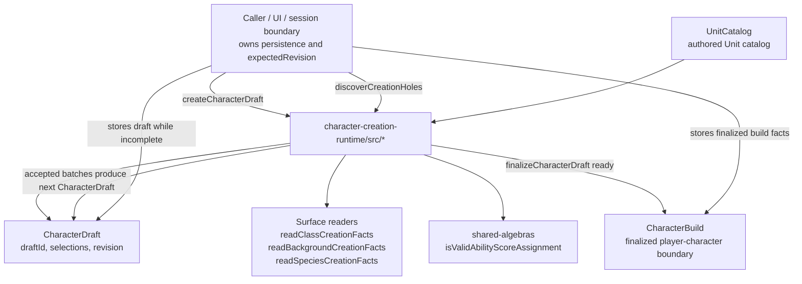
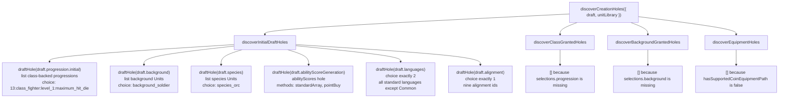
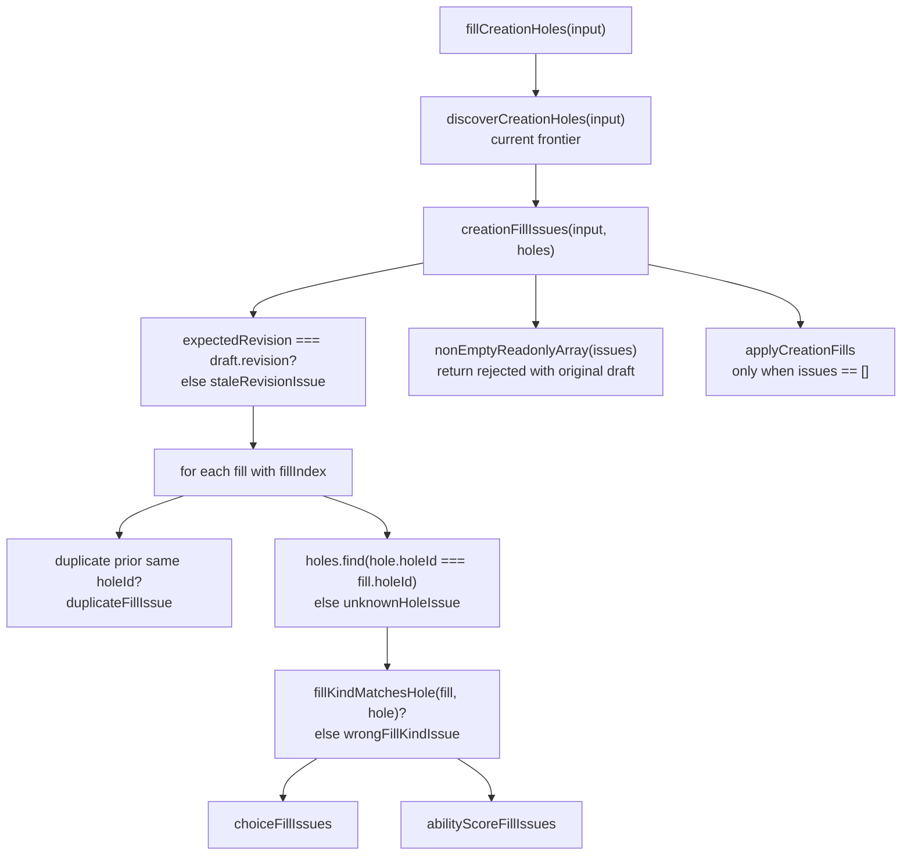
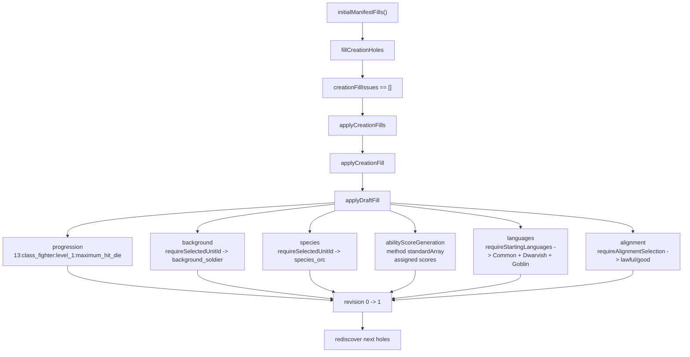
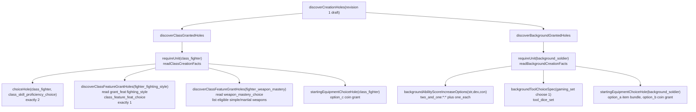
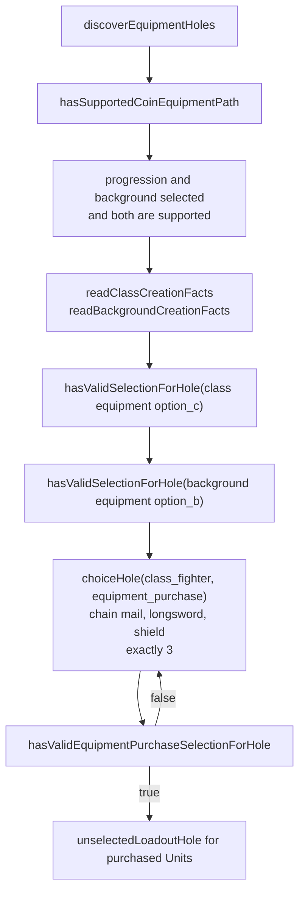
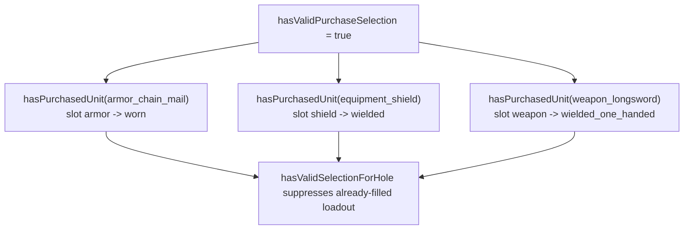
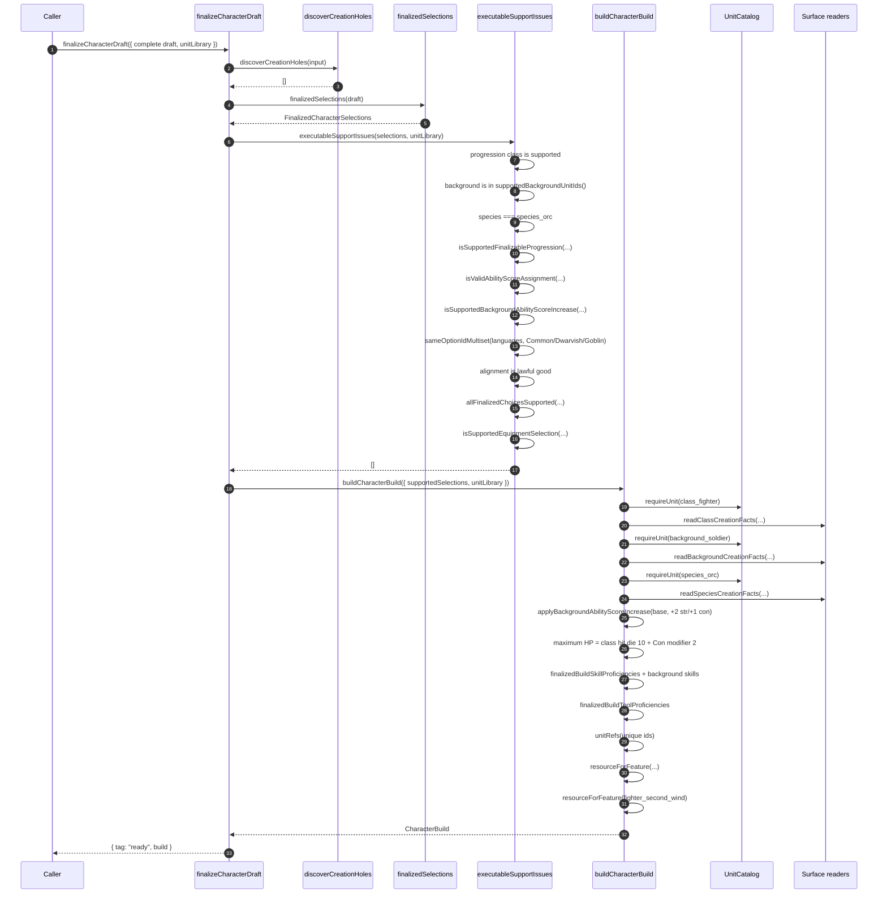
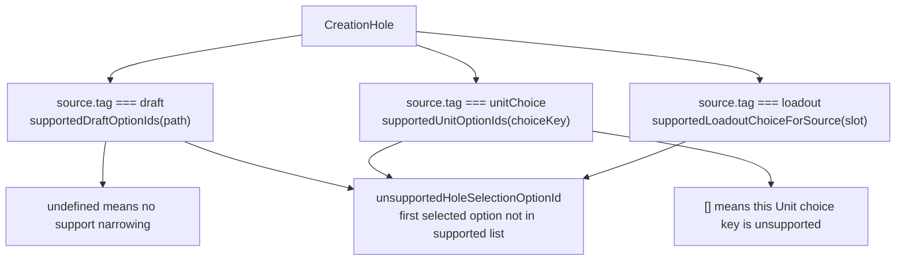

# Character Creation Runtime Time Diagram

This document traces `packages/character-creation-runtime/src/` as a
time-ordered runtime story. The example character is the currently supported
phase-1 "orc warrior" vertical: an Orc Soldier Fighter at level 1.

The important architectural idea is this:

1. `discoverCreationHoles` derives the current fillable frontier from the draft.
2. `fillCreationHoles` validates a whole caller batch against that current
   frontier.
3. Only a completely legal batch reaches `applyCreationFills`.
4. Accepted fills reveal later Unit-backed holes.
5. `finalizeCharacterDraft` refuses to build a `CharacterBuild` until discovery
   says there are no open holes and final legality checks pass.

## Source Anchors

- Runtime implementation: `src/index.ts` re-exports the split runtime modules:
  `src/types.ts`, `src/draft.ts`, `src/discovery.ts`, `src/fill-reducer.ts`,
  `src/finalization.ts`, `src/hole-factories.ts`, `src/phase1-manifest.ts`, and
  `src/support-gates.ts`.
- Reducer tests and executable examples: `src/index.test.ts`.
- Package terms: `VOCABULARY.md`.
- Rules vocabulary: `../../UBIQUITOUS_LANGUAGE.md`.
- Local RAW corpus used by this package: `../../.references/srd-5.2.1/`.
- Authored Surface records for this path:
  - `../surface/content/class_fighter.json`
  - `../surface/content/background_soldier.json`
  - `../surface/content/species_orc.json`
  - `../surface/content/fighter_fighting_style.json`
  - `../surface/content/fighter_weapon_mastery.json`
  - `../surface/content/feat_defense.json`

## Runtime Cast



`UnitCatalog` is not copied into a runtime-owned catalog. The runtime accepts the
Surface `UnitCatalog` directly because the repo owns both layers and avoids
duplicating data.

## Full Time Diagram: Wrong Holes First, Then Legal Orc Soldier Fighter

```mermaid
sequenceDiagram
  autonumber
  actor Caller
  participant Runtime as character-creation-runtime/src/*
  participant Draft as CharacterDraft
  participant Catalog as UnitCatalog
  participant Surface as Surface creation readers
  participant Algebra as Ability score algebra
  participant Sheet as CharacterBuild

  Caller->>Runtime: createCharacterDraft({ draftId })
  Runtime-->>Caller: draft revision 0, selections.choices = []

  Caller->>Runtime: discoverCreationHoles({ draft, unitLibrary })
  Runtime->>Runtime: discoverInitialDraftHoles()
  Runtime->>Runtime: hasDraftSelection(...) for each initial path
  Runtime->>Runtime: draftHole("draft.progression.initial", unitLibrary)
  Runtime->>Catalog: listUnits()
  Runtime->>Runtime: unitOption(class_fighter)
  Runtime->>Runtime: choiceHole(...) -> holeIdForSource(draftSource(path))
  Runtime->>Runtime: draftHole("draft.background", unitLibrary)
  Runtime->>Catalog: listUnits()
  Runtime->>Runtime: draftHole("draft.species", unitLibrary)
  Runtime->>Catalog: listUnits()
  Runtime->>Runtime: draftHole("draft.abilityScoreGeneration", unitLibrary)
  Runtime->>Runtime: draftHole("draft.languages", unitLibrary)
  Runtime->>Runtime: draftHole("draft.alignment", unitLibrary)
  Runtime->>Runtime: discoverClassGrantedHoles() returns [] because no class
  Runtime->>Runtime: discoverBackgroundGrantedHoles() returns [] because no background
  Runtime->>Runtime: discoverEquipmentHoles() returns [] because no equipment path
  Runtime-->>Caller: six initial holes

  Note over Caller,Runtime: Wrong-hole batch: forged/stale/mismatched inputs.
  Caller->>Runtime: fillCreationHoles({ draft rev 0, expectedRevision: 1, fills: bad fills })
  Runtime->>Runtime: discoverCreationHoles(input) again
  Runtime->>Runtime: creationFillIssues(input, current holes)
  Runtime->>Runtime: staleRevisionIssue(input)
  Runtime->>Runtime: for each fill: find matching hole by holeId
  Runtime->>Runtime: duplicateFillIssue(...) if same hole appears twice
  Runtime->>Runtime: unknownHoleIssue(...) for future/inactive hole ids
  Runtime->>Runtime: fillIssuesForHole(...)
  Runtime->>Runtime: fillKindMatchesHole(...)
  Runtime->>Runtime: wrongFillKindIssue(...) for text into choice hole
  Runtime->>Runtime: choiceFillIssues(...)
  Runtime->>Runtime: invalidChoiceIssue(...) for background_soldier as progression
  Runtime->>Runtime: unsupportedChoiceIssue(...) for valid but unsupported options
  Runtime->>Runtime: finalizeCharacterDraft(original draft)
  Runtime->>Runtime: discoverCreationHoles(original draft)
  Runtime->>Runtime: nonEmptyReadonlyArray(holes) -> incomplete
  Runtime-->>Caller: rejected, original draft unchanged, issues plus incomplete finalization

  Note over Caller,Runtime: Legal batch 1 fills only initial draft holes.
  Caller->>Runtime: fillCreationHoles({ draft rev 0, expectedRevision: 0, initialManifestFills })
  Runtime->>Runtime: discoverCreationHoles(input)
  Runtime->>Runtime: creationFillIssues(...) returns []
  Runtime->>Runtime: finalizeCharacterDraft(original draft) -> incomplete
  Runtime->>Runtime: applyCreationFills(draft, holes, fills)
  loop each accepted fill
    Runtime->>Runtime: requireHole(holes, fill.holeId)
    Runtime->>Runtime: applyCreationFill(selections, hole, fill)
    alt source.tag is draft
      Runtime->>Runtime: applyDraftFill(...)
      Runtime->>Runtime: requireOneOptionId(fill)
      Runtime->>Runtime: requireSelectedUnitId(hole, optionId)
      Runtime->>Runtime: requireAcceptedChoiceOption(hole, optionId)
      Runtime->>Runtime: requireStartingLanguages(...) for language fill
      Runtime->>Runtime: requireAlignmentSelection(...) for alignment fill
    else ability scores
      Runtime->>Algebra: isValidAbilityScoreAssignment("standardArray", scores)
    end
  end
  Runtime-->>Caller: accepted draft revision 1 with Fighter, Soldier, Orc, scores, languages, alignment
  Runtime->>Runtime: discoverCreationHoles(new draft)
  Runtime->>Runtime: discoverClassGrantedHoles(...)
  Runtime->>Catalog: requireUnit("class_fighter")
  Runtime->>Surface: readClassCreationFacts(class_fighter)
  Runtime->>Runtime: discoverClassFeatureGrantHoles(fighter_fighting_style)
  Runtime->>Catalog: listUnits()
  Runtime->>Runtime: discoverClassFeatureGrantHoles(fighter_weapon_mastery)
  Runtime->>Catalog: requireUnit("fighter_weapon_mastery")
  Runtime->>Catalog: listUnits()
  Runtime->>Runtime: startingEquipmentChoiceHole(class_fighter option_c)
  Runtime->>Runtime: discoverBackgroundGrantedHoles(...)
  Runtime->>Catalog: requireUnit("background_soldier")
  Runtime->>Surface: readBackgroundCreationFacts(background_soldier)
  Runtime->>Runtime: backgroundAbilityScoreIncreaseOptions(str,dex,con)
  Runtime->>Runtime: backgroundToolChoiceHole(...)
  Runtime->>Runtime: backgroundToolChoiceSpec(gaming_set choose 1)
  Runtime->>Runtime: startingEquipmentChoiceHole(background option_a/option_b)
  Runtime->>Runtime: discoverEquipmentHoles() returns [] until equipment-path choices are selected
  Runtime-->>Caller: next holes: Fighter skills, style, mastery, Soldier ASI/tool, class/background equipment

  Note over Caller,Runtime: Legal batch 2 fills Unit-granted choices.
  Caller->>Runtime: fillCreationHoles({ draft rev 1, expectedRevision: 1, class/background choices })
  Runtime->>Runtime: creationFillIssues(...) checks exact counts and support gates
  Runtime->>Runtime: applyCreationFills(...)
  Runtime->>Runtime: applyUnitFill(...) for ASI, tool, skills, style, mastery, equipment-path choices
  Runtime->>Runtime: requireBackgroundAbilityScoreIncreaseSelection("two_and_one:str:con")
  Runtime->>Runtime: selectedChoiceOption(requireAcceptedChoiceOption(...))
  Runtime-->>Caller: accepted draft revision 2
  Runtime->>Runtime: discoverCreationHoles(new draft)
  Runtime->>Runtime: hasSupportedCoinEquipmentPath(...)
  Runtime->>Catalog: requireUnit("class_fighter")
  Runtime->>Surface: readClassCreationFacts(...)
  Runtime->>Catalog: requireUnit("background_soldier")
  Runtime->>Surface: readBackgroundCreationFacts(...)
  Runtime->>Runtime: hasValidSelectionForHole(class equipment option_c)
  Runtime->>Runtime: hasValidSelectionForHole(background equipment option_b)
  Runtime->>Runtime: unselectedPurchaseHole(...)
  Runtime-->>Caller: equipment_purchase hole for chain mail, longsword, shield

  Note over Caller,Runtime: Legal batch 3 purchases supported equipment.
  Caller->>Runtime: fillCreationHoles({ draft rev 2, expectedRevision: 2, purchase fill })
  Runtime->>Runtime: choiceFillIssues(...) exact 3, no duplicate, supported purchase ids
  Runtime->>Runtime: applyUnitFill(...)
  Runtime->>Runtime: requireSelectedUnitIds(hole, optionIds)
  Runtime-->>Caller: accepted draft revision 3 with equipment.selectedUnitIds
  Runtime->>Runtime: discoverEquipmentHoles(new draft)
  Runtime->>Runtime: hasValidEquipmentPurchaseSelectionForHole(...)
  Runtime->>Runtime: unselectedLoadoutHole(chain mail)
  Runtime->>Runtime: unselectedLoadoutHole(shield)
  Runtime->>Runtime: unselectedLoadoutHole(longsword)
  Runtime-->>Caller: loadout holes: armor worn, shield wielded, longsword wielded one-handed

  Note over Caller,Runtime: Legal batch 4 fills loadout.
  Caller->>Runtime: fillCreationHoles({ draft rev 3, expectedRevision: 3, loadout fills })
  Runtime->>Runtime: creationFillIssues(...) returns []
  Runtime->>Runtime: applyUnitFill(...) stores Unit-backed selected options
  Runtime-->>Caller: accepted draft revision 4

  Caller->>Runtime: finalizeCharacterDraft({ draft rev 4, unitLibrary })
  Runtime->>Runtime: discoverCreationHoles(...) returns []
  Runtime->>Runtime: finalizedSelections(draft)
  Runtime->>Runtime: executableSupportIssues(selections, unitLibrary)
  Runtime->>Algebra: isValidAbilityScoreAssignment(...)
  Runtime->>Runtime: isSupportedBackgroundAbilityScoreIncrease(...)
  Runtime->>Runtime: sameOptionIdMultiset(...)
  Runtime->>Runtime: sameChoiceSelectionMultiset(...)
  Runtime->>Runtime: buildCharacterBuild(...)
  Runtime->>Catalog: requireUnit(class/background/species/features)
  Runtime->>Surface: readClassCreationFacts(...)
  Runtime->>Surface: readBackgroundCreationFacts(...)
  Runtime->>Surface: readSpeciesCreationFacts(...)
  Runtime->>Runtime: applyBackgroundAbilityScoreIncrease(...)
  Runtime->>Runtime: abilityModifier(finalScores.con)
  Runtime->>Runtime: finalizedBuildSkillProficiencies(...)
  Runtime->>Runtime: finalizedBuildToolProficiencies(...)
  Runtime->>Runtime: characterBuildUnitRefs(...)
  Runtime->>Runtime: unitRefs(...)
  Runtime->>Runtime: resourceForFeature(fighter_second_wind)
  Runtime-->>Sheet: ready CharacterBuild
```



## What The First Discovery Actually Opens

The empty draft starts with `selections: { choices: [] }`, so
`discoverInitialDraftHoles` opens every path in `INITIAL_CHARACTER_DRAFT_PATHS`.



Each choice hole is built through `choiceHole`, which calls
`holeIdForSource`. That gives ids like:

- `cc:draft:draft.progression.initial`
- `cc:draft:draft.background`
- `cc:draft:draft.species`
- `cc:draft:draft.languages`

The hole id is a semantic address, not an array position. Reordering holes does
not change what a fill means.

## Why Wrong Holes Are Rejected Before Mutation

`fillCreationHoles` never trusts a caller's previously discovered holes. It
rediscovers the current frontier from the submitted draft, validates the entire
batch, and only then applies.



Examples from the tests:

| Bad caller action                                                 | Function path                                                                                        | Issue               |
| ----------------------------------------------------------------- | ---------------------------------------------------------------------------------------------------- | ------------------- |
| Uses `expectedRevision: draft.revision + 1`                       | `creationFillIssues` -> `staleRevisionIssue`                                                         | `staleRevision`     |
| Sends two fills for `cc:draft:draft.progression.initial`          | fill loop -> duplicate check -> `duplicateFillIssue`                                                 | `duplicateFill`     |
| Sends a future equipment hole before equipment path is open       | fill loop -> `holes.find(...)` fails -> `unknownHoleIssue`                                           | `unknownHole`       |
| Sends `{ kind: "abilityScores" }` for the progression choice hole | `fillKindMatchesHole` -> `wrongFillKindIssue`                                                        | `wrongFillKind`     |
| Sends `background_soldier` as the progression option              | `choiceFillIssues` -> option not in progression hole                                                 | `invalidChoice`     |
| Sends `neutral_good` alignment in the phase-1 manifest            | `supportedDraftOptionIds("draft.alignment")` allows only `lawful_good`                               | `unsupportedChoice` |
| Sends `Dwarvish, Elvish` languages                                | valid language options, but `supportedDraftOptionIds("draft.languages")` allows only Dwarvish/Goblin | `unsupportedChoice` |
| Sends only one language                                           | `choiceFillIssues` compares length to cardinality 2                                                  | `tooFewChoices`     |
| Sends three languages                                             | `choiceFillIssues` compares length to cardinality 2                                                  | `tooManyChoices`    |

The rejection still includes `finalizeCharacterDraft(original draft)`, which is
usually `incomplete` because the original draft still has open holes.

## Legal Batch 1: Draft-Owned Selections

The first legal batch fills only draft-owned holes.



Important detail: the `draft.progression.initial` fill writes one durable
`CharacterProgression`, such as
`{ startingClass: "class_fighter", advancements: [] }`. Post-start entries
record later class choices and their Hit Point rule evidence in order.

## Legal Batch 2: Unit-Granted Holes

After Fighter and Soldier are selected, discovery starts reading authored Unit
facts.



The legal phase-1 fill chooses:

- Fighter skills: `perception`, `survival`.
- Fighting Style: `defense`.
- Weapon Mastery: `weapon_longsword`, `weapon_spear`, `weapon_flail`.
- Soldier ASI: `two_and_one:str:con`.
- Soldier tool: `tool_dice_set`.
- Fighter equipment path: `option_c`.
- Soldier equipment path: `option_b`.

`applyUnitFill` handles this batch. It has three important branches:

- `BACKGROUND_ABILITY_SCORE_INCREASE_CHOICE_KEY` writes the typed
  `backgroundAbilityScoreIncrease` field.
- `EQUIPMENT_PURCHASE_CHOICE_KEY` writes `equipment.selectedUnitIds`.
- Other choice holes append to `selections.choices` with the original hole
  `source` and accepted option metadata.

That last point matters for Unit-backed selections. For Fighting Style and
Weapon Mastery, `selectedChoiceOption` preserves `unitRef` from the hole option.
Selected-equipment loadout fills store the loadout source plus selected option
only; fill validation proves the option belongs to the source equipment before
the durable selection is written.

## Legal Batch 3: Equipment Purchase Opens Only After Coin Path

`discoverEquipmentHoles` is gated by `hasSupportedCoinEquipmentPath`.



Why the purchase hole is not open earlier:

- Before `option_c` and `option_b`, the draft has not selected the coin-grant
  path.
- If the draft has malformed equipment-path choice metadata, then
  `hasValidSelectionForHole` returns false and purchase does not open.
- If the draft has a malformed purchase selection, purchase stays fillable and
  loadout stays closed.

This prevents a draft from equipping or wielding unowned items.

## Legal Batch 4: Loadout Holes Depend On Owned Equipment

After the purchase fill writes:

```ts
equipment: {
  selectedUnitIds: [
    "armor_chain_mail",
    "weapon_longsword",
    "equipment_shield",
  ],
}
```

`discoverEquipmentHoles` calls `unselectedLoadoutHole` three times:



The loadout fills are stored in `selections.choices` as loadout selections keyed
by selected-equipment source and slot. They store the selected option only; source
equipment identity is not duplicated into the selected option.

## Finalization Time Diagram



If any holes remain, finalization returns `incomplete` before it tries to narrow
the draft. If no holes remain but required typed fields are still missing,
`finalizedSelections` returns `undefined` and finalization returns `invalid`.
If typed fields exist but contradict the current executable support boundary, the
`executableSupportIssues` checks return `illegalFinalization`.

## Build Projection For The Supported Orc Soldier Fighter

The ready `CharacterBuild` contains durable build facts only:

- `progression`: one level-1 Fighter progression.
- `background`: Soldier.
- `species`: Orc.
- `originLanguages`: Common, Dwarvish, and Goblin.
- `alignment`: Lawful Good.
- `abilityScores`: final scores after the Soldier background increase:
  Strength 17, Dexterity 14, Constitution 14, Intelligence 8, Wisdom 10,
  Charisma 12.
- `hitPoints.maximum`: `10 + abilityModifier(14) = 12`.
- `hitPoints.hitDice`: one d10 Fighter Hit Die.
- `proficiencies`: Fighter saving throws, selected skills plus Soldier skills,
  Fighter weapon/armor training, and selected tool.
- `features`: class, background, species, and choice-sourced feature refs.
- `resources`: activation resources from class features such as Second Wind.
- `equipment`: phase-1 starting loadout.

It does not store character/session identity such as `characterId`, raw creation
selections, or cached runtime projections such as `unitRefs`. Callers can derive
Unit refs from the build with `characterBuildUnitRefs` when they need that
projection.

## Why Some Legal-Looking Choices Are Unsupported

The hole options often come from authored SRD records or shared facts, but this
runtime intentionally supports only the first vertical. That is why
`supportedHoleOptionIds` exists.



Examples:

- Alignment hole lists all nine alignments, but phase 1 supports only
  `lawful_good`.
- Language hole lists all selectable standard languages, but phase 1 supports
  only `Dwarvish` and `Goblin`.
- Fighter skill hole lists every Fighter skill option from the Surface record,
  but phase 1 supports only `perception` and `survival`.
- Background equipment option `option_a` exists, but the supported equipment
  path uses `option_b`.

This is not provenance. SRD provenance stays in Surface records. These support
gates are runtime implementation boundaries for the currently modeled vertical.

## Function Call Inventory

The diagrams above intentionally include most of the runtime
functions. This inventory groups them by responsibility.

| Responsibility            | Functions                                                                                                                                                                                                                                                                                                                                                                                                                      |
| ------------------------- | ------------------------------------------------------------------------------------------------------------------------------------------------------------------------------------------------------------------------------------------------------------------------------------------------------------------------------------------------------------------------------------------------------------------------------ |
| Public API                | `createCharacterDraft`, `discoverCreationHoles`, `fillCreationHoles`, `finalizeCharacterDraft`                                                                                                                                                                                                                                                                                                                                 |
| Draft discovery           | `discoverInitialDraftHoles`, `draftHole`, `hasDraftSelection`, `draftSource`, `choiceHole`, `holeIdForSource`, `unitOption`, `skillOption`                                                                                                                                                                                                                                                                                     |
| Class discovery           | `discoverClassGrantedHoles`, `discoverClassFeatureGrantHoles`, `startingEquipmentChoiceHole`, `unselectedUnitChoiceHole`                                                                                                                                                                                                                                                                                                       |
| Background discovery      | `discoverBackgroundGrantedHoles`, `backgroundAbilityScoreIncreaseOptions`, `backgroundAbilityScoreIncreaseOptionId`, `backgroundToolChoiceHole`, `backgroundToolChoiceSpec`                                                                                                                                                                                                                                                    |
| Equipment discovery       | `discoverEquipmentHoles`, `hasSupportedCoinEquipmentPath`, `unselectedPurchaseHole`, `unselectedLoadoutHole`, `hasValidEquipmentPurchaseSelectionForHole`, `hasPurchasedUnit`                                                                                                                                                                                                                                                  |
| Existing-selection checks | `hasValidSelectionForHole`, `choiceSelectionMatchesHole`, `hasValidBackgroundAbilityScoreIncreaseSelectionForHole`, `choiceOptionIdsFitHole`, `selectedChoiceOptionMatchesHole`, `hasDuplicateOptionIds`, `sameCreationHoleSource`                                                                                                                                                                                             |
| Batch validation          | `creationFillIssues`, `fillIssuesForHole`, `fillKindMatchesHole`, `choiceFillIssues`, `abilityScoreFillIssues`, `unsupportedHoleSelectionOptionId`, `supportedHoleOptionIds`, `supportedDraftOptionIds`, `supportedUnitOptionIds`                                                                                                                                                                                              |
| Issue constructors        | `wrongFillKindIssue`, `invalidChoiceIssue`, `invalidAbilityScoresIssue`, `tooFewChoicesIssue`, `tooManyChoicesIssue`, `unsupportedChoiceIssue`, `staleRevisionIssue`, `duplicateFillIssue`, `unknownHoleIssue`                                                                                                                                                                                                                 |
| Applying accepted fills   | `applyCreationFills`, `requireHole`, `applyCreationFill`, `applyDraftFill`, `applyUnitFill`, `selectedChoiceOption`, `requireSelectedUnitIds`, `requireOneOptionId`, `requireSelectedUnitId`, `requireAcceptedChoiceOption`, `requireStartingLanguages`, `requireAlignmentSelection`, `requireBackgroundAbilityScoreIncreaseSelection`                                                                                         |
| Final legality            | `finalizedSelections`, `executableSupportIssues`, `allFinalizedChoicesSupported`, `supportedStartingEquipmentCoinGrantChoice`, `choiceSelection`, `unitChoiceSelection`, `choiceSelectionWithOptions`, `selectedChoiceOptionRecord`, `expectedValueIssue`, `illegalFinalizationIssue`, `isSupportedFinalizableProgression`, `isSupportedBackgroundAbilityScoreIncrease`, `sameChoiceSelectionMultiset`, `sameOptionIdMultiset` |
| Build projection          | `buildCharacterBuild`, `characterBuildUnitRefs`, `requireReadable`, `applyBackgroundAbilityScoreIncrease`, `abilityModifier`, `finalizedBuildSkillProficiencies`, `finalizedBuildToolProficiencies`, `resourceForFeature`, `unitRefs`, `uniqueValues`, `nonEmptyReadonlyArray`                                                                                                                                                 |

## Connascence Notes For Future Readers

Several facts must change together:

- Support-profile constants such as `SUPPORTED_PROGRESSIONS`, supported option
  ids, and `executableSupportIssues` all encode the currently executable
  creation boundary.
- `CreationHoleSource` and `holeIdForSource` are coupled by name and meaning:
  changing one requires changing fill ids, tests, and the Quint model.
- Choice cardinality, accepted option metadata, and selection suppression are
  coupled by algorithm in `choiceFillIssues`, `choiceOptionIdsFitHole`, and
  `choiceSelectionMatchesHole`.
- Equipment purchase and loadout are intentionally ordered: loadout holes depend
  on a valid purchase selection and `hasPurchasedUnit`.
- `applyDraftFill("draft.progression.initial")` creates the progression selected
  from `SUPPORTED_PROGRESSIONS`; finalization later checks that value with
  `isSupportedFinalizableProgression`.

When extending the runtime beyond this Orc Soldier Fighter vertical, update the
runtime, tests, Surface records/readers if needed, and
the character-creation parity model together.
