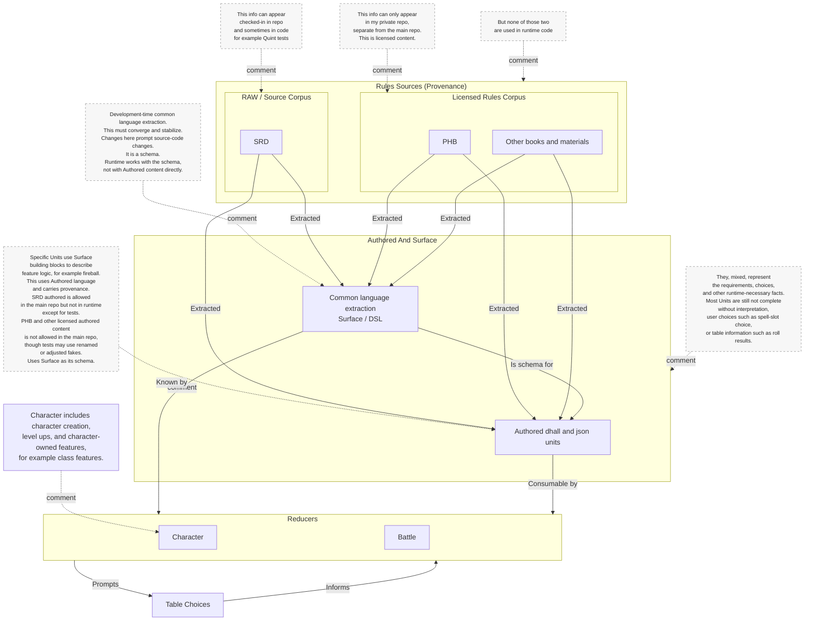
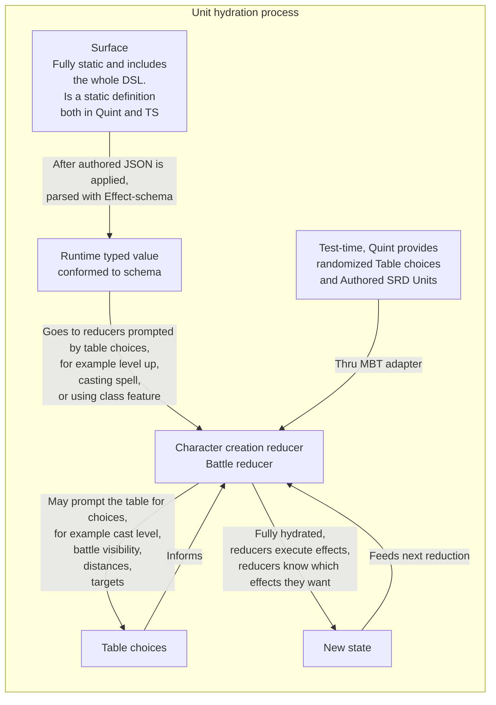
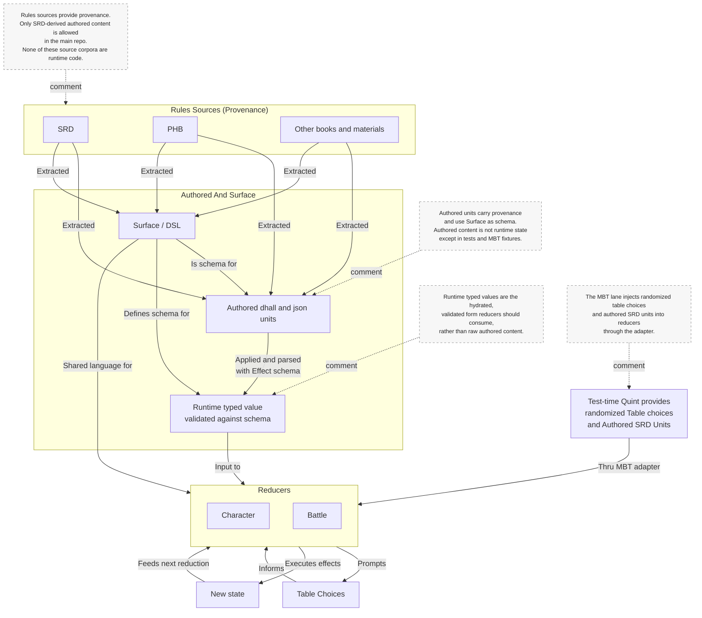

 # Surface To Battle Manual Diagram

Incremental manual diagram draft.

```mermaid
flowchart TD
  classDef note fill:#f7f7f7,stroke:#999,stroke-dasharray: 4 4,color:#222,font-size:12px;

  subgraph SOURCES["Rules Sources (Provenance)"]
    direction TB

    subgraph RAW["RAW / Source Corpus"]
      direction TB
      SRD["SRD"]
    end

    subgraph LICENSED["Licensed Rules Corpus"]
      direction TB
      PHB["PHB"]
      OTHER_BOOKS["Other books and materials"]
    end
  end

  RAW_NOTE["This info can appear<br/>checked-in in repo<br/>and sometimes in code<br/>for example Quint tests"]
  LICENSED_NOTE["This info can only appear<br/>in my private repo,<br/>separate from the main repo.<br/>This is licensed content."]
  SOURCES_NOTE["But none of those two<br/>are used in runtime code"]

  RAW_NOTE -. comment .-> RAW
  LICENSED_NOTE -. comment .-> LICENSED
  SOURCES_NOTE -. comment .-> SOURCES

  subgraph CONTENT["Authored And Surface"]
    direction TB
    AUTHORED["Authored dhall and json units"]
    SURFACE["Common language extraction\nSurface / DSL"]
  end

  subgraph REDUCERS["Reducers"]
    direction TB
    CHARACTER["Character"]
    BATTLE["Battle"]
  end

  TABLE_CHOICES["Table Choices"]

  AUTHORED_NOTE["Specific Units use Surface<br/>building blocks to describe<br/>feature logic, for example fireball.<br/>This uses Authored language<br/>and carries provenance.<br/>SRD authored is allowed<br/>in the main repo but not in runtime<br/>except for tests.<br/>PHB and other licensed authored content<br/>is not allowed in the main repo,<br/>though tests may use renamed<br/>or adjusted fakes.<br/>Uses Surface as its schema."]
  SURFACE_NOTE["Development-time common language extraction.<br/>This must converge and stabilize.<br/>Changes here prompt source-code changes.<br/>It is a schema.<br/>Runtime works with the schema,<br/>not with Authored content directly."]
  CONTENT_NOTE["They, mixed, represent<br/>the requirements, choices,<br/>and other runtime-necessary facts.<br/>Most Units are still not complete<br/>without interpretation,<br/>user choices such as spell-slot choice,<br/>or table information such as roll results."]
  CHARACTER_NOTE["Character includes character creation,<br/>level ups, and character-owned features,<br/>for example class features."]

  AUTHORED_NOTE -. comment .-> AUTHORED
  SURFACE_NOTE -. comment .-> SURFACE
  CONTENT_NOTE -. comment .-> CONTENT
  CHARACTER_NOTE -. comment .-> CHARACTER

  SRD -->|Extracted| AUTHORED
  SRD -->|Extracted| SURFACE
  PHB -->|Extracted| AUTHORED
  PHB -->|Extracted| SURFACE
  OTHER_BOOKS -->|Extracted| AUTHORED
  OTHER_BOOKS -->|Extracted| SURFACE
  SURFACE -->|Is schema for| AUTHORED
  SURFACE -->|Known by| REDUCERS
  AUTHORED -->|Consumable by| REDUCERS
  REDUCERS -->|Prompts| TABLE_CHOICES
  TABLE_CHOICES -->|Informs| REDUCERS

  class RAW_NOTE,LICENSED_NOTE,SOURCES_NOTE,AUTHORED_NOTE,SURFACE_NOTE,CONTENT_NOTE note
```

## Unit Hydration Process

```mermaid
flowchart TD
  classDef note fill:#f7f7f7,stroke:#999,stroke-dasharray: 4 4,color:#222,font-size:12px;

  subgraph HYDRATION["Unit hydration process"]
    direction TB
    HYDRATION_SURFACE["Surface<br/>Fully static and includes<br/>the whole DSL.<br/>Is a static definition<br/>both in Quint and TS"]
    HYDRATION_VALUE["Runtime typed value<br/>conformed to schema"]
    HYDRATION_REDUCERS["Character creation reducer<br/>Battle reducer"]
    HYDRATION_TEST["Test-time, Quint provides<br/>randomized Table choices<br/>and Authored SRD Units"]
    HYDRATION_TABLE["Table choices"]
    HYDRATION_STATE["New state"]
  end

  HYDRATION_SURFACE -->|After authored JSON is applied,<br/>parsed with Effect-schema| HYDRATION_VALUE
  HYDRATION_VALUE -->|Goes to reducers prompted by table choices,<br/>for example level up,<br/>casting spell,<br/>or using class feature| HYDRATION_REDUCERS
  HYDRATION_TEST -->|Thru MBT adapter| HYDRATION_REDUCERS
  HYDRATION_REDUCERS -->|May prompt the table for choices,<br/>for example cast level,<br/>battle visibility,<br/>distances,<br/>targets| HYDRATION_TABLE
  HYDRATION_TABLE -->|Informs| HYDRATION_REDUCERS
  HYDRATION_REDUCERS -->|Fully hydrated,<br/>reducers execute effects,<br/>reducers know which effects they want| HYDRATION_STATE
  HYDRATION_STATE -->|Feeds next reduction| HYDRATION_REDUCERS
```

## Merged View

```mermaid
flowchart TD
  classDef note fill:#f7f7f7,stroke:#999,stroke-dasharray: 4 4,color:#222,font-size:12px;

  subgraph MERGED_SOURCES["Rules Sources (Provenance)"]
    direction TB
    MERGED_SRD["SRD"]
    MERGED_PHB["PHB"]
    MERGED_OTHER["Other books and materials"]
  end

  subgraph MERGED_CONTENT["Authored And Surface"]
    direction TB
    MERGED_AUTHORED["Authored dhall and json units"]
    MERGED_SURFACE["Surface / DSL"]
    MERGED_RUNTIME["Runtime typed value<br/>validated against schema"]
  end

  subgraph MERGED_REDUCERS["Reducers"]
    direction TB
    MERGED_CHARACTER["Character"]
    MERGED_BATTLE["Battle"]
  end

  MERGED_TABLE["Table Choices"]
  MERGED_STATE["New state"]
  MERGED_TEST["Test-time Quint provides<br/>randomized Table choices<br/>and Authored SRD Units"]

  MERGED_SRD -->|Extracted| MERGED_AUTHORED
  MERGED_SRD -->|Extracted| MERGED_SURFACE
  MERGED_PHB -->|Extracted| MERGED_AUTHORED
  MERGED_PHB -->|Extracted| MERGED_SURFACE
  MERGED_OTHER -->|Extracted| MERGED_AUTHORED
  MERGED_OTHER -->|Extracted| MERGED_SURFACE

  MERGED_SURFACE -->|Is schema for| MERGED_AUTHORED
  MERGED_AUTHORED -->|Applied and parsed<br/>with Effect schema| MERGED_RUNTIME
  MERGED_SURFACE -->|Defines schema for| MERGED_RUNTIME
  MERGED_SURFACE -->|Shared language for| MERGED_REDUCERS
  MERGED_RUNTIME -->|Input to| MERGED_REDUCERS

  MERGED_TEST -->|Thru MBT adapter| MERGED_REDUCERS
  MERGED_REDUCERS -->|Prompts| MERGED_TABLE
  MERGED_TABLE -->|Informs| MERGED_REDUCERS
  MERGED_REDUCERS -->|Executes effects| MERGED_STATE
  MERGED_STATE -->|Feeds next reduction| MERGED_REDUCERS

  MERGED_SOURCES_NOTE["Rules sources provide provenance.<br/>Only SRD-derived authored content is allowed<br/>in the main repo.<br/>None of these source corpora are runtime code."]
  MERGED_AUTHORED_NOTE["Authored units carry provenance<br/>and use Surface as schema.<br/>Authored content is not runtime state<br/>except in tests and MBT fixtures."]
  MERGED_RUNTIME_NOTE["Runtime typed values are the hydrated,<br/>validated form reducers should consume,<br/>rather than raw authored content."]
  MERGED_TEST_NOTE["The MBT lane injects randomized table choices<br/>and authored SRD units into reducers<br/>through the adapter."]

  MERGED_SOURCES_NOTE -. comment .-> MERGED_SOURCES
  MERGED_AUTHORED_NOTE -. comment .-> MERGED_AUTHORED
  MERGED_RUNTIME_NOTE -. comment .-> MERGED_RUNTIME
  MERGED_TEST_NOTE -. comment .-> MERGED_TEST

  class MERGED_SOURCES_NOTE,MERGED_AUTHORED_NOTE,MERGED_RUNTIME_NOTE,MERGED_TEST_NOTE note
```
