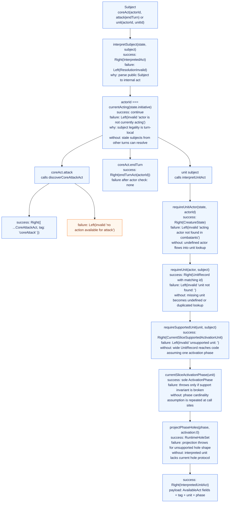
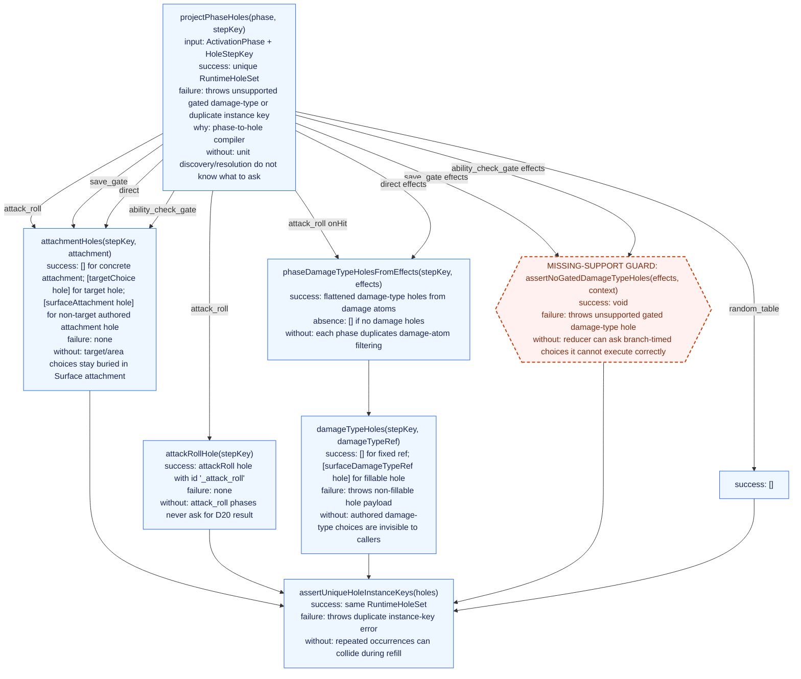
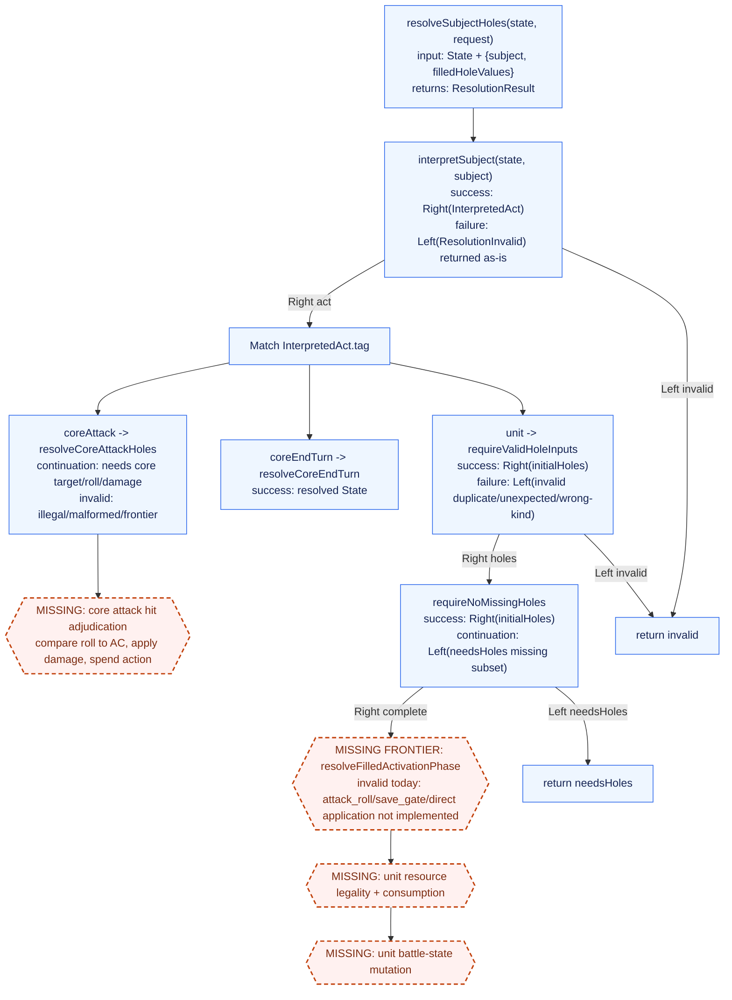
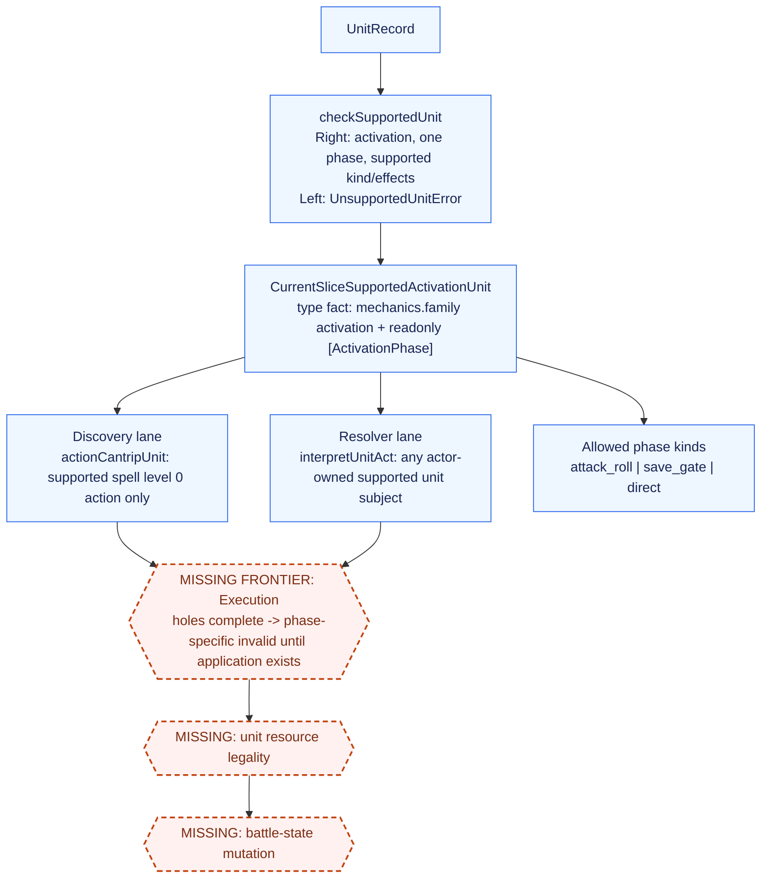

# Surface Runtime Correction Architecture

This is a data-flow map of the current reducer architecture. Return labels name
the concrete success, absence, continuation, and invalid payloads. Each major
node also states what would happen if it did not exist.

## System Graph

```mermaid
flowchart TD
  Content["Authored unit JSON<br/>input: content/{unitId}.json<br/>output: raw JSON text<br/>why: Surface content source<br/>without: reducer has no authored unit data"]
  Decode["decodeUnitRecordSync(raw)<br/>input: parsed JSON<br/>success: UnitRecord<br/>failure: schema/decode throw<br/>why: parse at content boundary<br/>without: invalid JSON shape can enter runtime"]
  AssertSupport["assertSupportedUnit(unit)<br/>input: UnitRecord<br/>success: CurrentSliceSupportedActivationUnit<br/>failure: throws UnsupportedUnitError<br/>why: fail fast while loading unsupported content<br/>without: unsupported unit shapes enter CreatureState.units"]
  CreatureUnits["CreatureState.units<br/>data: readonly UnitRecord[] on each combatant<br/>why: actor-owned unit source<br/>without: unit-backed acts cannot be discovered or resolved by ownership"]
  State["State<br/>data: initiative, combatants, action economy<br/>why: single legality/replay input<br/>without: discovery and resolution would not share one runtime snapshot"]

  DiscoverPublic["discoverAvailableActs(state)<br/>input: State<br/>success: AvailableAct[] = subject + label + summary + initialHoles<br/>absence: [] only if interpreted discovery returns no acts; current code normally includes End Turn<br/>why: public discovery API<br/>without: callers depend on internal InterpretedAct or duplicate projection"]
  DiscoverInterpreted["discoverInterpretedActs(state)<br/>input: State<br/>success: InterpretedAct[] = legal current-actor acts with resolver payloads attached<br/>absence: omits unavailable attack and non-discoverable units<br/>why: one internal representation for discovery and later subject interpretation<br/>without: discovery must rebuild tag/unit/phase details or expose internals"]
  ProjectAvailable["project InterpretedAct to AvailableAct<br/>input: InterpretedAct<br/>success: { subject, label, summary, initialHoles }<br/>drops: tag, unit, phase<br/>why: caller chooses a subject, not executable internals<br/>without: public discovery leaks resolver-only payloads"]

  CoreAttackDiscover["discoverCoreAttackAct(state, actorId)<br/>input: State + CreatureId<br/>success: CoreAttackAct with initial core_attack_target hole<br/>absence: null when no action or no other combatant<br/>why: one attack availability source<br/>without: discovery and resolution can drift on attack legality"]
  EndTurnAct["endTurnAct(actorId)<br/>input: CreatureId<br/>success: InterpretedCoreEndTurnAct with no holes<br/>failure: none<br/>why: canonical end-turn payload<br/>without: End Turn shape duplicated across discovery and interpretation"]
  UnitDiscover["discoverUnitActs(state, actorId)<br/>input: State + CreatureId<br/>success: InterpretedUnitAct[] for discoverable action cantrips<br/>absence: [] for missing actor or no qualifying units<br/>why: enumerate unit-backed offers for acting creature<br/>without: unit-backed acts never appear in public discovery"]
  CantripGate["actionCantripUnit(unit)<br/>input: UnitRecord<br/>success: supported spell action cantrip<br/>absence: null for unsupported, non-spell, non-cantrip, or non-action<br/>why: current unit discovery lane<br/>without: unsupported or non-action units leak into discovery"]
  InterpretUnit["interpretUnitAct(state, unitSubject)<br/>input: State + {actorId, unitId}<br/>success: Right(InterpretedUnitAct with supported unit, phase, initialHoles)<br/>failure: Left(invalid actor/unit/support reason)<br/>why: parse subject into execution payload<br/>without: resolution reimplements unit lookup/support/hole projection"]
  ProjectHoles["projectPhaseHoles(phase, stepKey)<br/>input: ActivationPhase + HoleStepKey<br/>success: RuntimeHoleSet<br/>failure: throws for unsupported gated damage-type holes or duplicate instance keys<br/>why: one runtime-hole vocabulary<br/>without: discovery and resolution invent parallel hole projections"]

  Request["ResolutionRequest<br/>data: subject + accumulated FilledHoleValue[]<br/>why: replay-from-root input<br/>without: caller cannot refill holes against a stable branch identity"]
  Resolve["resolveSubjectHoles(state, request)<br/>input: State + ResolutionRequest<br/>success: resolved State only for endTurn today<br/>continuation: needsHoles<br/>invalid: stale subject, bad fills, or unimplemented execution<br/>why: top-level replay/refill dispatcher<br/>without: callers duplicate interpretation and act-specific routing"]
  InterpretSubject["interpretSubject(state, subject)<br/>input: State + Subject<br/>success: Right(InterpretedAct)<br/>failure: Left(ResolutionInvalid)<br/>why: re-validate chosen subject against current state<br/>without: stale or forged subjects bypass legality checks"]
  ResolveCoreAttack["resolveCoreAttackHoles(state, filled)<br/>input: State + FilledHoleValue[]<br/>continuation: needs target, attack roll, or damage roll<br/>invalid: no action, no target, bad target, malformed fills, or adjudication frontier<br/>why: core attack owns staged replay<br/>without: Attack can be discovered but not driven through choices"]
  ResolveEndTurn["resolveCoreEndTurn(state)<br/>input: State<br/>success: resolved State with next initiative and reset action economy<br/>failure: none<br/>why: implement core endTurn mutation<br/>without: End Turn can be selected but not executed"]
  ValidateInputs["requireValidHoleInputs(filled, holes)<br/>input: FilledHoleValue[] + expected RuntimeHoleSet<br/>success: Right(same holes)<br/>failure: Left(invalid duplicate, unexpected, or wrong-kind fill)<br/>why: shape-check fills before asking/executing<br/>without: stale or malformed fills reach semantics"]
  RequireComplete["requireNoMissingHoles(filled, holes)<br/>input: FilledHoleValue[] + validated RuntimeHoleSet<br/>success: Right(same holes)<br/>continuation: Left(needsHoles with missing subset)<br/>why: separate valid-but-incomplete from executable<br/>without: unit resolution proceeds with missing data or treats missing data as invalid"]
  ResolvePhase{{"MISSING FRONTIER: resolveFilledActivationPhase(phase)<br/>input: filled ActivationPhase<br/>invalid today: phase-specific application frontier<br/>why: explicit post-refill execution boundary<br/>without: unit resolution conflates complete holes with implemented effects"}}
  UnitResource{{"MISSING: unit resource legality + consumption<br/>action cost, slots, use counts, once/turn"}}
  UnitMutation{{"MISSING: unit battle-state mutation<br/>damage, healing, extra action, conditions/effects"}}
  CoreAttackAdjudication{{"MISSING: core attack hit adjudication + damage mutation"}}

  Content --> Decode --> AssertSupport --> CreatureUnits --> State
  State --> DiscoverPublic --> DiscoverInterpreted
  DiscoverInterpreted --> CoreAttackDiscover
  DiscoverInterpreted --> EndTurnAct
  DiscoverInterpreted --> UnitDiscover --> CantripGate --> InterpretUnit --> ProjectHoles
  ProjectHoles --> DiscoverInterpreted
  DiscoverInterpreted --> ProjectAvailable --> AvailableActs["AvailableAct[]"]

  State --> Resolve
  Request --> Resolve
  Resolve --> InterpretSubject
  InterpretSubject -->|Right coreAttack| ResolveCoreAttack --> CoreAttackAdjudication
  InterpretSubject -->|Right coreEndTurn| ResolveEndTurn
  InterpretSubject -->|Right unit| ValidateInputs --> RequireComplete --> ResolvePhase --> UnitResource --> UnitMutation
  InterpretSubject -. unit path uses .-> InterpretUnit

  classDef missing fill:#fff1f0,stroke:#c2410c,stroke-width:2px,stroke-dasharray: 6 4,color:#7c2d12;
  classDef implemented fill:#eef6ff,stroke:#2563eb,color:#172554;
  class ResolvePhase,UnitResource,UnitMutation,CoreAttackAdjudication missing;
  class Content,Decode,AssertSupport,CreatureUnits,State,DiscoverPublic,DiscoverInterpreted,ProjectAvailable,CoreAttackDiscover,EndTurnAct,UnitDiscover,CantripGate,InterpretUnit,ProjectHoles,Request,Resolve,InterpretSubject,ResolveCoreAttack,ResolveEndTurn,ValidateInputs,RequireComplete,AvailableActs implemented;
```

## Interpretation Graph

## Hole Projection Graph

## Resolution Graph

## Core Attack Replay

```mermaid
flowchart TD
  Discover["discoverCoreAttackAct(state, actorId)<br/>success: CoreAttackAct with [coreAttackTargetHole()]<br/>absence: null if no action or no other combatant<br/>without: attack availability can drift from resolution"]
  Resolve["resolveCoreAttackHoles(state, filled)<br/>input: State + FilledHoleValue[]<br/>invalid early: no action or no valid target<br/>without: core Attack has no replay protocol"]

  Target["target stage<br/>looks for targetChoice core_attack_target<br/>missing: needsHoles([coreAttackTargetHole()]) after validating only target is expected<br/>invalid: self or non-combatant target<br/>without: later stages can run without legal defender"]
  Roll["attack-roll stage<br/>looks for attackRoll core_attack_roll<br/>missing: needsHoles([coreAttackRollHole()]) after validating target+roll expected<br/>without: hit adjudication lacks D20 Test result"]
  Damage["damage stage<br/>looks for rolledDice core_attack_damage<br/>missing: needsHoles([coreAttackDamageHole()]) after validating target+roll+damage expected<br/>without: future hit application lacks damage dice"]
  FullValidate["full validation<br/>success: no extra/malformed fills<br/>failure: duplicate/unexpected/wrong-kind invalid<br/>without: valid required fills plus bad extras reach execution"]
  Frontier{{"MISSING FRONTIER<br/>invalid 'attack hit adjudication is not implemented yet'"}}
  SpendAction{{"MISSING: spend action"}}
  HitCheck{{"MISSING: compare attack roll to target AC"}}
  ApplyDamage{{"MISSING: apply rolled damage to target State"}}

  Discover --> Resolve --> Target --> Roll --> Damage --> FullValidate --> Frontier --> SpendAction --> HitCheck --> ApplyDamage

  classDef missing fill:#fff1f0,stroke:#c2410c,stroke-width:2px,stroke-dasharray: 6 4,color:#7c2d12;
  classDef implemented fill:#eef6ff,stroke:#2563eb,color:#172554;
  class Frontier,SpendAction,HitCheck,ApplyDamage missing;
  class Discover,Resolve,Target,Roll,Damage,FullValidate implemented;
```

## Function Contracts

| Function or type                               | Input                                 | Success / continuation payload                                                     | Failure / absence payload                                                               | Why                                                            | Without this                                                       |
| ---------------------------------------------- | ------------------------------------- | ---------------------------------------------------------------------------------- | --------------------------------------------------------------------------------------- | -------------------------------------------------------------- | ------------------------------------------------------------------ |
| `State`                                        | n/a                                   | Runtime snapshot: `initiative`, `combatants`, action economy                       | n/a                                                                                     | Shared substrate for legality and replay                       | Discovery/resolution would not agree on current combat facts       |
| `CreatureState.units`                          | n/a                                   | Actor-owned `ReadonlyArray<UnitRecord>`                                            | n/a                                                                                     | Places authored units on combatants                            | Unit-backed act ownership cannot be checked                        |
| `loadSupportedUnit(unitId)`                    | `string`                              | Decoded `CurrentSliceSupportedActivationUnit`                                      | File/JSON/schema throw, or `UnsupportedUnitError`                                       | Schema + support boundary for content loading                  | Content bypasses validation or support gate                        |
| `checkSupportedUnit(unit)`                     | `UnitRecord`                          | `Right(CurrentSliceSupportedActivationUnit)`                                       | `Left(UnsupportedUnitError)` with specific support reason                               | Central executable support gate                                | Support constraints scatter across modules                         |
| `assertSupportedUnit(unit)`                    | `UnitRecord`                          | `CurrentSliceSupportedActivationUnit`                                              | Throws `UnsupportedUnitError`                                                           | Fail-fast loader variant of support gate                       | Unsupported content can enter supported library                    |
| `getCurrentSliceSupportedActivationUnit(unit)` | `UnitRecord`                          | `Some(CurrentSliceSupportedActivationUnit)`                                        | `None`                                                                                  | Non-throwing discovery/interpreter support check               | Discovery uses exceptions or duplicates support logic              |
| `discoverAvailableActs(state)`                 | `State`                               | `AvailableAct[]` of `{ subject, label, summary, initialHoles }`                    | No error path; could be `[]`, though End Turn normally exists                           | Public act-offer API                                           | Callers consume `InterpretedAct` internals or duplicate projection |
| `discoverInterpretedActs(state)`               | `State`                               | `InterpretedAct[]`: optional core attack, End Turn, discoverable unit acts         | Omits unavailable attack and non-discoverable units                                     | Internal discovered-act IR with dispatch and execution payload | Public discovery loses parsed payload or recomputes it             |
| `discoverCoreAttackAct(state, actorId)`        | `State`, `CreatureId`                 | `CoreAttackAct` with `core_attack_target` initial hole                             | `null` if no action or no other combatant                                               | Shared core attack availability and discovery payload          | Attack discovery and resolution legality drift                     |
| `actionCantripUnit(unit)`                      | `UnitRecord`                          | `DiscoverableActionCantrip`                                                        | `null` if unsupported, non-spell, non-cantrip, or non-action                            | Current unit discovery filter                                  | Discovery exposes units outside the current lane                   |
| `discoverUnitActs(state, actorId)`             | `State`, `CreatureId`                 | `InterpretedUnitAct[]`                                                             | `[]` if actor missing or no qualifying units                                            | Enumerates acting actor unit acts                              | Unit-backed acts do not appear in discovery                        |
| `interpretSubject(state, subject)`             | `State`, `Subject`                    | `Right(InterpretedAct)`                                                            | `Left(ResolutionInvalid)` for stale actor, unavailable attack, missing/unsupported unit | Re-parse selected subject against current state                | Stale/forged subjects can bypass legality                          |
| `interpretUnitAct(state, subject)`             | `State`, `UnitSubject`                | `Right(InterpretedUnitAct)` with supported unit, phase, initial holes              | `Left(ResolutionInvalid)` for missing actor/unit/unsupported unit                       | Unit subject parser                                            | Resolution repeats lookup/support/projection                       |
| `requireUnitActor(state, actorId)`             | `State`, `CreatureId`                 | `Right(CreatureState)`                                                             | `Left(invalid 'acting actor not found in combatants')`                                  | Actor existence boundary                                       | Undefined actor flows downstream                                   |
| `requireUnit(actor, subject)`                  | `CreatureState`, `UnitSubject`        | `Right(UnitRecord)` matching `unitId`                                              | `Left(invalid 'unit not found: <unitId>')`                                              | Unit ownership boundary                                        | Missing unit handling is duplicated or unsafe                      |
| `requireSupportedUnit(unit, subject)`          | `UnitRecord`, `UnitSubject`           | `Right(CurrentSliceSupportedActivationUnit)`                                       | `Left(invalid 'unsupported unit: <unitId>')`                                            | Converts support failure to reducer invalid                    | Wide unit reaches one-phase assumptions                            |
| `currentSliceActivationPhase(unit)`            | `CurrentSliceSupportedActivationUnit` | Sole `ActivationPhase`                                                             | Throws only if support invariant is broken                                              | Names one-phase current-slice invariant                        | Positional phase assumption repeats                                |
| `projectPhaseHoles(phase, stepKey)`            | `ActivationPhase`, `HoleStepKey`      | `RuntimeHoleSet` for the phase                                                     | Throws unsupported gated damage-type or duplicate instance key                          | Phase-to-hole compiler                                         | Unit acts cannot expose initial holes                              |
| `validateCurrentHoleInputs(filled, holes)`     | `FilledHoleValue[]`, `RuntimeHoleSet` | `null`                                                                             | `ResolutionInvalid` for duplicate, unexpected, or wrong-kind fills                      | Pure shape validation                                          | Bad fills reach semantic execution                                 |
| `requireValidHoleInputs(filled, holes)`        | `FilledHoleValue[]`, `RuntimeHoleSet` | `Right(same holes)`                                                                | `Left(ResolutionInvalid)` from validation                                               | Pipeline wrapper preserving expected holes                     | Callers hand-roll null checks                                      |
| `missingHoles(filled, holes)`                  | `FilledHoleValue[]`, `RuntimeHoleSet` | Missing subset of `holes` by `holeId`                                              | No invalid path                                                                         | Shared ID-set subtraction                                      | Missing-hole computation duplicates                                |
| `requireNoMissingHoles(filled, holes)`         | `FilledHoleValue[]`, `RuntimeHoleSet` | `Right(same holes)` when complete                                                  | `Left({ tag: 'needsHoles', holes: missingSubset })`                                     | Separates incomplete valid input from executable input         | Unit execution can proceed incomplete or misreport missing input   |
| `resolveSubjectHoles(state, request)`          | `State`, `ResolutionRequest`          | `{ tag: 'resolved', state }` or `{ tag: 'needsHoles', holes }` or frontier invalid | `ResolutionInvalid` for illegal subject/bad fills/unimplemented execution               | Top-level replay/refill dispatcher                             | Callers duplicate interpretation and routing                       |
| `resolveCoreAttackHoles(state, filled)`        | `State`, `FilledHoleValue[]`          | `needsHoles` for target, roll, or damage; frontier invalid after full data         | Invalid for no action, no target, invalid target, bad fills                             | Core attack replay protocol                                    | Attack can be offered but not advanced                             |
| `resolveCoreEndTurn(state)`                    | `State`                               | `{ tag: 'resolved', state: next turn with action economy reset }`                  | No local failure                                                                        | Only implemented state mutation here                           | End Turn can be selected but not executed                          |
| `resolveFilledActivationPhase(phase, filled, currentHoles)` | Filled `ActivationPhase`, current `FilledHoleValue[]`, current `RuntimeHole[]` | No resolved success today                                                          | `attack_roll` now validates `targetChoice` + `attackRoll` and rejects invalid target before phase-specific frontier | Explicit unit execution boundary                               | Completed unit holes have no semantic destination                  |
| `coreAttackTargetHole()`                       | none                                  | `RuntimeHole` for `core_attack_target`                                             | none                                                                                    | Stable target ask                                              | Core target identity duplicates                                    |
| `coreAttackRollHole()`                         | none                                  | `RuntimeHole` for `core_attack_roll`                                               | none                                                                                    | Stable attack-roll ask                                         | Core roll identity duplicates                                      |
| `coreAttackDamageHole()`                       | none                                  | `RuntimeHole` for `core_attack_damage`                                             | none                                                                                    | Stable damage-roll ask                                         | Core damage identity duplicates                                    |

## Current Slice Invariants

Important consequences:

- Discovery uses `InterpretedAct` as an internal representation:
  `discoverAvailableActs(state)` calls `discoverInterpretedActs(state)` and
  then drops resolver-only fields.
- Unit discovery is narrower than unit resolution: discovery surfaces action
  cantrips, while explicit unit subjects can resolve any actor-owned supported
  unit.
- Runtime holes are current-stage facts. Replay resends all accumulated
  `FilledHoleValue[]`; the interpreted act decides which fills are legal now.
- Unit target holes now use the same runtime answer shape as core attack:
  `targetChoice`. The authored target attachment remains hole metadata, not the
  filled answer payload.
- Support owns admissible unit shape. Runtime-hole projection owns question
  derivation. Refilling owns generic answer validation and completeness.
  Resolution owns dispatch to core mutation or phase-family frontiers.

## What The System Graph Still Misses

The intended reducer interface is simpler than the current implementation graph:

```mermaid
flowchart LR
  State["Battle State<br/>implemented: State"]
  Options["decisionOptions(state)<br/>implemented: discoverAvailableActs(state)"]
  Resolve["react(state, request)<br/>implemented: resolveSubjectHoles(state, request)"]
  EndTurnState["Battle State'<br/>implemented only for endTurn"]

  TableDecision{{"MISSING: Table Decision<br/>selected subject + accumulated FilledHoleValue[]"}}
  ReducerFacade{{"MISSING: single reducer facade<br/>one table-facing protocol wrapping options + reaction"}}
  StateLoop{{"MISSING: explicit resolved-state feedback<br/>next options come from returned state"}}
  UnitExecution{{"MISSING: unit phase execution<br/>attack_roll | save_gate | direct semantics"}}
  ResourceLegality{{"MISSING: unit resource legality<br/>action cost, slots, use counts, once/turn"}}
  ApplyEffects{{"MISSING: battle-state mutation<br/>damage, healing, extra action, conditions/effects"}}
  DecisionType{{"MISSING: explicit Decision type<br/>AvailableAct subject + filled answers"}}

  State --> Options
  Options --> TableDecision
  TableDecision --> DecisionType --> Resolve
  State --> Resolve
  Resolve -->|resolved today: endTurn| EndTurnState
  EndTurnState --> StateLoop --> Options
  Resolve -->|needsHoles| TableDecision
  Resolve -->|invalid| TableDecision

  Options -. should be one interface with .-> ReducerFacade
  Resolve -. should be one interface with .-> ReducerFacade
  Resolve -->|unit holes complete| ResourceLegality --> UnitExecution --> ApplyEffects --> EndTurnState

  classDef missing fill:#fff1f0,stroke:#c2410c,stroke-width:2px,stroke-dasharray: 6 4,color:#7c2d12;
  classDef implemented fill:#eef6ff,stroke:#2563eb,color:#172554;
  class TableDecision,ReducerFacade,StateLoop,UnitExecution,ResourceLegality,ApplyEffects,DecisionType missing;
  class State,Options,Resolve,EndTurnState implemented;
```

The current System Graph does not yet make these interface-level facts explicit:

- The table is not a node. The graph shows `ResolutionRequest`, but not the
  external decision-maker choosing an `AvailableAct.subject` and returning
  filled answers.
- The option/reaction loop is implicit. `discoverAvailableActs(state)` is
  option production, and `resolveSubjectHoles(state, request)` is reaction, but
  the graph does not show them as the two halves of one reducer protocol.
- State feedback is underdrawn. `resolveCoreEndTurn` returns a new `State`, but
  the graph does not draw `resolved.state` back into the next discovery cycle.
- Unit execution is still a frontier. Completed unit holes currently reach
  phase-specific invalid results, not state mutation. The missing nodes are
  effect application, damage/healing application, save outcome application,
  extra action grants, and resource consumption.
- Resource legality is incomplete for unit-backed acts. The graph has core
  attack action-economy legality, but not spell slot spending, use-count
  spending, action/bonus/free activation costs, once-per-turn limits, or illegal
  use rejection for units.
- The decision type is not explicit. `AvailableAct` is an offered option;
  `ResolutionRequest` is a replay request. The conceptual table decision is the
  bridge between them: selected `subject` plus accumulated `FilledHoleValue[]`.
