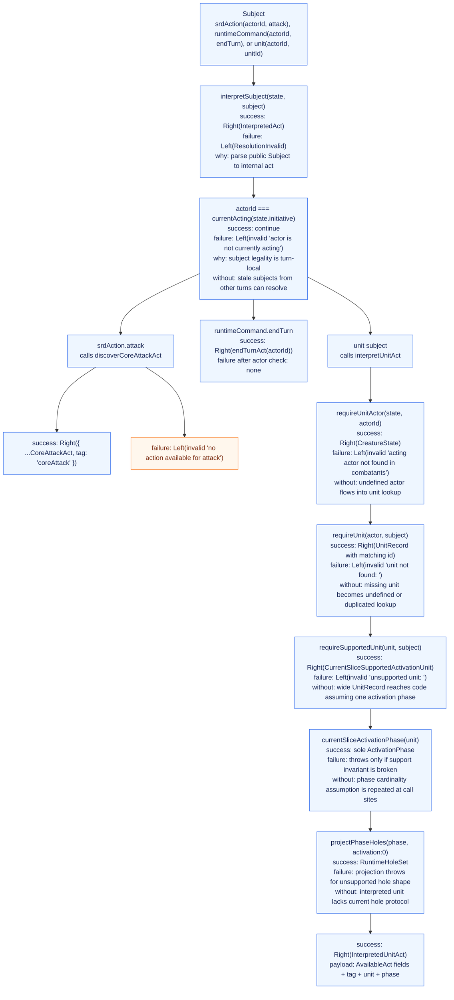
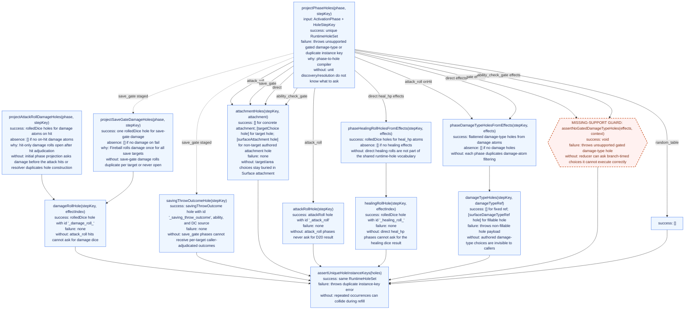
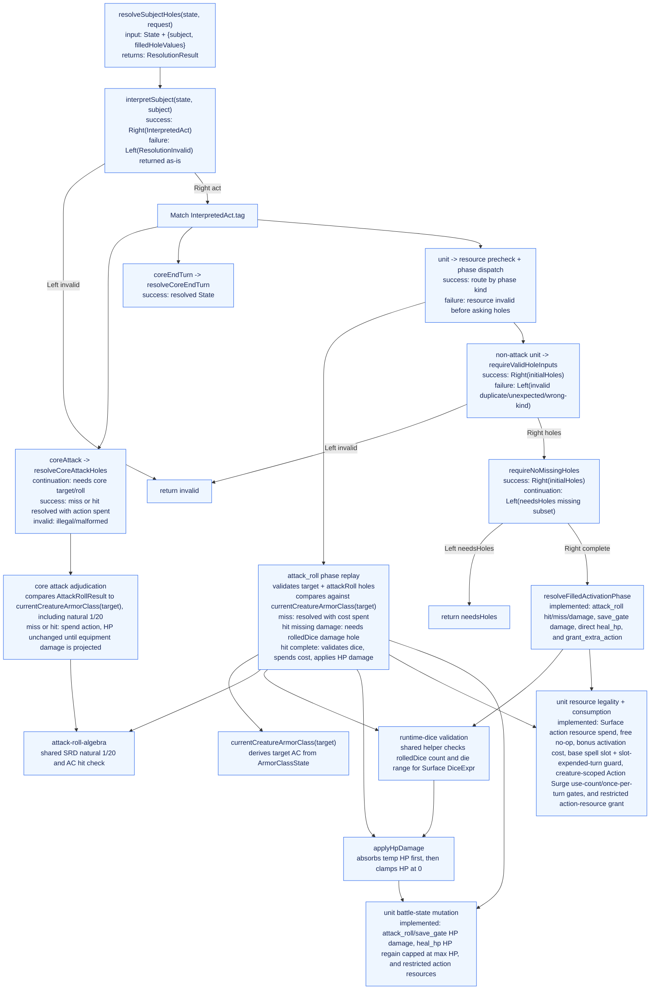
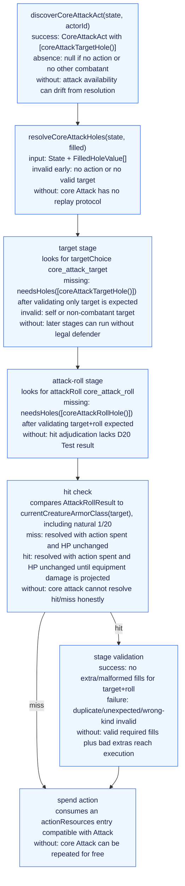
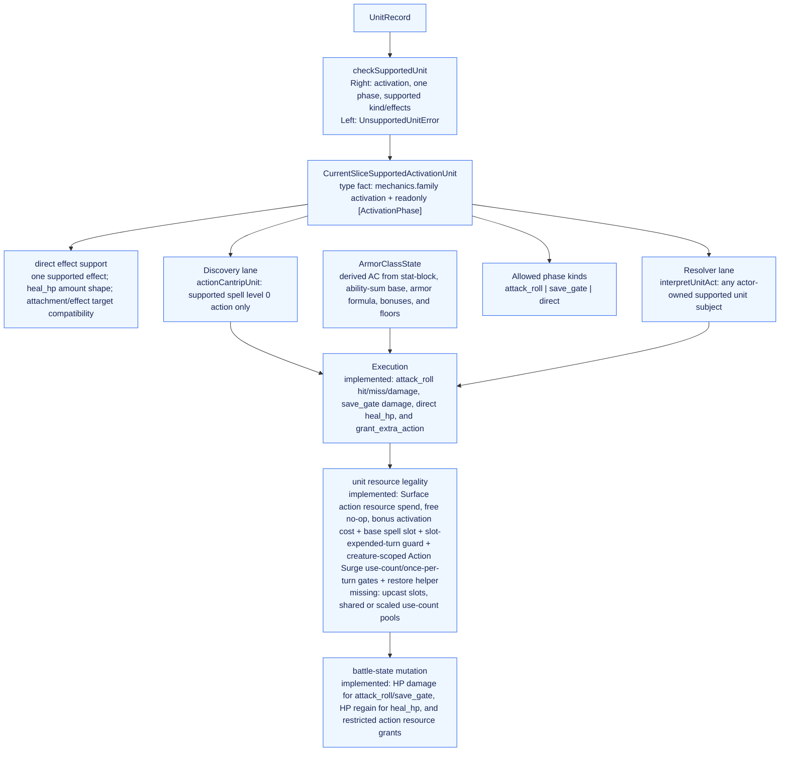

# Surface Runtime Correction Architecture

Status: legacy architecture map for `@dnd/surface-runtime-correction`.

The battle reducer protocol extracted from this package now has a package-owned
map at [../battle-runtime/ARCHITECTURE_GRAPH.md](../battle-runtime/ARCHITECTURE_GRAPH.md).
Do not copy this whole file into `@dnd/battle-runtime`: this graph also contains
Correction-owned Unit activation, cantrip/save-gate/heal/grant-extra-action,
spell-slot, and use-count machinery. Treat those lanes as source material for
restore work until they are intentionally implemented in the owning runtime
package.

<!-- Keep mutation examples intentionally sparse. Do not add more edge-case mutation
examples to this graph unless explicitly asked; one or two concrete examples are
enough to keep the architecture readable. -->

This is a data-flow map of the current reducer architecture. Return labels name
the concrete success, absence, continuation, and invalid payloads. Each major
node also states what would happen if it did not exist.

This is intentionally a representative graph, not a full Surface vocabulary
mirror. Add branches when they explain an implemented vertical, not just because
the schema has another variant.

## System Graph

```mermaid
flowchart TD
  Content["Authored unit JSON<br/>input: content/{unitId}.json<br/>output: raw JSON text<br/>why: Surface content source<br/>without: reducer has no authored unit data"]
  Decode["decodeUnitRecordSync(raw)<br/>input: parsed JSON<br/>success: UnitRecord<br/>failure: schema/decode throw<br/>why: parse at content boundary<br/>without: invalid JSON shape can enter runtime"]
  AssertSupport["assertSupportedUnit(unit)<br/>input: UnitRecord<br/>success: CurrentSliceSupportedActivationUnit<br/>failure: throws UnsupportedUnitError<br/>why: fail fast while loading unsupported content<br/>without: unsupported unit shapes enter CreatureState.units"]
  CreatureUnits["CreatureState.units<br/>data: readonly UnitRecord[] on each combatant<br/>why: actor-owned unit source<br/>without: unit-backed acts cannot be discovered or resolved by ownership"]
  State["State<br/>data: initiative, combatants, action economy, unit activation/use-count memory<br/>why: single legality/replay input<br/>without: discovery and resolution would not share one runtime snapshot"]
  ArmorClass["ArmorClassState helpers<br/>input: creature.armorClass<br/>success: currentCreatureArmorClass(target)<br/>why: attack rolls compare against derived target AC<br/>without: unit attack rolls need duplicated or scalar AC state"]
  Damage["applyHpDamage(creature, amount)<br/>success: creature with temp HP absorbed first and HP clamped at 0<br/>why: one HP damage arithmetic boundary while dead/dying semantics are not modeled here<br/>without: reducers duplicate temp-HP and clamp math"]
  AttackRollAlgebra["attack-roll-algebra<br/>package: @dnd/shared-algebras<br/>input: AttackRollResult + Armor Class<br/>success: SRD natural 1/20 and AC hit fact<br/>why: one D20 attack-roll adjudication path for Correction and battle runtime<br/>without: runtimes drift on natural 1/20 semantics"]
  RuntimeDice["runtime-dice helpers<br/>shared validation in @dnd/shared-algebras, Correction wrapper returns Either<br/>input: rolled dice groups + Surface DiceExpr<br/>success: validated dice total/count/range facts<br/>failure: validation error reason<br/>why: one dice-roll validation path for Surface dice expressions<br/>without: each effect family validates rolls differently or forgets die range"]

  DiscoverPublic["discoverAvailableActs(state)<br/>input: State<br/>success: AvailableAct[] = subject + label + summary + initialHoles<br/>absence: [] only if interpreted discovery returns no acts; current code normally includes End Turn<br/>why: public discovery API<br/>without: callers depend on internal InterpretedAct or duplicate projection"]
  DiscoverInterpreted["discoverInterpretedActs(state)<br/>input: State<br/>success: InterpretedAct[] = legal current-actor acts with resolver payloads attached<br/>absence: omits unavailable attack and non-discoverable units<br/>why: one internal representation for discovery and later subject interpretation<br/>without: discovery must rebuild tag/unit/phase details or expose internals"]
  ProjectAvailable["project InterpretedAct to AvailableAct<br/>input: InterpretedAct<br/>success: { subject, label, summary, initialHoles }<br/>drops: tag, unit, phase<br/>why: caller chooses a subject, not executable internals<br/>without: public discovery leaks resolver-only payloads"]

  CoreAttackDiscover["discoverCoreAttackAct(state, actorId)<br/>input: State + CreatureId<br/>success: CoreAttackAct with initial core_attack_target hole<br/>absence: null when no action or no other combatant<br/>why: one attack availability source<br/>without: discovery and resolution can drift on attack legality"]
  EndTurnAct["endTurnAct(actorId)<br/>input: CreatureId<br/>success: InterpretedCoreEndTurnAct with no holes<br/>failure: none<br/>why: canonical end-turn payload<br/>without: End Turn shape duplicated across discovery and interpretation"]
  UnitDiscover["discoverUnitActs(state, actorId)<br/>input: State + CreatureId<br/>success: InterpretedUnitAct[] for discoverable action cantrips<br/>absence: [] for missing actor or no qualifying units<br/>why: enumerate unit-backed offers for acting creature<br/>without: unit-backed acts never appear in public discovery"]
  CantripGate["actionCantripUnit(unit)<br/>input: UnitRecord<br/>success: supported spell action cantrip<br/>absence: null for unsupported, non-spell, non-cantrip, or non-action<br/>why: current unit discovery lane<br/>without: unsupported or non-action units leak into discovery"]
  InterpretUnit["interpretUnitAct(state, unitSubject)<br/>input: State + {actorId, unitId}<br/>success: Right(InterpretedUnitAct with supported unit, phase, initialHoles)<br/>failure: Left(invalid actor/unit/support reason)<br/>why: parse subject into execution payload<br/>without: resolution reimplements unit lookup/support/hole projection"]
  SharedHoles["runtime-hole-algebra<br/>package: @dnd/shared-algebras<br/>data: HoleId, HoleInstanceKey, RuntimeHole, FilledHoleValue<br/>why: one refill vocabulary for Correction holes; battle may reuse identity types without exposing these variants<br/>without: Correction duplicates hole/fill protocol types"]
  ProjectHoles["projectPhaseHoles(phase, stepKey)<br/>input: ActivationPhase + HoleStepKey<br/>success: RuntimeHoleSet<br/>failure: throws for unsupported gated damage-type holes or duplicate instance keys<br/>why: Correction projection into shared runtime-hole vocabulary<br/>without: discovery and resolution invent parallel hole projections"]

  Request["ResolutionRequest<br/>data: subject + accumulated FilledHoleValue[]<br/>why: replay-from-root input<br/>without: caller cannot refill holes against a stable branch identity"]
  Resolve["resolveSubjectHoles(state, request)<br/>input: State + ResolutionRequest<br/>success: resolved State for endTurn, supported unit attack_roll, save_gate damage, direct heal_hp, and grant_extra_action<br/>continuation: needsHoles<br/>invalid: stale subject, bad fills, illegal target, or unimplemented execution<br/>why: top-level replay/refill dispatcher<br/>without: callers duplicate interpretation and act-specific routing"]
  InterpretSubject["interpretSubject(state, subject)<br/>input: State + Subject<br/>success: Right(InterpretedAct)<br/>failure: Left(ResolutionInvalid)<br/>why: re-validate chosen subject against current state<br/>without: stale or forged subjects bypass legality checks"]
  ResolveCoreAttack["resolveCoreAttackHoles(state, filled)<br/>input: State + FilledHoleValue[]<br/>continuation: needs target or attack roll<br/>success: miss or hit spends action; HP unchanged until equipment damage is projected<br/>invalid: no action, no target, bad target, or malformed fills<br/>why: core attack owns staged replay without inventing weapon damage<br/>without: Attack can be discovered but not driven through choices"]
  ResolveEndTurn["resolveCoreEndTurn(state)<br/>input: State<br/>success: resolved State with next initiative, reset action economy, and cleared once-per-turn unit activations<br/>failure: none<br/>why: implement core endTurn mutation<br/>without: End Turn can be selected but not executed"]
  UnitAttackReplay["unit attack_roll staged replay<br/>input: initial holes + accumulated fills<br/>success: miss resolves, hit asks/applies damage<br/>why: damage dice holes open only after a hit<br/>without: damage rolls are requested too early or rejected as future fills"]
  UnitSaveReplay["unit save_gate staged replay<br/>input: area fill + saving throw outcomes + one damage roll<br/>success: applies full damage on failed saves and half damage on successes<br/>why: Fireball-style damage rolls once for all targets<br/>without: save-gate units stop at a frontier"]
  ValidateInputs["requirePresentOrNeedsHoles / requireCompleteOrNeedsHoles<br/>input: FilledHoleValue[] + expected RuntimeHoleSet<br/>success: staged continue or complete holes<br/>failure/continuation: invalid duplicate/unexpected/wrong-kind or needsHoles<br/>why: one refill protocol for staged branches<br/>without: each branch repeats missing/validation order"]
  RequireComplete["complete non-staged unit holes<br/>input: FilledHoleValue[] + initial holes<br/>success: Right(same holes)<br/>continuation: Left(needsHoles with missing subset)<br/>why: direct units need all initial holes before execution<br/>without: unit resolution proceeds with missing data or treats missing data as invalid"]
  ResolvePhase["resolveFilledActivationPhase(phase)<br/>input: filled supported phase + current holes<br/>success: unit attack_roll hit/miss/damage, save_gate damage, direct heal_hp HP mutation, or grant_extra_action resource grant<br/>invalid/frontier: unsupported execution remains explicit<br/>why: explicit post-refill execution boundary<br/>without: unit resolution conflates complete holes with implemented effects"]
  UnitResource["unit resource legality + consumption<br/>implemented: Surface action resource spend, free no-op, bonus activation cost, base spell slot, slot-expended-turn guard, creature-scoped Action Surge use-count/once-per-turn gates, and restricted action-resource grant<br/>missing: upcast slots, shared or scaled use-count pools"]
  UnitMutation["unit battle-state mutation<br/>implemented: unit attack_roll HP damage, save_gate HP damage, direct heal_hp HP regain, and restricted action resources<br/>missing: conditions/effects"]
  CoreAttackAdjudication["core attack adjudication<br/>implemented: compare D20 attack result against derived AC and spend action<br/>missing: equipment-backed weapon damage"]

  Content --> Decode --> AssertSupport --> CreatureUnits --> State
  State --> ArmorClass
  State --> Damage
  AttackRollAlgebra --> ResolveCoreAttack
  State --> DiscoverPublic --> DiscoverInterpreted
  DiscoverInterpreted --> CoreAttackDiscover
  DiscoverInterpreted --> EndTurnAct
  DiscoverInterpreted --> UnitDiscover --> CantripGate --> InterpretUnit --> ProjectHoles
  SharedHoles --> ProjectHoles
  ProjectHoles --> DiscoverInterpreted
  DiscoverInterpreted --> ProjectAvailable --> AvailableActs["AvailableAct[]"]

  State --> Resolve
  Request --> Resolve
  Resolve --> InterpretSubject
  InterpretSubject -->|Right coreAttack| ResolveCoreAttack --> CoreAttackAdjudication
  InterpretSubject -->|Right coreEndTurn| ResolveEndTurn
  InterpretSubject -->|Right unit attack_roll| UnitAttackReplay --> ResolvePhase
  InterpretSubject -->|Right unit save_gate| UnitSaveReplay --> ResolvePhase
  InterpretSubject -->|Right non-attack unit| ValidateInputs --> RequireComplete --> ResolvePhase
  ResolvePhase --> AttackRollAlgebra
  ResolvePhase --> RuntimeDice --> Damage --> UnitMutation
  ResolvePhase --> ArmorClass
  ResolvePhase --> UnitResource
  InterpretSubject -. unit path uses .-> InterpretUnit

  classDef missing fill:#fff1f0,stroke:#c2410c,stroke-width:2px,stroke-dasharray: 6 4,color:#7c2d12;
  classDef implemented fill:#eef6ff,stroke:#2563eb,color:#172554;
  class CoreAttackAdjudication implemented;
  class Content,Decode,AssertSupport,CreatureUnits,State,ArmorClass,Damage,AttackRollAlgebra,RuntimeDice,DiscoverPublic,DiscoverInterpreted,ProjectAvailable,CoreAttackDiscover,EndTurnAct,UnitDiscover,CantripGate,InterpretUnit,ProjectHoles,Request,Resolve,InterpretSubject,ResolveCoreAttack,ResolveEndTurn,UnitAttackReplay,ValidateInputs,RequireComplete,ResolvePhase,UnitResource,UnitMutation,AvailableActs implemented;
```

## Interpretation Graph

## Hole Projection Graph

## Resolution Graph

## Core Attack Replay

## Function Contracts

| Function or type                                               | Input                                                                                    | Success / continuation payload                                                                                                                                                                           | Failure / absence payload                                                                   | Why                                                                       | Without this                                                           |
| -------------------------------------------------------------- | ---------------------------------------------------------------------------------------- | -------------------------------------------------------------------------------------------------------------------------------------------------------------------------------------------------------- | ------------------------------------------------------------------------------------------- | ------------------------------------------------------------------------- | ---------------------------------------------------------------------- |
| `State`                                                        | n/a                                                                                      | Runtime snapshot: `initiative`, `combatants`, `actionResources`, `currentHasBonusAction`, `unitActivationsThisTurn`, `expendedUnitUseCounts`                                                             | n/a                                                                                         | Shared substrate for legality and replay                                  | Discovery/resolution would not agree on current combat facts           |
| `CreatureState.units`                                          | n/a                                                                                      | Creature-owned `ReadonlyArray<UnitRecord>`                                                                                                                                                               | n/a                                                                                         | Places authored units on combatants                                       | Unit-backed act ownership cannot be checked                            |
| `CreatureState.armorClass`                                     | n/a                                                                                      | `ArmorClassState` base/bonuses/floors/training/hand-use facts                                                                                                                                            | n/a                                                                                         | Carries target AC facts without a duplicated current-AC scalar            | Attack-roll resolution cannot derive target AC                         |
| `currentCreatureArmorClass(creature)`                          | `{ armorClass: ArmorClassState }`                                                        | `ArmorClass` derived from stat-block AC, ability-sum base, armor formula, bonuses, and floors                                                                                                            | n/a                                                                                         | Single current AC projection                                              | AC math duplicates in attack-roll resolution                           |
| `applyHpDamage(creature, amount)`                              | `CreatureState`, damage amount                                                           | `CreatureState` with temp HP absorbed first and HP clamped at `0`                                                                                                                                        | n/a                                                                                         | Single HP-damage arithmetic boundary                                      | Damage reducers duplicate temp-HP and clamp logic                      |
| `loadSupportedUnit(unitId)`                                    | `string`                                                                                 | Decoded `CurrentSliceSupportedActivationUnit`                                                                                                                                                            | File/JSON/schema throw, or `UnsupportedUnitError`                                           | Schema + support boundary for content loading                             | Content bypasses validation or support gate                            |
| `checkSupportedUnit(unit)`                                     | `UnitRecord`                                                                             | `Right(CurrentSliceSupportedActivationUnit)`; save-gate support is currently area-only                                                                                                                   | `Left(UnsupportedUnitError)` with specific support reason                                   | Central executable support gate                                           | Support constraints scatter across modules                             |
| `assertSupportedUnit(unit)`                                    | `UnitRecord`                                                                             | `CurrentSliceSupportedActivationUnit`                                                                                                                                                                    | Throws `UnsupportedUnitError`                                                               | Fail-fast loader variant of support gate                                  | Unsupported content can enter supported library                        |
| `getCurrentSliceSupportedActivationUnit(unit)`                 | `UnitRecord`                                                                             | `Some(CurrentSliceSupportedActivationUnit)`                                                                                                                                                              | `None`                                                                                      | Non-throwing discovery/interpreter support check                          | Discovery uses exceptions or duplicates support logic                  |
| `discoverAvailableActs(state)`                                 | `State`                                                                                  | `AvailableAct[]` of `{ subject, label, summary, initialHoles }`                                                                                                                                          | No error path; could be `[]`, though End Turn normally exists                               | Public act-offer API                                                      | Callers consume `InterpretedAct` internals or duplicate projection     |
| `discoverInterpretedActs(state)`                               | `State`                                                                                  | `InterpretedAct[]`: optional core attack, End Turn, discoverable unit acts                                                                                                                               | Omits unavailable attack and non-discoverable units                                         | Internal discovered-act IR with dispatch and execution payload            | Public discovery loses parsed payload or recomputes it                 |
| `discoverCoreAttackAct(state, actorId)`                        | `State`, `CreatureId`                                                                    | `CoreAttackAct` with `core_attack_target` initial hole                                                                                                                                                   | `null` if no action or no other combatant                                                   | Shared core attack availability and discovery payload                     | Attack discovery and resolution legality drift                         |
| `unitResourceKey(actorId, unitId)`                             | `CreatureId`, `UnitRecord["id"]`                                                         | Branded `UnitResourceKey` scoped by creature and authored unit                                                                                                                                           | n/a                                                                                         | Single identity for creature-owned unit activation/use-count state        | Different creatures' identical unit ids collide or keying duplicates   |
| `hasUnitActionResource(state, actorId, unitId)`                | `ActionEconomyState`, `CreatureId`, `UnitRecord["id"]`                                   | `true` when the unit already granted an unspent action resource for that owner                                                                                                                           | `false`                                                                                     | Duplicate-grant guard for unit action resources                           | One unit can grant parallel action resources by replay                 |
| `grantUnitActionResource(state, actorId, unitId, restriction)` | `ActionEconomyState`, `CreatureId`, `UnitRecord["id"]`, `ActionRestriction`              | `Right(state)` with source-owner restricted unit action resource                                                                                                                                         | `Left("unit-granted action resource already granted")`                                      | Shared action-resource grant primitive                                    | Grant shape and duplicate checks scatter across reducers               |
| `actionCantripUnit(unit)`                                      | `UnitRecord`                                                                             | `DiscoverableActionCantrip`                                                                                                                                                                              | `null` if unsupported, non-spell, non-cantrip, or non-action                                | Current unit discovery filter                                             | Discovery exposes units outside the current lane                       |
| `discoverUnitActs(state, actorId)`                             | `State`, `CreatureId`                                                                    | `InterpretedUnitAct[]`                                                                                                                                                                                   | `[]` if actor missing or no qualifying units                                                | Enumerates acting actor unit acts                                         | Unit-backed acts do not appear in discovery                            |
| `interpretSubject(state, subject)`                             | `State`, `Subject`                                                                       | `Right(InterpretedAct)`                                                                                                                                                                                  | `Left(ResolutionInvalid)` for stale actor, unavailable attack, missing/unsupported unit     | Re-parse selected subject against current state                           | Stale/forged subjects can bypass legality                              |
| `interpretUnitAct(state, subject)`                             | `State`, `UnitSubject`                                                                   | `Right(InterpretedUnitAct)` with supported unit, phase, initial holes                                                                                                                                    | `Left(ResolutionInvalid)` for missing actor/unit/unsupported unit                           | Unit subject parser                                                       | Resolution repeats lookup/support/projection                           |
| `requireUnitActor(state, actorId)`                             | `State`, `CreatureId`                                                                    | `Right(CreatureState)`                                                                                                                                                                                   | `Left(invalid 'acting actor not found in combatants')`                                      | Actor existence boundary                                                  | Undefined actor flows downstream                                       |
| `requireUnit(actor, subject)`                                  | `CreatureState`, `UnitSubject`                                                           | `Right(UnitRecord)` matching `unitId`                                                                                                                                                                    | `Left(invalid 'unit not found: <unitId>')`                                                  | Unit ownership boundary                                                   | Missing unit handling is duplicated or unsafe                          |
| `requireSupportedUnit(unit, subject)`                          | `UnitRecord`, `UnitSubject`                                                              | `Right(CurrentSliceSupportedActivationUnit)`                                                                                                                                                             | `Left(invalid 'unsupported unit: <unitId>')`                                                | Converts support failure to reducer invalid                               | Wide unit reaches one-phase assumptions                                |
| `currentSliceActivationPhase(unit)`                            | `CurrentSliceSupportedActivationUnit`                                                    | Sole `ActivationPhase`                                                                                                                                                                                   | Throws only if support invariant is broken                                                  | Names one-phase current-slice invariant                                   | Positional phase assumption repeats                                    |
| `projectPhaseHoles(phase, stepKey)`                            | `ActivationPhase`, `HoleStepKey`                                                         | `RuntimeHoleSet` for the phase                                                                                                                                                                           | Throws unsupported gated damage-type or duplicate instance key                              | Phase-to-hole compiler                                                    | Unit acts cannot expose initial holes                                  |
| `projectAttackRollDamageHoles(phase, stepKey)`                 | Attack-roll `ActivationPhase`, `HoleStepKey`                                             | `RuntimeHoleSet` of hit-only damage `rolledDice` holes                                                                                                                                                   | No invalid path                                                                             | Opens damage dice only after hit adjudication                             | Attack-roll damage holes are asked too early or duplicated             |
| `projectSaveGateSavingThrowOutcomeHoles(phase, stepKey)`       | Save-gate `ActivationPhase`, `HoleStepKey`                                               | One `savingThrowOutcome` hole carrying the save ability and DC source                                                                                                                                    | No invalid path                                                                             | Opens per-target caller-adjudicated save outcomes after area/target fills | Save-gate execution has no branch outcome input                        |
| `projectSaveGateDamageHoles(phase, stepKey)`                   | Save-gate `ActivationPhase`, `HoleStepKey`                                               | One shared damage `rolledDice` hole                                                                                                                                                                      | No invalid path                                                                             | Models Fireball-style one damage roll for all targets                     | Save-gate damage is rolled per target or not at all                    |
| `attackRollHits(roll, armorClass)`                             | `AttackRollResult`, Armor Class                                                          | `true` for natural 20 or total >= AC; `false` for natural 1 or total < AC                                                                                                                                | n/a                                                                                         | Shared SRD attack-roll hit adjudication                                   | Correction and battle runtime drift on natural 1/20                    |
| `attackRollResultIsValid(roll)`                                | `AttackRollResult`                                                                       | `true` when total is an integer and natural d20 is 1..20                                                                                                                                                 | `false`                                                                                     | Shared attack-roll boundary validation                                    | Invalid d20 values enter hit adjudication                              |
| `validateRolledDiceForDiceExpr(groups, expr)`                  | `RolledDiceGroup[]`, `DiceExpr`                                                          | `Right(void)` when count and every die result fit the expression's die size                                                                                                                              | `Left({ reason })` for wrong count or out-of-range die result                               | Correction wrapper around shared Surface dice-roll validation             | Effect families duplicate or forget dice validation                    |
| `rolledDiceTotal(groups)`                                      | `RolledDiceGroup[]`                                                                      | Sum of all die results                                                                                                                                                                                   | n/a                                                                                         | Re-exported shared roll total computation                                 | Each effect sums roll groups differently                               |
| `validateCurrentHoleInputs(filled, holes)`                     | `FilledHoleValue[]`, `RuntimeHoleSet`                                                    | `null`                                                                                                                                                                                                   | `ResolutionInvalid` for duplicate, unexpected, wrong-kind, or mismatched Surface echo fills | Pure shape validation                                                     | Bad fills reach semantic execution                                     |
| `requireValidHoleInputs(filled, holes)`                        | `FilledHoleValue[]`, `RuntimeHoleSet`                                                    | `Right(same holes)`                                                                                                                                                                                      | `Left(ResolutionInvalid)` from validation                                                   | Pipeline wrapper preserving expected holes                                | Callers hand-roll null checks                                          |
| `missingHoles(filled, holes)`                                  | `FilledHoleValue[]`, `RuntimeHoleSet`                                                    | Missing subset of `holes` by `holeId`                                                                                                                                                                    | No invalid path                                                                             | Shared ID-set subtraction                                                 | Missing-hole computation duplicates                                    |
| `requireNoMissingHoles(filled, holes)`                         | `FilledHoleValue[]`, `RuntimeHoleSet`                                                    | `Right(same holes)` when complete                                                                                                                                                                        | `Left({ tag: 'needsHoles', holes: missingSubset })`                                         | Separates incomplete valid input from executable input                    | Unit execution can proceed incomplete or misreport missing input       |
| `resolveSubjectHoles(state, request)`                          | `State`, `ResolutionRequest`                                                             | `{ tag: 'resolved', state }` for endTurn, supported unit `attack_roll`, `save_gate`, direct `heal_hp`, or `grant_extra_action`; `needsHoles`                                                             | `ResolutionInvalid` for illegal subject/bad fills/unsupported execution                     | Top-level replay/refill dispatcher                                        | Callers duplicate interpretation and routing                           |
| `resolveCoreAttackHoles(state, filled)`                        | `State`, `FilledHoleValue[]`                                                             | `needsHoles` for target or roll; resolved miss or hit with action spent and no HP mutation until equipment damage exists                                                                                 | Invalid for no action, no target, invalid target, bad fills                                 | Core attack replay protocol                                               | Attack can be offered but not advanced                                 |
| `resolveCoreEndTurn(state)`                                    | `State`                                                                                  | Resolved next-turn state with action economy reset and `unitActivationsThisTurn` cleared                                                                                                                 | No local failure                                                                            | Only implemented state mutation here                                      | End Turn can be selected but not executed                              |
| `resolveFilledActivationPhase(phase, filled, currentHoles)`    | Filled supported `ActivationPhase`, current `FilledHoleValue[]`, current `RuntimeHole[]` | `attack_roll` resolves miss or hit damage; `save_gate` applies full/half damage; direct `heal_hp` resolves target + healing dice and HP regain; `grant_extra_action` grants a restricted action resource | Unsupported execution returns explicit invalid                                              | Explicit unit execution boundary                                          | Completed unit holes have no semantic destination                      |
| `restoreUnitUseCountsForCreature(state, actorId)`              | `State`, `CreatureId`                                                                    | `State` with `expendedUnitUseCounts` entries removed only for that creature                                                                                                                              | n/a                                                                                         | Shared restore hook for Surface rest/dawn-style use-count refresh         | Restore logic either clears every creature or duplicates key filtering |
| `coreAttackTargetHole()`                                       | none                                                                                     | `RuntimeHole` for `core_attack_target`                                                                                                                                                                   | none                                                                                        | Stable target ask                                                         | Core target identity duplicates                                        |
| `coreAttackRollHole()`                                         | none                                                                                     | `RuntimeHole` for `core_attack_roll`                                                                                                                                                                     | none                                                                                        | Stable attack-roll ask                                                    | Core roll identity duplicates                                          |

## Current Slice Invariants

Important consequences:

- Discovery uses `InterpretedAct` as an internal representation:
  `discoverAvailableActs(state)` calls `discoverInterpretedActs(state)` and
  then drops resolver-only fields.
- Unit discovery is narrower than unit resolution: discovery surfaces action
  cantrips, while explicit unit subjects can resolve any actor-owned supported
  unit.
- Runtime holes are current-stage facts. Replay resends all accumulated
  `FilledHoleValue[]`; the interpreted act decides which fills are legal now.
- Unit target holes now use the same runtime answer shape as core attack:
  `targetChoice`. The authored target attachment remains hole metadata, not the
  filled answer payload.
- Support owns admissible unit shape. Runtime-hole projection owns question
  derivation. Refilling owns generic answer validation and completeness.
  Resolution owns dispatch to core mutation or phase-family frontiers.

## What The System Graph Still Misses

The intended reducer interface is simpler than the current implementation graph:

```mermaid
flowchart LR
  State["Battle State<br/>implemented: State"]
  Options["decisionOptions(state)<br/>implemented: discoverAvailableActs(state)"]
  Resolve["react(state, request)<br/>implemented: resolveSubjectHoles(state, request)"]
  EndTurnState["Battle State'<br/>implemented for endTurn, unit attack_roll, save_gate, and direct heal_hp"]

  TableDecision{{"MISSING: Table Decision<br/>selected subject + accumulated FilledHoleValue[]"}}
  ReducerFacade{{"MISSING: single reducer facade<br/>one table-facing protocol wrapping options + reaction"}}
  StateLoop{{"MISSING: explicit resolved-state feedback<br/>next options come from returned state"}}
  UnitExecution["unit phase execution<br/>implemented: attack_roll hit/miss/damage, save_gate damage, direct heal_hp, and grant_extra_action"]
  ResourceLegality["unit resource legality<br/>implemented: Surface action resource spend, free no-op, bonus activation cost + base spell slot + slot-expended-turn guard + creature-scoped Action Surge use-count/once-per-turn gates + restore helper<br/>missing: upcast slots, shared or scaled use-count pools"]
  ApplyEffects["battle-state mutation<br/>implemented: HP damage, healing, and restricted action resources<br/>missing: conditions/effects"]
  DecisionType{{"MISSING: explicit Decision type<br/>AvailableAct subject + filled answers"}}

  State --> Options
  Options --> TableDecision
  TableDecision --> DecisionType --> Resolve
  State --> Resolve
  Resolve -->|resolved today: endTurn, unit attack_roll, save_gate, direct heal_hp, or grant_extra_action| EndTurnState
  EndTurnState --> StateLoop --> Options
  Resolve -->|needsHoles| TableDecision
  Resolve -->|invalid| TableDecision

  Options -. should be one interface with .-> ReducerFacade
  Resolve -. should be one interface with .-> ReducerFacade
  Resolve -->|unit holes complete| ResourceLegality --> UnitExecution --> ApplyEffects --> EndTurnState

  classDef missing fill:#fff1f0,stroke:#c2410c,stroke-width:2px,stroke-dasharray: 6 4,color:#7c2d12;
  classDef implemented fill:#eef6ff,stroke:#2563eb,color:#172554;
  class TableDecision,ReducerFacade,StateLoop,DecisionType missing;
  class State,Options,Resolve,EndTurnState,UnitExecution,ResourceLegality,ApplyEffects implemented;
```

The current System Graph does not yet make these interface-level facts explicit:

- The table is not a node. The graph shows `ResolutionRequest`, but not the
  external decision-maker choosing an `AvailableAct.subject` and returning
  filled answers.
- The option/reaction loop is implicit. `discoverAvailableActs(state)` is
  option production, and `resolveSubjectHoles(state, request)` is reaction, but
  the graph does not show them as the two halves of one reducer protocol.
- State feedback is underdrawn. `resolveCoreEndTurn` returns a new `State`, but
  the graph does not draw `resolved.state` back into the next discovery cycle.
- Unit execution is still partial. Direct `heal_hp` can now validate its target
  and healing dice, pay action/free activation cost plus a base spell slot,
  enforce the slot-expended-turn guard, then mutate HP. Attack-roll and
  save-gate damage application are implemented. Extra action grants are
  implemented for the Action Surge-shaped slice.
- Resource legality is still incomplete for unit-backed acts. It now handles
  action/free activation cost, base spell slot spending, the slotted-spell
  once-per-turn guard, and Action Surge's creature-scoped once-per-turn/use-count
  gates plus restore helper, but upcast slot choice, shared/scaled use-count
  semantics, and broader illegal-use rejection remain missing.
- The decision type is not explicit. `AvailableAct` is an offered option;
  `ResolutionRequest` is a replay request. The conceptual table decision is the
  bridge between them: selected `subject` plus accumulated `FilledHoleValue[]`.
