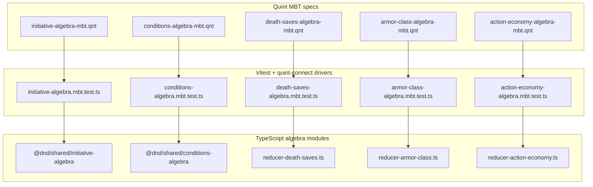
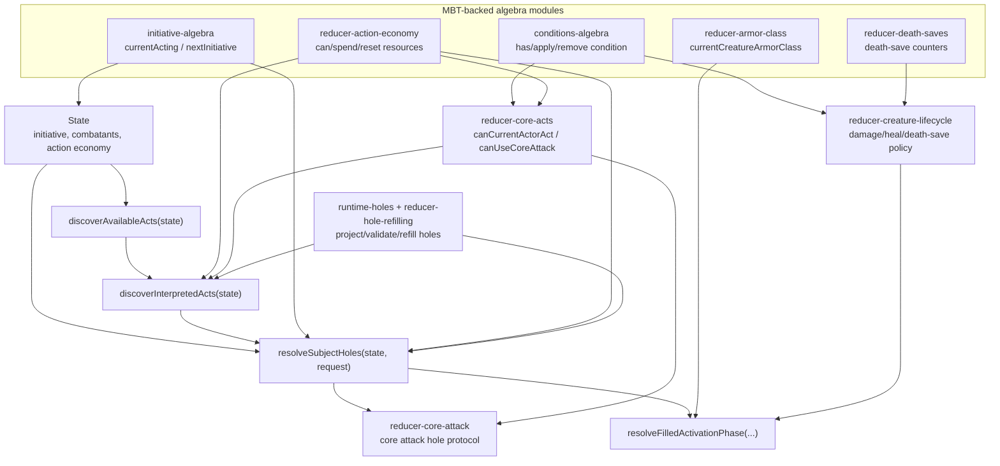
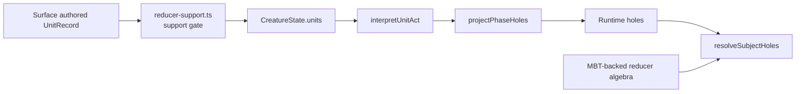
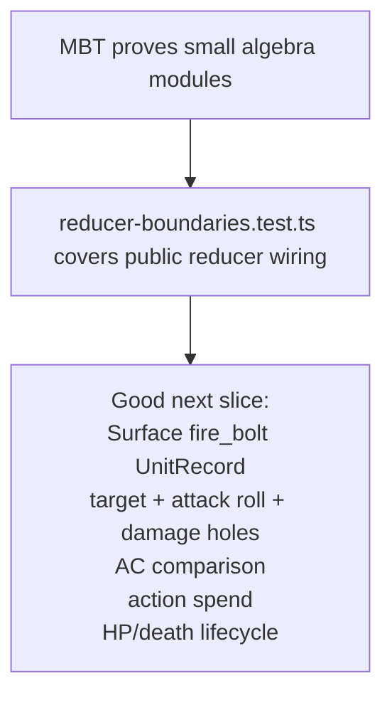

# MBT To Reducer Graph

This package keeps model-based tests small on purpose. Each Quint file models one reducer algebra, and the TypeScript MBT driver replays that Quint transition system against the TypeScript module that production code also imports.

The MBT entry points do not currently prove `resolveSubjectHoles` as one large state machine. They prove the smaller sub-reducers that the main reducer composes, while `reducer-boundaries.test.ts` covers the public discovery/resolution wiring.

## Entry Points



Each driver uses the same shape:

```ts
await run({
  spec,
  init: "init",
  step: "step",
  driver,
  backend: "typescript",
  stateCheck,
});
```

Quint chooses traces. The driver exposes matching action names. After every step, `stateCheck` compares the normalized Quint state with the TypeScript module state.

## Reducer Composition



The important connection is that MBT drivers and production reducer code import the same TypeScript modules. For example, action-economy MBT validates `spendActivationResource`, and `resolveSubjectHoles` uses that same function when a unit is resolved.

## Coverage Status

Legend:

- **Implemented + MBT + reducer-used:** MBT covers the TS module, and the main reducer imports that same module in discovery/resolution.
- **Implemented + reducer-used, not MBT-covered:** production reducer uses it, but only unit/boundary tests cover it today.
- **Implemented + MBT, partially reducer-used:** MBT covers the algebra, but the main reducer currently uses only part of that algebra.
- **Missing:** explicit frontier or no integrated proof exists yet.

```mermaid
flowchart TD
  classDef full fill:#ecfdf5,stroke:#047857,color:#064e3b;
  classDef partial fill:#fffbeb,stroke:#b45309,color:#78350f;
  classDef reducerOnly fill:#eff6ff,stroke:#2563eb,color:#1e3a8a;
  classDef missing fill:#fff1f2,stroke:#be123c,stroke-dasharray:6 4,color:#881337;

  subgraph Full["Implemented + MBT + reducer-used"]
    InitiativeFull["initiative algebra<br/>MBT: yes<br/>Reducer: current actor + end turn"]
    ConditionsFull["conditions algebra<br/>MBT: yes<br/>Reducer: incapacitated/unconscious lifecycle"]
    DeathPureFull["death-save counter algebra<br/>MBT: yes<br/>Reducer: via lifecycle helpers"]
    ArmorFull["armor-class algebra<br/>MBT: yes<br/>Reducer: unit attack AC comparison"]
  end

  subgraph Partial["Implemented + MBT, partially reducer-used"]
    ActionPartial["action economy algebra<br/>MBT: action/free/bonus/reset<br/>Reducer: action spend/reset now; bonus/free only resolver-ready"]
  end

  subgraph ReducerOnly["Implemented + reducer-used, not MBT-covered"]
    LifecycleOnly["creature lifecycle<br/>damage/heal/zero-HP policy<br/>Tests: unit + reducer-boundary"]
    SupportOnly["Surface support gate<br/>UnitRecord -> supported slice<br/>Tests: reducer-support + boundaries"]
    HolesOnly["runtime holes/refilling<br/>project/validate/replay holes<br/>Tests: runtime-holes + boundaries"]
    PublicReducerOnly["public reducer flow<br/>discoverAvailableActs / resolveSubjectHoles<br/>Tests: reducer-boundaries"]
  end

  subgraph Missing["Missing or explicit frontier"]
    IntegratedMbtMissing["integrated reducer MBT<br/>Surface act -> holes -> resolution -> state"]
    SurfaceMbtMissing["Surface parsing/projection MBT<br/>authored UnitRecord -> reducer holes/effects"]
    CoreAttackMissing["core Attack adjudication<br/>target + roll + damage still frontier"]
    SaveGateMissing["save_gate outcome application"]
    GrantExtraActionMissing["grant_extra_action execution"]
    UpcastUsesMissing["upcast slots / use counts / other once-turn limits"]
    StartTurnDeathSaveMissing["start-turn death-save reducer path"]
  end

  DeathPureFull --> LifecycleOnly
  ConditionsFull --> LifecycleOnly
  LifecycleOnly --> PublicReducerOnly
  InitiativeFull --> PublicReducerOnly
  ActionPartial --> PublicReducerOnly
  ArmorFull --> PublicReducerOnly
  SupportOnly --> PublicReducerOnly
  HolesOnly --> PublicReducerOnly

  IntegratedMbtMissing -. would cover .-> PublicReducerOnly
  SurfaceMbtMissing -. would cover .-> SupportOnly

  class InitiativeFull,ConditionsFull,DeathPureFull,ArmorFull full;
  class ActionPartial partial;
  class LifecycleOnly,SupportOnly,HolesOnly,PublicReducerOnly reducerOnly;
  class IntegratedMbtMissing,SurfaceMbtMissing,CoreAttackMissing,SaveGateMissing,GrantExtraActionMissing,UpcastUsesMissing,StartTurnDeathSaveMissing missing;
```



The key non-obvious status is death saves. The pure counter algebra is MBT-covered. The composed creature lifecycle that decides whether a creature dies at 0 HP, uses death saves, becomes unconscious, or resets counters on healing is not MBT-covered yet; it is covered by reducer unit tests and reducer boundary tests.

The key action-economy status is similar. The algebra supports action, free action, bonus action, and reset. The public discovery lane currently exposes action cantrips only, so bonus/free-action algebra is resolver-ready but not fully exercised by discovered unit-backed acts.

## Surface Boundary



The Quint MBT specs do not parse or execute Surface directly. They model the reducer algebra after Surface has already been decoded, support-checked, and projected into reducer state.

Surface enters the main reducer path through `UnitRecord`s on `CreatureState.units`. The reducer support gate narrows those authored units to the current supported slice. Then `interpretUnitAct` and `projectPhaseHoles` turn Surface-authored holes and effects into runtime holes and reducer actions.

The exception is armor class: the armor MBT models reducer-level armor concepts that are meant to receive Surface-derived armor data, such as armor formulas, shield training, hand use, unarmored bonuses, and floors. It still tests the TypeScript reducer algebra, not Surface parsing itself.

Surface is therefore **used by the reducer**, not directly by the `.qnt` files:

- `UnitRecord`s sit on `CreatureState.units`.
- `reducer-support.ts` decides whether an authored unit is inside this reducer slice.
- `runtime-holes.ts` projects supported Surface holes/effects into reducer-facing runtime holes.
- `resolveSubjectHoles` consumes the projected holes and then calls MBT-backed reducer algebra where needed.

The `.qnt` files intentionally model post-projection reducer concepts. A future Surface projection MBT should test authored Surface fixtures against the projected runtime holes/effect metadata.

## Current Coverage Boundary



This split is deliberate for state explosion. The small algebras are composable and independently checkable. The public reducer tests make sure those same modules are used in discovery and resolution. A later integrated MBT should cover one narrow vertical Surface-backed reducer slice rather than all combat at once.

## Missing Work List

Missing entirely:

- Integrated reducer MBT for a real Surface-backed act.
- Surface parsing/projection MBT.
- Core `Attack` adjudication and state mutation.
- `save_gate` outcome execution.
- `grant_extra_action` execution.
- Upcast slots, use counts, and other once-per-turn limits.
- Start-turn death-save transition in the public reducer.

Implemented but not fully utilized by MBT:

- Creature lifecycle composition (`damageCreatureHp`, `healCreatureHp`, zero-HP policy).
- Public reducer discovery/resolution flow.
- Surface support gate and runtime-hole projection/refilling.

Implemented but not fully utilized by main reducer logic:

- Bonus/free-action action-economy spending is implemented in the sub-reducer, but current public discovery only offers action cantrips.
- Armor algebra is ready for Surface-derived armor data, but Surface projection of armor state is not MBT-covered here.
- Death-save counter algebra is ready for start-turn death-save rolls, but the public reducer has no start-turn death-save act/window yet.
