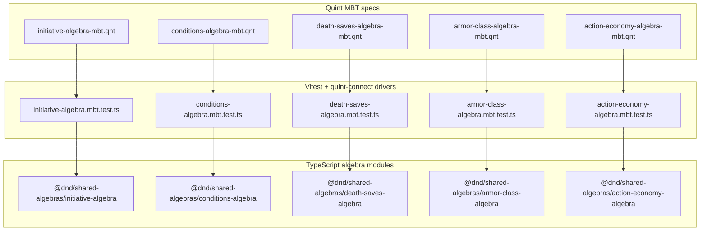
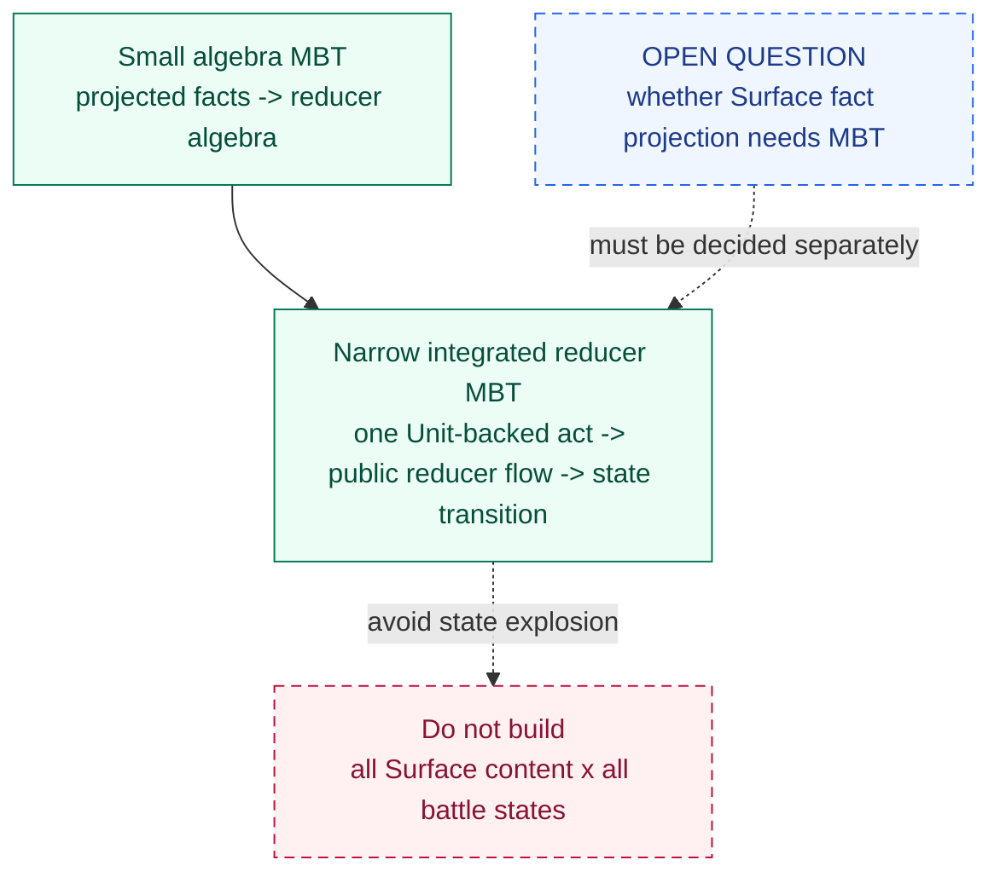
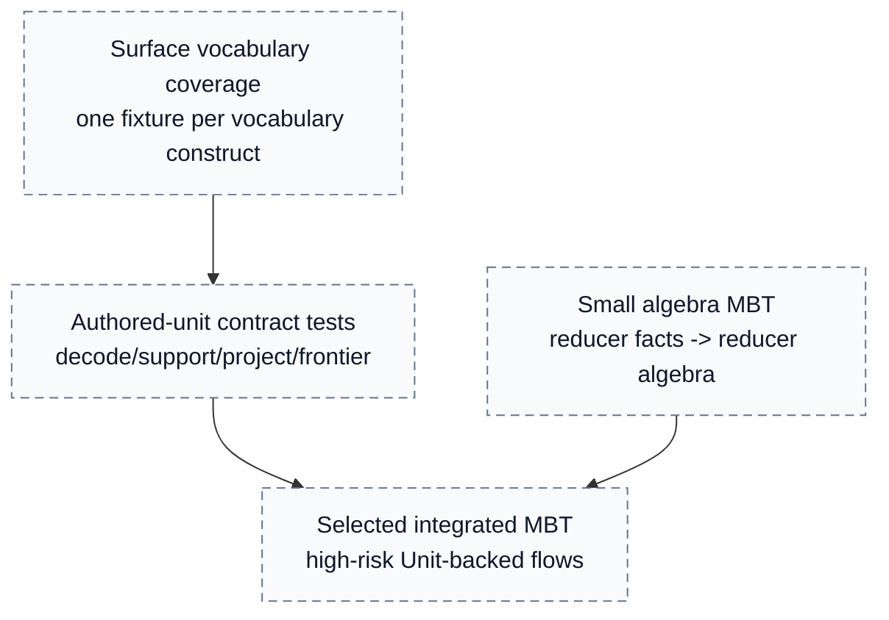
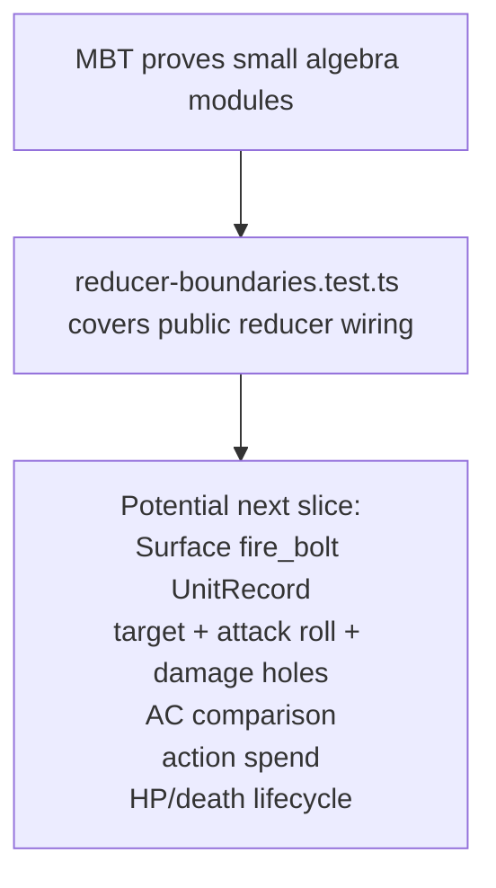

# MBT To Reducer Graph

This package keeps model-based tests small on purpose. Each Quint file models one reducer algebra, and the TypeScript MBT driver replays that Quint transition system against the TypeScript module that production code also imports.

The MBT entry points do not currently prove `resolveSubjectHoles` as one large state machine. They prove the smaller sub-reducers that the main reducer composes, while `reducer-boundaries.test.ts` covers the public discovery/resolution wiring.

## Ownership Note

`@dnd/shared-algebras` is the correction package's reusable algebra home. It
contains shared initiative, conditions, death-save, armor-class, and
action-economy algebras consumed by this package's MBT drivers and reducer
code.

The shared-algebras package is intentionally separate from `@dnd/shared`:

- `@dnd/shared` owns low-level scalar/domain types.
- `@dnd/shared-algebras` owns reusable semantic algebras.
- `@dnd/shared-algebras` may depend on Surface vocabulary where an algebra or adapter intentionally speaks Surface, but Surface imports must stay explicit.

The death-save, armor-class, and action-economy algebras used to live inside `surface-runtime-correction`; they now live in `@dnd/shared-algebras`. Their MBT specs check those shared TypeScript modules against the local Quint models:

- death saves are tied to `CreatureState`, zero-HP lifecycle policy, healing, and damage;
- armor class is the reducer-local structured state for armor/equipment reducer facts, regardless of whether those facts later come from Surface, fixtures, or another caller;
- action economy is tied to this reducer's current turn-resource fields and current Surface activation-cost support.

Ownership rule:

- move reusable algebra to `@dnd/shared-algebras`;
- move battle lifecycle/action semantics to `@dnd/battle-runtime`
  when they become canonical runtime behavior for the new battle path;
- keep `@dnd/core` ownership scoped to the legacy/broad Core lane until that
  lane is deleted, rewritten, or explicitly preserved;
- keep Surface projection glue near the Surface/correction runtime.

MBT is evidence about behavior, not ownership. Passing MBT does not make a module canonical; canonical status is decided by where the repo wants that rule to live and which callers should depend on it.

## Entry Points



Each driver uses the same shape:

```ts
await run({
  spec,
  init: "init",
  step: "step",
  driver,
  backend: "typescript",
  stateCheck,
});
```

Quint chooses traces. The driver exposes matching action names. After every step, `stateCheck` compares the normalized Quint state with the TypeScript module state.

## Reducer Composition


The important connection is that MBT drivers and production reducer code import the same TypeScript modules. For example, action-economy MBT validates `spendActivationResource`, and `resolveSubjectHoles` uses that same function when a unit is resolved.

## Coverage Status

Legend:

- **MBT-covered module with reducer usage:** MBT covers the TS module, and the main reducer imports some or all of that module in discovery/resolution.
- **Implemented + reducer-used, not MBT-covered:** production reducer uses it, but only unit/boundary tests cover it today.
- **Implemented + MBT, partially reducer-used:** MBT covers the algebra, but the main reducer currently uses only part of that algebra.
- **Missing:** explicit frontier or no integrated proof exists yet.

```mermaid
flowchart TD
  classDef full fill:#ecfdf5,stroke:#047857,color:#064e3b;
  classDef partial fill:#fffbeb,stroke:#b45309,color:#78350f;
  classDef reducerOnly fill:#eff6ff,stroke:#2563eb,color:#1e3a8a;
  classDef missing fill:#fff1f2,stroke:#be123c,stroke-dasharray:6 4,color:#881337;

  subgraph Used["MBT-covered module with reducer usage"]
    InitiativeFull["initiative algebra<br/>MBT: yes<br/>Reducer: current actor + end turn"]
    ConditionsFull["conditions algebra<br/>MBT: yes<br/>Reducer: incapacitated/unconscious lifecycle"]
    DeathPureFull["death-save counter algebra<br/>MBT: yes<br/>Reducer: damage/heal lifecycle helpers<br/>Unused now: start-turn roll path"]
    ArmorFull["armor-class algebra<br/>MBT: yes<br/>Reducer: unit attack AC comparison<br/>Unused now: Surface armor/equipment projection"]
  end

  subgraph Partial["Implemented + MBT, partially reducer-used"]
    ActionPartial["action economy algebra<br/>MBT: Surface action resources/free/bonus/reset<br/>Reducer: action resource spend/reset, Action Surge grant, and bonus resolver-ready"]
  end

  subgraph ReducerOnly["Implemented + reducer-used, not MBT-covered"]
    LifecycleOnly["creature lifecycle<br/>damage/heal/zero-HP policy<br/>Tests: unit + reducer-boundary"]
    SupportOnly["Surface support gate<br/>UnitRecord -> supported slice<br/>Tests: reducer-support + boundaries"]
    HolesOnly["runtime holes/refilling<br/>project/validate/replay holes<br/>Tests: runtime-holes + boundaries"]
    SaveGateOnly["save_gate damage execution<br/>area + save outcomes + one damage roll<br/>Tests: reducer-boundary"]
    PublicReducerOnly["public reducer flow<br/>discoverAvailableActs / resolveSubjectHoles<br/>Tests: reducer-boundaries"]
  end

  subgraph Missing["Missing or explicit frontier"]
    IntegratedMbtMissing["integrated reducer MBT<br/>Surface act -> holes -> resolution -> state"]
    SurfaceMbtQuestion["OPEN QUESTION<br/>whether/where to MBT Surface fact projection"]
    CoreAttackMissing["core Attack adjudication<br/>target + roll + damage still frontier"]
    UpcastUsesMissing["upcast slots / shared or scaled use-count pools"]
    StartTurnDeathSaveMissing["start-turn death-save reducer path"]
  end

  DeathPureFull --> LifecycleOnly
  ConditionsFull --> LifecycleOnly
  LifecycleOnly --> PublicReducerOnly
  InitiativeFull --> PublicReducerOnly
  ActionPartial --> PublicReducerOnly
  ArmorFull --> PublicReducerOnly
  SupportOnly --> PublicReducerOnly
  HolesOnly --> PublicReducerOnly
  SaveGateOnly --> PublicReducerOnly

  IntegratedMbtMissing -. would cover .-> PublicReducerOnly
  SurfaceMbtQuestion -. would clarify .-> SupportOnly

  class InitiativeFull,ConditionsFull,DeathPureFull,ArmorFull full;
  class ActionPartial partial;
  class LifecycleOnly,SupportOnly,HolesOnly,SaveGateOnly,PublicReducerOnly reducerOnly;
  class IntegratedMbtMissing,SurfaceMbtQuestion,CoreAttackMissing,UpcastUsesMissing,StartTurnDeathSaveMissing missing;
```



The key non-obvious status is death saves. The pure counter algebra is MBT-covered. The composed creature lifecycle that decides whether a creature dies at 0 HP, uses death saves, becomes unconscious, or resets counters on healing is not MBT-covered yet; it is covered by reducer unit tests and reducer boundary tests. The start-turn death-save roll path is missing from the public reducer. It is a "wire soon" item because the pure counter and creature lifecycle helpers already exist; what is missing is the reducer act/window that asks for the death save roll at the right turn boundary.

The key action-economy status is similar. The algebra supports action resources with Surface `ActionRestriction`, free no-op costs, bonus actions, multiple unit-granted restricted action resources, duplicate-grant rejection, and reset. The public discovery lane currently exposes action cantrips and Action Surge; broader bonus-action discovery still depends on supported Surface units, not just the algebra. Action Surge's once-per-turn guard and creature-scoped use-count spend/restore helper are implemented in the reducer; upcast slots and shared or scaled use-count pools remain explicit later work.

Armor-class math is MBT-covered and used for unit attack AC comparison. Surface
armor/equipment projection into `ArmorClassState` does not exist in this
package. The new battle runtime path owns that projection at
`@dnd/battle-runtime` or its MCP composition boundary. That belongs to the open
Surface/MBT boundary discussion: first decide the Surface fact projection
contract, then decide whether that contract needs ordinary tests, MBT, or both.

## Surface Boundary

The full Surface-to-reducer data-flow graph belongs in `ARCHITECTURE_GRAPH.md`. This document only records the MBT boundary.

The Quint MBT specs do not parse or execute Surface directly. They model reducer facts after Surface has already been decoded, support-checked, and converted into reducer-facing state or runtime holes.

Current MBT validates reducer algebra over reducer facts, not Surface facts. The adjacent unit/boundary tests cover the current Surface-to-reducer boundary:

- `UnitRecord`s sit on `CreatureState.units`.
- `reducer-support.ts` decides whether an authored unit is inside this reducer slice.
- `runtime-holes.ts` projects supported Surface holes/effects into reducer-facing runtime holes.
- `resolveSubjectHoles` consumes the projected holes and then calls MBT-backed reducer algebra where needed.

The distinction matters: a reducer fact is something like "this activation costs one action", "this target has AC 18", or "this runtime hole asks for an attack roll". A Surface fact is authored content shape: `UnitRecord`, phases, attachments, effects, dice expressions, equipment, and other content-level data.

Core also has a separate projected-unit bridge in `@dnd/core`, with local tags
such as `CPUExecutable`, `CPUPersistent`, `PEASaveGateDamage`, `PPRSetBaseAc`,
and `PRGUseCount`. Those names are not Surface vocabulary and are not the
correction package's reducer-fact vocabulary. They are a transitional core-local
compiled projected-unit IR: authored Surface-like records are narrowed into
execution/persistent records that core can consume. Treat that bridge as another
projection boundary, not as the canonical Surface model. This
`CPU*`/`PEA*`/`PPR*` projected-unit vocabulary is not the intended long-term
architecture; it should be removed or replaced by direct Surface-authored
records feeding the owning runtime packages.

Whether Surface fact projection should get MBT is an open question. For now, this document must not assume a Surface projection MBT exists or must exist. The current concrete coverage is ordinary unit/boundary testing around support gates, runtime-hole projection, and reducer execution.

## Surface And State Explosion Policy

The project-wide battle model should not enumerate every concrete Surface-authored state. That would fight the architecture: combat semantics are proved over abstract mechanics and caller-provided inputs, while content, spatial facts, and table rulings enter through explicit projection/input boundaries.

That gives two current MBT layers plus one open design question:



Current `.qnt` files are the first layer. They should stay post-projection and should not parse Surface `UnitRecord`s or Surface JSON.

The open Surface projection question should be decided using representative contracts, not all content. Possible examples to evaluate:

- `fire_bolt`: Surface unit -> support gate -> target/attack/damage holes -> AC comparison -> action spend -> HP/death lifecycle.
- Armor/equipment: Surface armor/shield facts -> `ArmorClassState` -> `currentArmorClass`.
- Healing spell: Surface `cure_wounds` unit -> target/healing-roll holes -> spell slot/action spend -> lifecycle healing.

Do not make the full battle MBT enumerate all Surface content and all concrete runtime states. If Surface projection gets MBT later, keep it as projection-contract checks and keep battle semantics abstract where the architecture already treats inputs as caller/session/table-provided.

## Draft: Surface Vocabulary And Authored Unit Coverage

This section is a draft planning note, not a committed testing strategy.

Surface coverage should be split into different goals:

- **Vocabulary coverage:** every Surface vocabulary construct has at least one representative fixture that checks the projection contract into reducer facts.
- **Authored-unit coverage:** every authored unit has deterministic contract tests for decode, support-gate result, projected holes/effects, resource cost, and expected resolver frontier or execution path.
- **Reducer behavior coverage:** reducer algebras and selected integrated flows are checked with MBT where nondeterministic traces add value.

This is not the same as proving every authored unit in every battle state. The goal is to cover Surface language shapes and authored content contracts without multiplying them by all reducer states.



Per-authored-unit MBT is possible, but should be selective. The default should be table-driven contract tests. Add MBT when a unit introduces a new semantic reducer shape or a high-risk interaction.

Possible examples:

- `fire_bolt` covers `attack_roll`, target choice, attack roll, damage roll, action cost, AC comparison, and HP damage.
- `cure_wounds` covers direct `heal_hp`, target choice, healing dice, spell slot cost, and death-save/lifecycle healing.
- `fireball` covers `save_gate`, area attachment, saving throw outcomes, and damage application in the reducer-boundary tests; it remains a candidate for selected integrated MBT if this flow becomes a proof target.
- `chromatic_orb` should cover damage-type choice and continuation/frontier behavior until supported.
- `fighter_action_surge` covers `grant_extra_action` as a restricted action resource that excludes Magic, cannot be activated twice in the same turn, and spends/restores its creature-scoped current use count.

Open decision:

- Whether Surface vocabulary projection should use MBT, ordinary table-driven tests, or both.
- Current working bias: table-driven tests for broad vocabulary/authored-unit coverage; MBT for reducer algebra and selected integrated reducer flows.

## Current Coverage Boundary



This split is deliberate for state explosion. The small algebras are composable and independently checkable. The public reducer tests make sure those same modules are used in discovery and resolution. If integrated reducer MBT is added, it should cover one narrow vertical Unit-backed reducer slice rather than all combat at once.

## Missing Work List

Missing entirely:

- Integrated reducer MBT for a real Unit-backed act.
- Decision on whether Surface fact projection should have MBT, ordinary tests, or both.
- Core `Attack` adjudication and state mutation.
- Upcast slots and shared or scaled use-count pools.
- Start-turn death-save transition in the public reducer.

Implemented but not fully utilized by MBT:

- Creature lifecycle composition (`damageCreatureHp`, `healCreatureHp`, zero-HP policy).
- Public reducer discovery/resolution flow.
- `save_gate` damage execution.
- Surface support gate and runtime-hole projection/refilling.

Implemented but not fully utilized by main reducer logic:

- Bonus-action spending is implemented in the sub-reducer; discovery of bonus-action unit acts is not wired yet. Free activation costs are modeled as no action-economy spend.
- Armor algebra is ready to receive projected armor/equipment reducer facts; core use waits for core's armor/equipment projection path, and the Surface-to-armor projection contract is undecided and not implemented.
- Death-save counter algebra is ready for start-turn death-save rolls; the public reducer has no start-turn death-save act/window yet.

Likely wire soon:

- Start-turn death-save act/window. The algebra and lifecycle helpers already exist; the missing part is reducer scheduling and the roll hole/result application.
- Core attack adjudication. The hole protocol exists; the remaining work is hit comparison, action spend, and damage mutation, similar to the already implemented unit attack-roll path.

Likely wire later:

- Bonus-action unit discovery. The sub-reducer can spend the resource, but useful discovery depends on more supported Surface units.
- Shared resource-payment adoption in core. The current primitive should grow toward multi-cost validation and atomic spend.
- Surface armor/equipment projection. The armor reducer shape exists, but core adoption waits for core to have armor/equipment facts, and the projection contract from authored Surface equipment facts still needs design.
- Upcasts and shared or scaled use-count pools. These depend on broader Surface resource semantics.
