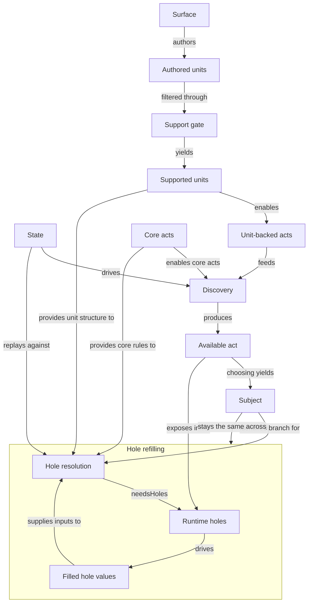

acts - executable branches in the reducer protocol. We say `acts` here to avoid
collision with the domain resource `action` in the action economy.
When an act is chosen, its `subject` becomes the execution identity reused
across hole refilling.

core acts - reducer-owned non-unit acts like `attack` and `endTurn`.

unit-backed acts - executable branches derived from authored units.

authored units - authored `UnitRecord`s from Surface.
In this slice, `units` is acceptable shorthand for authored units.

supported units - authored units that currently pass this package's support gate.
This term is only needed while the reducer supports a subset of authored units.
Once the reducer supports the whole intended unit subset, this distinction should disappear.

holes - caller-visible missing pieces needed to continue resolution. called "holes" not to call them "slots" to not confuse with the domain resource `slot`.
Examples: `targetChoice`, `attackRoll`, `rolledDice`, projected fillable Surface holes.

Surface holes - authored `hole` constructs in Surface syntax.
They live in the source language.

runtime holes - reducer-facing projected holes used by discovery/resolution.
These include both:
- projected authored fillables like `surfaceAttachment`
- reducer-local asks like `attackRoll`
This mixed umbrella term is intentional for the current slice.
It is a convenience bucket, not a claim that both sources have the same ownership.

hole id - stable identity used to match a hole across replay.
Used to pair holes in the currently active hole set with filled values.
For unit-backed acts, holes come from authored Surface structure interpreted in
the current state. For core acts, holes come from reducer-local rules.
Not for dispatch on Surface-unit semantics.
Example: `core_attack_target`.

hole instance key - concrete occurrence identity of a hole in one replay step/path.
Distinguishes repeated occurrences of the same kind of hole.
Example: `activation:0:surface:fireball_point` or `continuation:1:runtime:attackRoll`.

filled hole values - caller-supplied values for currently known holes.
Runtime holes are asks; filled hole values are keyed answers to those asks for the same subject.
Replay-from-root always resends the full accumulated filled-hole assignment for
the chosen subject.

subject - execution identity for one attempted branch.
Current variants:
- core act subject
- unit subject
Subject comes from choosing an available act.
It is then reused across replay and hole refilling for that same attempted branch.

available act - discovery payload for one currently legal subject plus metadata
and initial holes.
Core acts and unit-backed acts are sources of acts; available act is the
discovered wrapper returned by discovery.

discovery - derive currently legal available acts and their initial holes from battle state.

hole refilling - caller-side process of resending the same subject with a larger
filled-hole set after `needsHoles`.

hole resolution - replay-from-root advancement of a chosen subject plus filled holes.
This is the reducer-side step paired with caller-side hole refilling.

support gate - the load-time assertion that a unit is inside this reducer slice's
currently supported subset.
This term is only needed while the reducer supports a subset of authored units.
Once the reducer supports the whole intended unit subset, this distinction should disappear.

## Current Slice Graph

File anchors:
- state: [reducer-state.ts](/workspace/typescript/dnd/packages/surface-runtime-correction/src/reducer-state.ts:1)
- discovery / available acts: [reducer-discovery.ts](/workspace/typescript/dnd/packages/surface-runtime-correction/src/reducer-discovery.ts:1)
- subject / holes / filled hole values / results: [reducer-types.ts](/workspace/typescript/dnd/packages/surface-runtime-correction/src/reducer-types.ts:1)
- hole resolution: [reducer-hole-resolution.ts](/workspace/typescript/dnd/packages/surface-runtime-correction/src/reducer-hole-resolution.ts:1)
- core acts legality: [reducer-core-acts.ts](/workspace/typescript/dnd/packages/surface-runtime-correction/src/reducer-core-acts.ts:1)
- support gate: [reducer-support.ts](/workspace/typescript/dnd/packages/surface-runtime-correction/src/reducer-support.ts:1)
- supported unit loading: [authored-library.ts](/workspace/typescript/dnd/packages/surface-runtime-correction/src/authored-library.ts:1)
- unit-backed hole projection: [runtime-holes.ts](/workspace/typescript/dnd/packages/surface-runtime-correction/src/runtime-holes.ts:1)
- Surface relationship: [SURFACE_TO_BATTLE_MANUAL_DIAGRAM.md](/workspace/typescript/dnd/packages/prototype-content-surface/SURFACE_TO_BATTLE_MANUAL_DIAGRAM.md:1)
