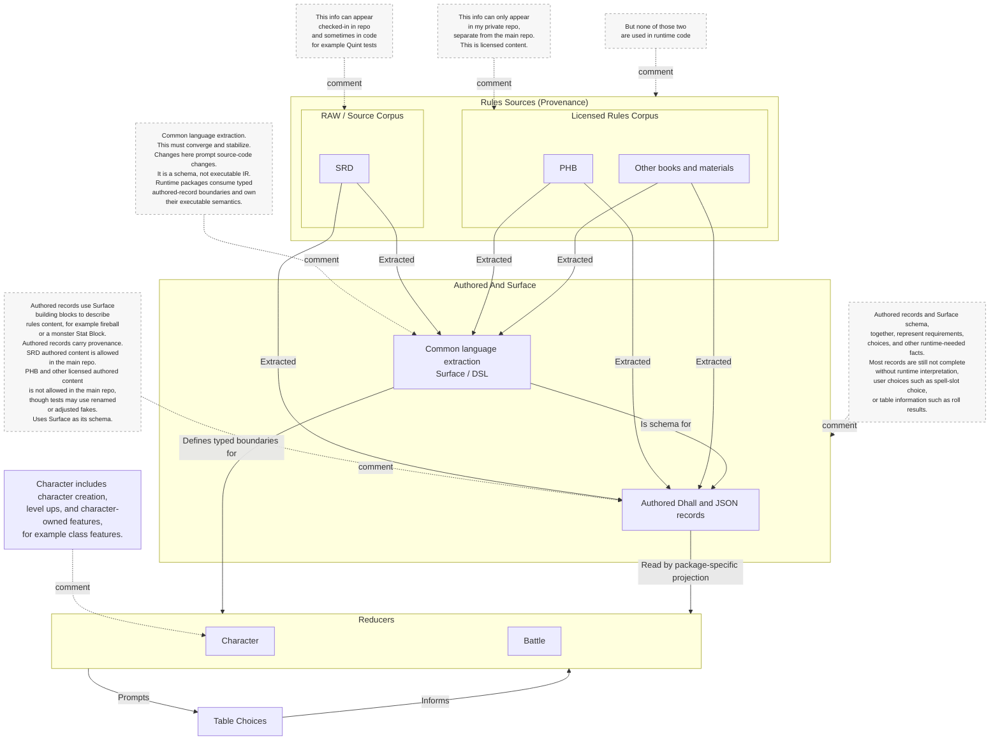
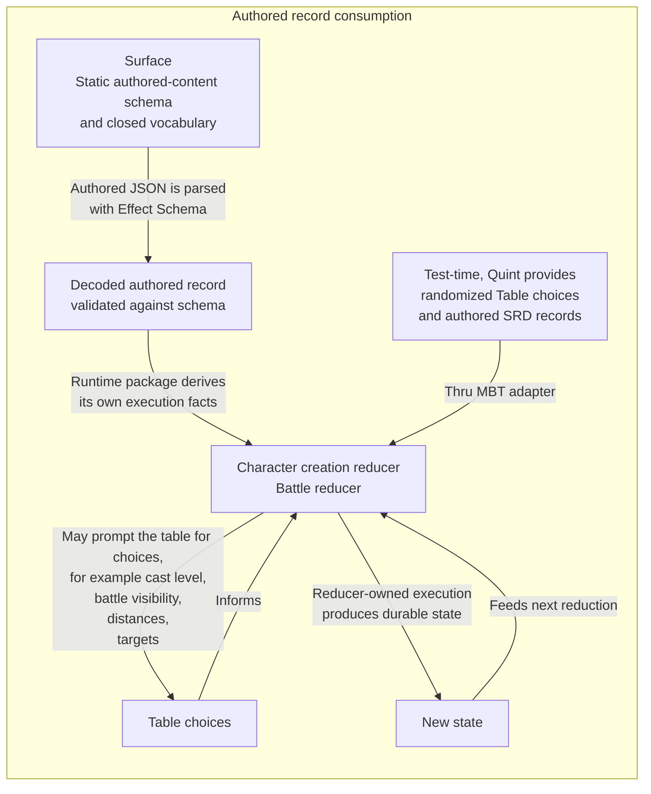
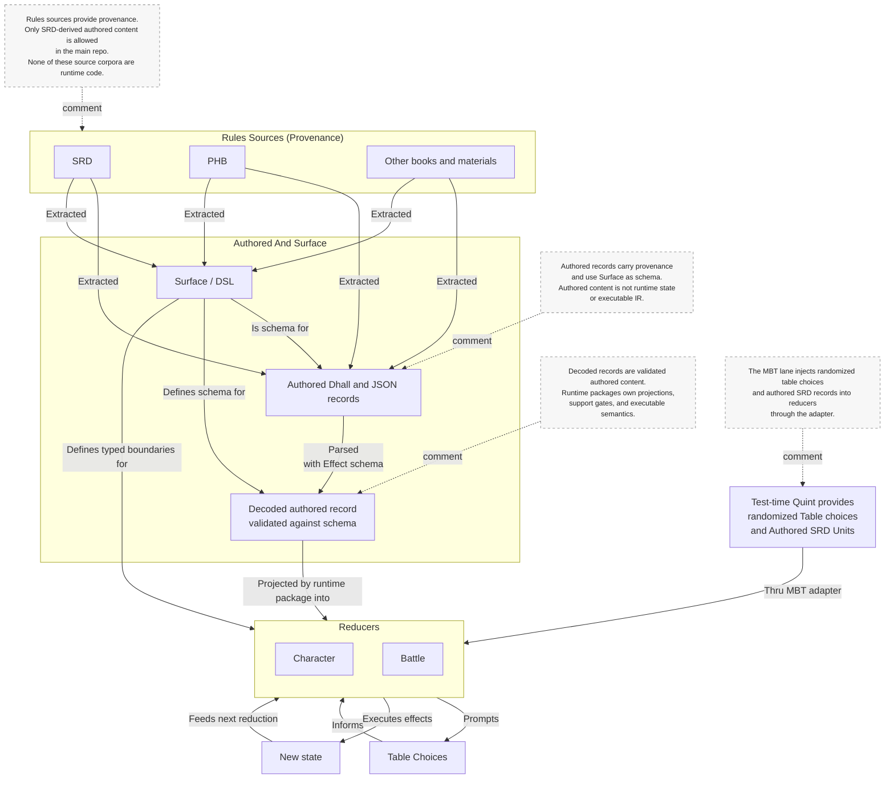

 # Surface To Battle Manual Diagram

Incremental manual diagram draft.

```mermaid
flowchart TD
  classDef note fill:#f7f7f7,stroke:#999,stroke-dasharray: 4 4,color:#222,font-size:12px;

  subgraph SOURCES["Rules Sources (Provenance)"]
    direction TB

    subgraph RAW["RAW / Source Corpus"]
      direction TB
      SRD["SRD"]
    end

    subgraph LICENSED["Licensed Rules Corpus"]
      direction TB
      PHB["PHB"]
      OTHER_BOOKS["Other books and materials"]
    end
  end

  RAW_NOTE["This info can appear<br/>checked-in in repo<br/>and sometimes in code<br/>for example Quint tests"]
  LICENSED_NOTE["This info can only appear<br/>in my private repo,<br/>separate from the main repo.<br/>This is licensed content."]
  SOURCES_NOTE["But none of those two<br/>are used in runtime code"]

  RAW_NOTE -. comment .-> RAW
  LICENSED_NOTE -. comment .-> LICENSED
  SOURCES_NOTE -. comment .-> SOURCES

  subgraph CONTENT["Authored And Surface"]
    direction TB
    AUTHORED["Authored Dhall and JSON records"]
    SURFACE["Common language extraction\nSurface / DSL"]
  end

  subgraph REDUCERS["Reducers"]
    direction TB
    CHARACTER["Character"]
    BATTLE["Battle"]
  end

  TABLE_CHOICES["Table Choices"]

  AUTHORED_NOTE["Authored records use Surface<br/>building blocks to describe<br/>rules content, for example fireball<br/>or a monster Stat Block.<br/>Authored records carry provenance.<br/>SRD authored content is allowed<br/>in the main repo.<br/>PHB and other licensed authored content<br/>is not allowed in the main repo,<br/>though tests may use renamed<br/>or adjusted fakes.<br/>Uses Surface as its schema."]
  SURFACE_NOTE["Common language extraction.<br/>This must converge and stabilize.<br/>Changes here prompt source-code changes.<br/>It is a schema, not executable IR.<br/>Runtime packages consume typed<br/>authored-record boundaries and own<br/>their executable semantics."]
  CONTENT_NOTE["Authored records and Surface schema,<br/>together, represent requirements,<br/>choices, and other runtime-needed facts.<br/>Most records are still not complete<br/>without runtime interpretation,<br/>user choices such as spell-slot choice,<br/>or table information such as roll results."]
  CHARACTER_NOTE["Character includes character creation,<br/>level ups, and character-owned features,<br/>for example class features."]

  AUTHORED_NOTE -. comment .-> AUTHORED
  SURFACE_NOTE -. comment .-> SURFACE
  CONTENT_NOTE -. comment .-> CONTENT
  CHARACTER_NOTE -. comment .-> CHARACTER

  SRD -->|Extracted| AUTHORED
  SRD -->|Extracted| SURFACE
  PHB -->|Extracted| AUTHORED
  PHB -->|Extracted| SURFACE
  OTHER_BOOKS -->|Extracted| AUTHORED
  OTHER_BOOKS -->|Extracted| SURFACE
  SURFACE -->|Is schema for| AUTHORED
  SURFACE -->|Defines typed boundaries for| REDUCERS
  AUTHORED -->|Read by package-specific projection| REDUCERS
  REDUCERS -->|Prompts| TABLE_CHOICES
  TABLE_CHOICES -->|Informs| REDUCERS

  class RAW_NOTE,LICENSED_NOTE,SOURCES_NOTE,AUTHORED_NOTE,SURFACE_NOTE,CONTENT_NOTE note
```

## Authored Record Consumption

```mermaid
flowchart TD
  classDef note fill:#f7f7f7,stroke:#999,stroke-dasharray: 4 4,color:#222,font-size:12px;

  subgraph HYDRATION["Authored record consumption"]
    direction TB
    HYDRATION_SURFACE["Surface<br/>Static authored-content schema<br/>and closed vocabulary"]
    HYDRATION_VALUE["Decoded authored record<br/>validated against schema"]
    HYDRATION_REDUCERS["Character creation reducer<br/>Battle reducer"]
    HYDRATION_TEST["Test-time, Quint provides<br/>randomized Table choices<br/>and authored SRD records"]
    HYDRATION_TABLE["Table choices"]
    HYDRATION_STATE["New state"]
  end

  HYDRATION_SURFACE -->|Authored JSON is parsed<br/>with Effect Schema| HYDRATION_VALUE
  HYDRATION_VALUE -->|Runtime package derives<br/>its own execution facts| HYDRATION_REDUCERS
  HYDRATION_TEST -->|Thru MBT adapter| HYDRATION_REDUCERS
  HYDRATION_REDUCERS -->|May prompt the table for choices,<br/>for example cast level,<br/>battle visibility,<br/>distances,<br/>targets| HYDRATION_TABLE
  HYDRATION_TABLE -->|Informs| HYDRATION_REDUCERS
  HYDRATION_REDUCERS -->|Reducer-owned execution<br/>produces durable state| HYDRATION_STATE
  HYDRATION_STATE -->|Feeds next reduction| HYDRATION_REDUCERS
```

## Merged View

```mermaid
flowchart TD
  classDef note fill:#f7f7f7,stroke:#999,stroke-dasharray: 4 4,color:#222,font-size:12px;

  subgraph MERGED_SOURCES["Rules Sources (Provenance)"]
    direction TB
    MERGED_SRD["SRD"]
    MERGED_PHB["PHB"]
    MERGED_OTHER["Other books and materials"]
  end

  subgraph MERGED_CONTENT["Authored And Surface"]
    direction TB
    MERGED_AUTHORED["Authored Dhall and JSON records"]
    MERGED_SURFACE["Surface / DSL"]
    MERGED_RUNTIME["Decoded authored record<br/>validated against schema"]
  end

  subgraph MERGED_REDUCERS["Reducers"]
    direction TB
    MERGED_CHARACTER["Character"]
    MERGED_BATTLE["Battle"]
  end

  MERGED_TABLE["Table Choices"]
  MERGED_STATE["New state"]
  MERGED_TEST["Test-time Quint provides<br/>randomized Table choices<br/>and Authored SRD Units"]

  MERGED_SRD -->|Extracted| MERGED_AUTHORED
  MERGED_SRD -->|Extracted| MERGED_SURFACE
  MERGED_PHB -->|Extracted| MERGED_AUTHORED
  MERGED_PHB -->|Extracted| MERGED_SURFACE
  MERGED_OTHER -->|Extracted| MERGED_AUTHORED
  MERGED_OTHER -->|Extracted| MERGED_SURFACE

  MERGED_SURFACE -->|Is schema for| MERGED_AUTHORED
  MERGED_AUTHORED -->|Parsed<br/>with Effect schema| MERGED_RUNTIME
  MERGED_SURFACE -->|Defines schema for| MERGED_RUNTIME
  MERGED_SURFACE -->|Defines typed boundaries for| MERGED_REDUCERS
  MERGED_RUNTIME -->|Projected by runtime package into| MERGED_REDUCERS

  MERGED_TEST -->|Thru MBT adapter| MERGED_REDUCERS
  MERGED_REDUCERS -->|Prompts| MERGED_TABLE
  MERGED_TABLE -->|Informs| MERGED_REDUCERS
  MERGED_REDUCERS -->|Executes effects| MERGED_STATE
  MERGED_STATE -->|Feeds next reduction| MERGED_REDUCERS

  MERGED_SOURCES_NOTE["Rules sources provide provenance.<br/>Only SRD-derived authored content is allowed<br/>in the main repo.<br/>None of these source corpora are runtime code."]
  MERGED_AUTHORED_NOTE["Authored records carry provenance<br/>and use Surface as schema.<br/>Authored content is not runtime state<br/>or executable IR."]
  MERGED_RUNTIME_NOTE["Decoded records are validated authored content.<br/>Runtime packages own projections,<br/>support gates, and executable semantics."]
  MERGED_TEST_NOTE["The MBT lane injects randomized table choices<br/>and authored SRD records into reducers<br/>through the adapter."]

  MERGED_SOURCES_NOTE -. comment .-> MERGED_SOURCES
  MERGED_AUTHORED_NOTE -. comment .-> MERGED_AUTHORED
  MERGED_RUNTIME_NOTE -. comment .-> MERGED_RUNTIME
  MERGED_TEST_NOTE -. comment .-> MERGED_TEST

  class MERGED_SOURCES_NOTE,MERGED_AUTHORED_NOTE,MERGED_RUNTIME_NOTE,MERGED_TEST_NOTE note
```
