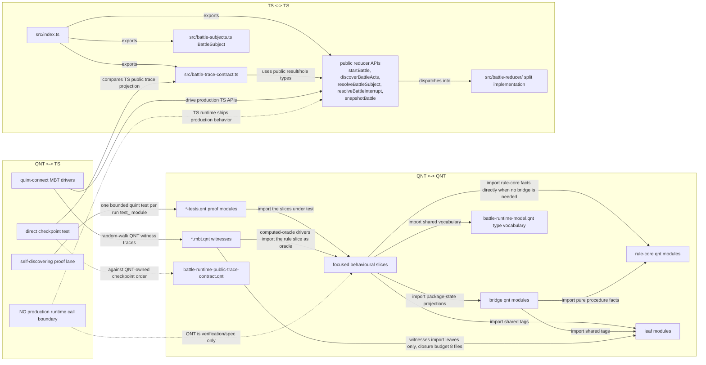
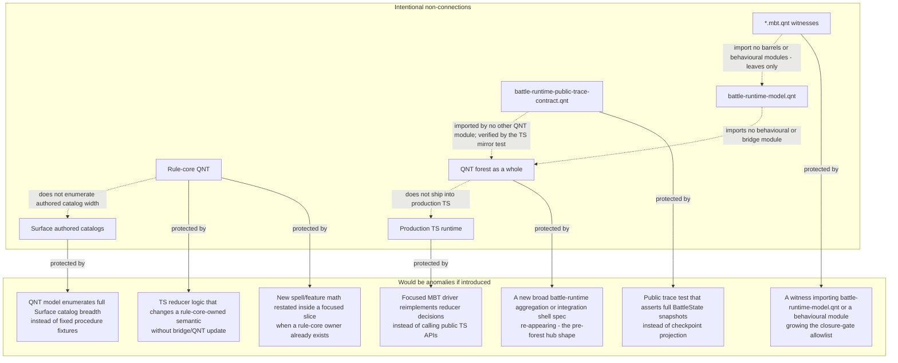

# Battle Runtime QNT/TS Connectivity

Date: 2026-06-10

Regenerated: the previous version of this map (2026-05-11) described the
pre-forest hub shape, centered on a broad
`packages/battle-runtime/battle-runtime.qnt` integration shell. That hub no
longer exists. The corpus is a forest of focused slices per
`docs/adr/0001-forest-of-qnt-slices.md`: there is no package-local full-shell
aggregation spec, and focused specs import the narrower modules they use
directly.

This map shows how the split is connected now. The important boundary is that
QNT and TypeScript do not call each other at production runtime. They connect
through verification lanes: focused MBT drivers run via quint-connect, the
self-discovering opt-in QNT proof lane, direct TS reducer tests, and the public
trace checkpoint contract.

Corpus shape at regeneration time: `packages/battle-runtime/` holds 224 `.qnt`
files — 106 `*.mbt.qnt` MBT witnesses paired with 106 `src/*.mbt.test.ts`
quint-connect drivers, 25 `*-tests.qnt` proof modules, and 93 other modules:
focused behavioural slices, five `*-bridge.qnt` modules plus their
`*-bridge-examples.qnt` companions, leaf modules, the
`battle-runtime-model.qnt` type vocabulary, and
`battle-runtime-public-trace-contract.qnt`.
`packages/shared-algebras/proofs/rule-core/` holds 89 reusable rule slices.

## End-To-End Shape

```mermaid
flowchart TB
  subgraph QNT["QNT proof/spec layer - forest of slices, no hub"]
    TraceQ["battle-runtime-public-trace-contract.qnt<br/>public checkpoint order, no BattleState diffs"]

    subgraph Slices["focused behavioural slices"]
      Conc["battle-runtime-concentration.qnt"]
      ReactWin["battle-runtime-reaction-window.qnt"]
      HPSlice["battle-runtime-hit-points.qnt"]
      MoreSlices["weapon-attacks, spell-invocation, movement,<br/>turn-advancement, legendary-actions, and many more"]
    end

    Model["battle-runtime-model.qnt<br/>type vocabulary: Actor, Combatant, BattleState,<br/>ActiveEffect, Hole, replay variants<br/>no behavioural imports"]

    subgraph Leaves["leaf modules - types, tags, pure facts"]
      ReactKinds["battle-runtime-reaction-kinds.qnt"]
      OtherLeaves["mirror-image-constants, see-invisibility-constants,<br/>sorcerous-burst-damage-choice"]
    end

    subgraph Bridges["battle-runtime QNT bridge modules"]
      MoveBridge["battle-runtime-movement-bridge.qnt"]
      IntBridge["battle-runtime-interrupt-bridge.qnt"]
      StatBridge["battle-runtime-stat-block-bridge.qnt"]
      FeatureBridge["battle-runtime-feature-bridge.qnt"]
      SpellBridge["battle-runtime-spell-bridge.qnt"]
    end

    subgraph RuleCore["shared-algebras/proofs/rule-core - 89 slices"]
      ActionTurn["action-turn-procedures.qnt"]
      Movement["movement-spatial-grapple.qnt"]
      HP["hit-point-damage, hit-point-recovery,<br/>zero-hit-point-lifecycle.qnt"]
      DamageAdj["damage-component-adjustments.qnt"]
      AttackComp["attack-damage-composition.qnt"]
      Reactions["reactions-continuations-concentration.qnt"]
      StatControls["stat-block-controls.qnt"]
      Features["unit-feature-*-core.qnt families<br/>pool-cost, action-count, rage-reckless, attack-rider, ..."]
      Spells["spell-definition-profiles, spell-invocation-*-core,<br/>spell-*-projection-core, spell-procedure-profiles.qnt"]
    end

    ProofMods["25 battle-runtime-*-tests.qnt proof modules<br/>run test_* blocks grouped by domain"]

    subgraph QntMbt["106 *.mbt.qnt MBT witnesses"]
      WitnessQ["literal projection witnesses - most<br/>self-contained SRD outcomes as literals,<br/>e.g. battle-runtime-weapon-attack-skeleton.mbt.qnt"]
      OracleQ["computed-oracle drivers - few, allowlisted<br/>import the rule slice as SRD oracle,<br/>e.g. battle-runtime-direct-condition-lifecycle.mbt.qnt"]
      RuleCoreMbtQ["9 rule-core-*.mbt.qnt lanes<br/>movement, reactions, features, spells,<br/>stat-block-controls, hit-point-damage, ..."]
    end
  end

  subgraph TS["TypeScript runtime layer"]
    PublicIndex["src/index.ts<br/>public package API"]
    BattleReducer["src/battle-reducer.ts<br/>public facade: types, schemas, re-exports"]
    ReducerImpl["src/battle-reducer/<br/>split implementation - 169 files"]
    Subjects["src/battle-subjects.ts<br/>BattleSubject replay keys"]
    TraceTS["src/battle-trace-contract.ts<br/>projects public results to checkpoints"]
  end

  subgraph Verify["TS verification lanes"]
    MbtDrivers["106 src/*.mbt.test.ts quint-connect drivers<br/>53 via the shared src/selected-identity-witness.ts wrapper"]
    ProofLane["src/battle-runtime-qnt-proofs.ts + .test.ts<br/>opt-in RUN_QNT_PROOFS=1, one bounded quint test per module"]
    TraceTest["src/battle-trace-contract.test.ts"]
    ReducerTests["focused src/*.test.ts reducer tests"]
    ClosureGate["scripts/check-mbt-driver-closure.cjs<br/>witness transitive closure budget of 8 files, in pnpm quality"]
  end

  Conc --> Model
  Conc --> Reactions
  ReactWin --> IntBridge
  ReactWin --> Model
  HPSlice --> HP
  HPSlice --> SpellBridge
  HPSlice --> Model
  MoreSlices --> MoveBridge
  MoreSlices --> StatBridge
  MoreSlices --> FeatureBridge
  MoreSlices --> SpellBridge
  MoreSlices --> Model

  MoveBridge --> ActionTurn
  MoveBridge --> Movement
  MoveBridge --> AttackComp
  IntBridge --> Reactions
  IntBridge --> ActionTurn
  IntBridge --> ReactKinds
  StatBridge --> StatControls
  FeatureBridge --> Features
  FeatureBridge --> DamageAdj
  FeatureBridge --> Reactions
  SpellBridge --> Spells
  SpellBridge --> DamageAdj
  SpellBridge --> OtherLeaves

  ProofMods --> Conc
  ProofMods --> MoreSlices
  ProofMods --> Model

  OracleQ --> Slices
  WitnessQ -. leaf imports only .-> Leaves
  RuleCoreMbtQ -. leaf imports only .-> Leaves
  ClosureGate -. bounds closure of .-> WitnessQ
  ClosureGate -. allowlists .-> OracleQ

  PublicIndex --> BattleReducer
  PublicIndex --> Subjects
  PublicIndex --> TraceTS
  BattleReducer --> ReducerImpl
  BattleReducer --> Subjects

  MbtDrivers --> PublicIndex
  MbtDrivers -. run via quint-connect .-> WitnessQ
  MbtDrivers -. run via quint-connect .-> OracleQ
  MbtDrivers -. run via quint-connect .-> RuleCoreMbtQ
  ProofLane -. runs every run test_ module .-> ProofMods
  ProofLane -. also covers .-> TraceQ
  TraceTest --> PublicIndex
  TraceTest -. mirrors checkpoint order .-> TraceQ
  ReducerTests --> PublicIndex

  classDef qnt fill:#eef5ff,stroke:#3567a8,color:#112;
  classDef ts fill:#effaf1,stroke:#2f7d3d,color:#112;
  classDef verify fill:#fff6df,stroke:#a87020,color:#112;

  class TraceQ,Conc,ReactWin,HPSlice,MoreSlices,Model,ReactKinds,OtherLeaves,MoveBridge,IntBridge,StatBridge,FeatureBridge,SpellBridge,ActionTurn,Movement,HP,DamageAdj,AttackComp,Reactions,StatControls,Features,Spells,ProofMods,WitnessQ,OracleQ,RuleCoreMbtQ qnt;
  class PublicIndex,BattleReducer,ReducerImpl,Subjects,TraceTS ts;
  class MbtDrivers,ProofLane,TraceTest,ReducerTests,ClosureGate verify;
```

## Interaction Semantics

## What Is Connected

```mermaid
flowchart TB
  subgraph Connected["Connected and active"]
    C1["Generic SRD semantics<br/>HP, damage, action economy, movement,<br/>features, spells, reactions, stat-block controls"]
    C2["Rule-core QNT slices"]
    C3["Battle-runtime QNT bridges and leaves"]
    C4["Focused battle-runtime behavioural slices"]
    C5["TS public reducer modules"]
    C6["Focused MBT witnesses, proof modules, and TS tests"]
    C7["Public trace checkpoint contract"]

    C1 --> C2 --> C3 --> C4
    C4 --> C6
    C2 --> C6
    C5 --> C6
    C7 --> C6
  end

  subgraph Composition["Cross-slice composition - deliberately not a QNT hub"]
    P1["production reducer command dispatch<br/>src/battle-reducer/"]
    P2["bounded-fixture integration witness<br/>battle-runtime-weapon-attack-skeleton.mbt.qnt"]

    P2 -. witnesses cross-slice sequencing of .-> P1
  end

  subgraph SharedByImport["Shared by direct import, not by a hub"]
    I1["QNT Actor / Combatant / BattleState / ActiveEffect / Hole / replay variants<br/>owned by battle-runtime-model.qnt, direct-imported by each focused slice"]
    I2["Package-local mutation and integration:<br/>interrupt stack, active-effect storage,<br/>concentration cleanup, concrete replay<br/>owned by focused slices"]
    I3["Rule-core bridge inputs<br/>projected from package state by the bridge modules"]

    I1 --> I2 --> I3
  end
```

## Non-Connections And Anomaly Watchlist

## Reading Guide

- Solid arrows mean a real code import/export/delegation path.
- Dotted arrows mean a verification relationship, not a production dependency.
- There is no hub. No package-local full-shell aggregation spec exists; a new
  one appearing is an anomaly, not a restoration. Each focused slice imports
  exactly the narrower modules it uses: a bridge for rule-core projections of
  package state, `battle-runtime-model.qnt` for shared vocabulary, leaf modules
  for shared tags, and rule-core directly when no package state is involved.
- Rule-core QNT owns reusable SRD procedure facts; the five bridge modules
  connect battle-runtime package state to those facts.
- Witnesses follow `docs/adr/0001-forest-of-qnt-slices.md`: prefer the
  self-contained literal projection witness; keep computed-oracle drivers few
  and allowlisted in `scripts/check-mbt-driver-closure.cjs`; never reimplement
  a rule inside a witness to avoid an import. The dominant MBT cost is
  import-closure instantiation per trace, hence the 8-file closure budget.
- The proof lane is opt-in (`pnpm --filter @dnd/battle-runtime
  test:qnt-proofs`, which sets `RUN_QNT_PROOFS=1`) and self-discovering:
  `src/battle-runtime-qnt-proofs.ts` globs every package-local `.qnt` with
  `run test_*` blocks and runs each as its own hard-deadlined `quint test`, so
  a runaway proof fails one module instead of hanging the suite.
- TypeScript owns concrete public fill payloads, authored content shape, and
  production reducer execution.
- The public trace contract is deliberately narrow: semantic checkpoint order
  in QNT (`battle-runtime-public-trace-contract.qnt`), concrete reducer trace
  in TS. The connection is the TS mirror test
  (`src/battle-trace-contract.test.ts`), not a QNT import.
