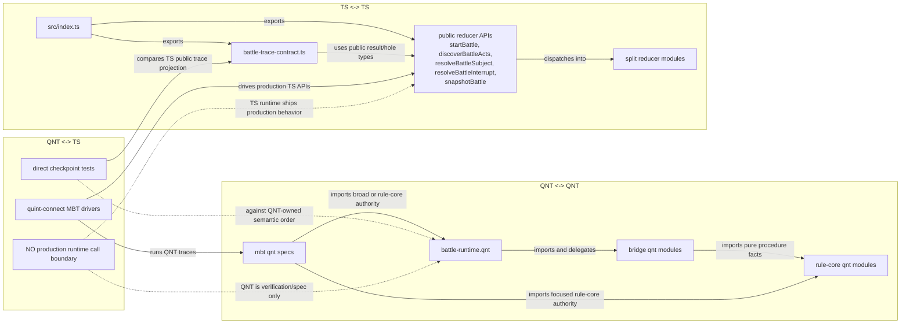
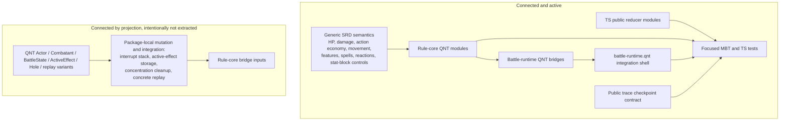
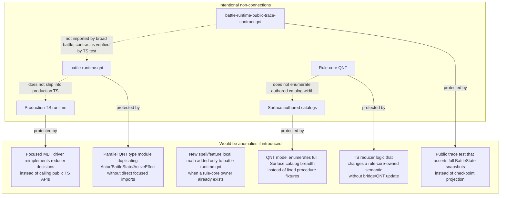

# Battle Runtime QNT/TS Connectivity

Date: 2026-05-11

This map shows how the split is connected now. The important boundary is that
QNT and TypeScript do not call each other at production runtime. They connect
through verification lanes: focused MBT drivers, direct TS tests, and the public
trace checkpoint contract.

## End-To-End Shape

```mermaid
flowchart TB
  subgraph QNT["QNT proof/spec layer"]
    BRQ["packages/battle-runtime/battle-runtime.qnt<br/>broad battle-runtime integration shell"]
    TraceQ["battle-runtime-public-trace-contract.qnt<br/>public checkpoint order, no BattleState diffs"]

    subgraph Bridges["battle-runtime QNT bridge modules"]
      MoveBridge["battle-runtime-movement-bridge.qnt"]
      IntBridge["battle-runtime-interrupt-bridge.qnt"]
      StatBridge["battle-runtime-stat-block-bridge.qnt"]
      FeatureBridge["battle-runtime-feature-bridge.qnt"]
      SpellBridge["battle-runtime-spell-bridge.qnt"]
    end

    subgraph RuleCore["shared-algebras/proofs/rule-core"]
      ActionTurn["action-turn-procedures.qnt"]
      Movement["movement-spatial-grapple.qnt"]
      HP["hit-point-damage/recovery<br/>zero-hit-point-lifecycle.qnt"]
      DamageAdj["damage-component-adjustments.qnt"]
      AttackComp["attack-damage-composition.qnt"]
      Reactions["reactions-continuations-concentration.qnt"]
      StatControls["stat-block-controls.qnt"]
      Features["unit-feature-procedure-profiles.qnt"]
      Spells["spell-procedure-profiles.qnt"]
    end

    subgraph QntMbt["QNT MBT specs"]
      IntegratedMbtQ["battle-runtime-weapon-attack-skeleton.mbt.qnt<br/>selected integrated weapon attack lane"]
      FocusedRuntimeMbtQ["battle-runtime-*.mbt.qnt<br/>extra attack, scalar buff, object, eldritch blast,<br/>sleep repeat-save, death saves, magic missile"]
      RuleCoreMbtQ["rule-core-*.mbt.qnt<br/>movement, reactions, features, spells, stat-block controls"]
    end
  end

  subgraph TS["TypeScript runtime layer"]
    PublicIndex["src/index.ts<br/>public package API"]
    TraceTS["src/battle-trace-contract.ts<br/>projects public results to checkpoints"]

    subgraph ReducerFacade["battle reducer facade and slices"]
      BattleReducer["src/battle-reducer.ts<br/>public types, schemas, legacy facade"]
      ReducerIndex["src/battle-reducer/index.ts<br/>split TS reducer barrel"]
      Discovery["battle-discovery / hole helpers"]
      Dispatcher["dispatcher / resolveBattleSubject<br/>interrupt and replay orchestration"]
      AttackTS["attack-main / attack-resolution / damage apply"]
      MovementTS["turn-end-movement / movement-speed"]
      SpellsTS["spells-* slices<br/>profiles, holes/fills, resolve, active effects"]
      FeaturesTS["unit-feature-support / reaction modifiers"]
      StatTS["statblock-* slices"]
    end

    subgraph Tests["TS verification"]
      TraceTest["src/battle-trace-contract.test.ts"]
      PublicTests["src/index.test.ts and focused runtime tests"]
      MbtDrivers["src/*.mbt.test.ts<br/>quint-connect drivers"]
    end
  end

  BRQ --> MoveBridge
  BRQ --> IntBridge
  BRQ --> StatBridge
  BRQ --> FeatureBridge
  BRQ --> SpellBridge
  BRQ --> Reactions

  MoveBridge --> ActionTurn
  MoveBridge --> Movement
  IntBridge --> Reactions
  StatBridge --> StatControls
  FeatureBridge --> Features
  FeatureBridge --> AttackComp
  SpellBridge --> Spells
  SpellBridge --> DamageAdj
  SpellBridge --> AttackComp
  SpellBridge --> ActionTurn
  SpellBridge --> Reactions
  BRQ --> HP
  BRQ --> DamageAdj
  BRQ --> AttackComp

  PublicIndex --> BattleReducer
  PublicIndex --> ReducerIndex
  PublicIndex --> TraceTS
  ReducerIndex --> Discovery
  ReducerIndex --> Dispatcher
  ReducerIndex --> AttackTS
  ReducerIndex --> MovementTS
  ReducerIndex --> SpellsTS
  ReducerIndex --> FeaturesTS
  ReducerIndex --> StatTS
  BattleReducer --> ReducerIndex

  TraceTS --> BattleReducer
  TraceTest --> PublicIndex
  TraceTest -. mirrors checkpoint order .-> TraceQ
  PublicTests --> PublicIndex
  MbtDrivers --> PublicIndex
  MbtDrivers -. run via quint-connect .-> IntegratedMbtQ
  MbtDrivers -. run via quint-connect .-> FocusedRuntimeMbtQ
  MbtDrivers -. run via quint-connect .-> RuleCoreMbtQ

  IntegratedMbtQ --> BRQ
  FocusedRuntimeMbtQ --> BRQ
  RuleCoreMbtQ --> RuleCore

  classDef qnt fill:#eef5ff,stroke:#3567a8,color:#112;
  classDef ts fill:#effaf1,stroke:#2f7d3d,color:#112;
  classDef verify fill:#fff6df,stroke:#a87020,color:#112;
  classDef boundary fill:#f8eeee,stroke:#a43b3b,color:#112;

  class BRQ,TraceQ,MoveBridge,IntBridge,StatBridge,FeatureBridge,SpellBridge,ActionTurn,Movement,HP,DamageAdj,AttackComp,Reactions,StatControls,Features,Spells,IntegratedMbtQ,FocusedRuntimeMbtQ,RuleCoreMbtQ qnt;
  class PublicIndex,TraceTS,BattleReducer,ReducerIndex,Discovery,Dispatcher,AttackTS,MovementTS,SpellsTS,FeaturesTS,StatTS ts;
  class TraceTest,PublicTests,MbtDrivers verify;
```

## Interaction Semantics

## What Is Connected

## Non-Connections And Anomaly Watchlist

## Reading Guide

- Solid arrows mean a real code import/export/delegation path.
- Dotted arrows mean a verification relationship, not a production dependency.
- The broad QNT file is still connected, but its intended role is integration:
  battle-runtime state, replay, reaction windows, mutation, and smoke checks.
- Rule-core QNT owns reusable SRD procedure facts.
- TypeScript owns concrete public fill payloads, authored content shape, and
  production reducer execution.
- The public trace contract is deliberately narrow: semantic checkpoint order in
  QNT, concrete reducer trace in TS.
