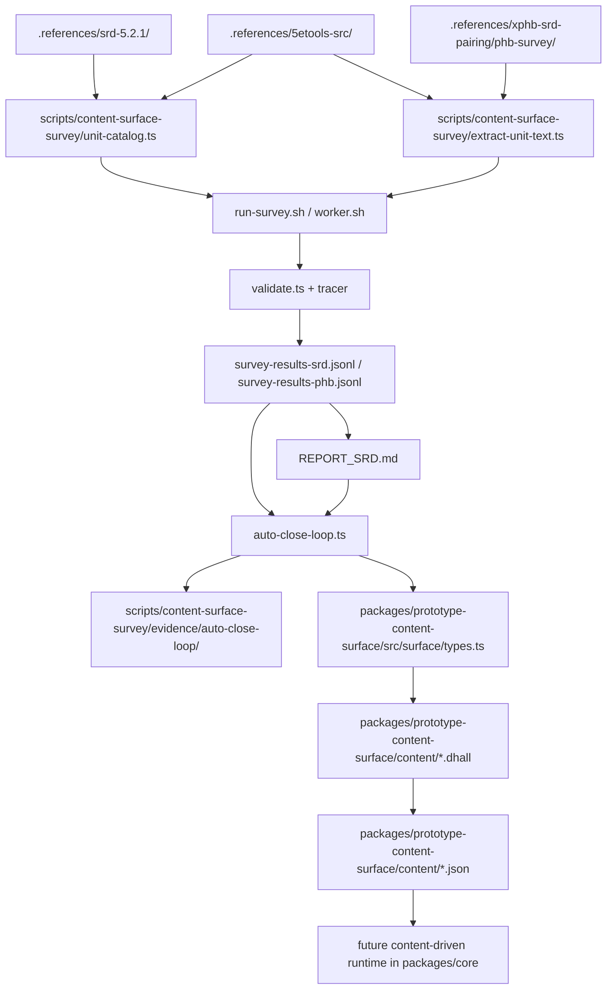

# Content Surface Data Flow (Temporary)

This note is temporary. It exists to explain the current SRD/PHB data flow while
the convergence loop and the content-surface authoring workflow are still in
motion.

The end artifact is still just:

- `packages/prototype-content-surface/src/surface/types.ts`
- `packages/prototype-content-surface/content/<slug>.dhall`
- compiled `content/<slug>.json`

Everything else in this document is support machinery around getting that
surface and authored corpus into shape.

## Three distinct concepts

Do not collapse these:

1. **Provenance**
   - the canonical rules source the shipped content claims to come from
2. **Structured input**
   - machine-readable helper data used to catalog, normalize, or cross-check
3. **Runtime projection**
   - execution-facing facts derived from authored content

Current mapping:

- **SRD provenance**: `.references/srd-5.2.1/`
- **Structured input**: `.references/5etools-src/`
- **Research-only PHB/XPHB lane**: `.references/xphb-srd-pairing/`

5etools is useful structured input. It is never provenance.

## Bird's-eye pipeline

## What is actually checked into git

### Main repo

Checked into the main repo:

- `packages/prototype-content-surface/src/surface/types.ts`
- `packages/prototype-content-surface/src/interpreter/*.ts`
- `packages/prototype-content-surface/content/<slug>.dhall`
- `packages/prototype-content-surface/content/<slug>.json`
- `scripts/content-surface-survey/survey-results-srd.jsonl`
- `scripts/content-surface-survey/REPORT_SRD.md`
- `scripts/content-surface-survey/evidence/auto-close-loop/`

Not intended as durable shared git state:

- `scripts/content-surface-survey/results-srd/<slug>/`
  - mutable latest local rerun state
- `.output/content-surface-closure/`
  - local telemetry, locks, state, failure logs

### PHB/XPHB sub-repo

PHB/XPHB outputs live in the nested private repo:

- `.references/xphb-srd-pairing/phb-survey/results/<slug>/`
- `.references/xphb-srd-pairing/phb-survey/survey-results-phb.jsonl`
- `.references/xphb-srd-pairing/phb-survey/workspace/...`

So:

- PHB/XPHB outputs are **not** supposed to enter the main repo's shipped SRD
  content paths
- but they **are** valid committed outputs in the separate sub-repo

## Current output locations

### Mutable latest survey state

These are overwritten by reruns:

- SRD:
  - `scripts/content-surface-survey/results-srd/<slug>/`
- PHB/XPHB:
  - `.references/xphb-srd-pairing/phb-survey/results/<slug>/`

### Aggregate datasets

These are the rollup JSONL files:

- SRD:
  - `scripts/content-surface-survey/survey-results-srd.jsonl`
- PHB/XPHB:
  - `.references/xphb-srd-pairing/phb-survey/survey-results-phb.jsonl`

### Durable per-batch loop evidence

These are tracked batch snapshots from the convergence loop:

- `scripts/content-surface-survey/evidence/auto-close-loop/`

This archive exists because parallel workers should not integrate
`results-srd/*` directly.

## What `.references/xphb-srd-pairing/` is still for

Still operationally needed:

1. `phb-survey/`
   - active PHB/XPHB survey lane
   - dataset, per-slug results, and workspace
2. `TAXONOMY_atoms_graph.md`
3. `TAXONOMY_graph_representation.md`
4. `README.md` / `INDEX.md` / `RESEARCH_capstone.md`
   - historical taxonomy explanation and lookup

Useful but no longer central:

- validation-round notes
- enrichment pilots
- older synthesis notes
- coverage ledgers

Those are now mostly historical research context, not the active control
surface.

## Current center of gravity

Today the active system is:

- `packages/prototype-content-surface/`
- `scripts/content-surface-survey/`
- `.references/srd-5.2.1/`

The pairing repo is now:

- still needed for PHB/XPHB research outputs
- still useful as taxonomy seed/reference
- no longer the main operational center of gravity

## End goal

All this temporary machinery exists to push toward one stable outcome:

1. the surface in `src/surface/types.ts` converges
2. units are authored as `content/<slug>.dhall`
3. compiled JSON becomes the runtime-facing artifact
4. `packages/core` eventually executes authored content generically

When that state is mature, the survey/evidence/control machinery matters much
less than the surface and the authored Dhall corpus.
