# QNT Evidence Types And Cleanroom Value

This note explains the practical QNT evidence shapes in this repo. It separates
cleanroom value, testing value, and modeled state footprint.

Cleanroom value means: how much the artifact helps a cleanroom implementation
agent build the correct reducer, state shape, projection, or bridge from RAW and
QNT evidence without copying TypeScript implementation details.

Important filename warning: `.mbt.qnt` does not always mean random model-based
testing. Many `.mbt.qnt` files are fixed replay or projection witnesses.

Architecture warning: the repo does not aim to rebuild one whole-engine QNT
model. That was the original attractive shape, but the state product became
too large to execute usefully. The current architecture is a forest of bounded
QNT slices. Executable connections are per artifact: focused MBT harnesses,
route-connector harnesses, proof lanes, or importing consumers connect bounded
QNT artifacts to the matching production runtime surface. Cross-slice
composition lives in the production reducer and in bounded integration
witnesses, not in a single top-level QNT that owns the whole game.

This guide calls the QNT artifact's actual variables, function arguments, return
records, and trace fields its **modeled state footprint**. It does not mean "how
important this rule is" and it is not the same as TypeScript's full runtime
state.

## What A Quint Trace Is

A Quint trace is the sequence of states produced when Quint executes a spec.
For this repo's MBT tests, the important command shape is `quint run --mbt`.
The QNT file supplies an `init` action and a `step` action. Quint chooses one
enabled action per step, records the full QNT state after each step, and marks
which action was taken with `mbt::actionTaken`.

Trace state 0 is the init state. `quint-connect` dispatches it when
`mbt::actionTaken` is non-empty, and skips only the TypeScript-backend empty
placeholder.

Those states are emitted in ITF, the Quint/TLA-style interchange trace format.
ITF is not TypeScript runtime state. It is serialized QNT state: sets, variants,
records, integers, and action metadata encoded so a tool can read them.
`quint-connect` reads that ITF, converts values into JavaScript shapes, extracts
the action name, calls the matching TypeScript driver action, then compares the
QNT state from the trace with the driver's projected TypeScript state.

Full random/action MBT flow:

```mermaid
flowchart LR
  RAW[RAW rule text] --> Core[Semantic-core QNT rule logic]
  Core --> MbtQnt[.mbt.qnt driver with init and step]
  MbtQnt --> QuintRun[quint run --mbt]
  QuintRun --> Trace[ITF trace: state 0, state 1, ...]
  Trace --> ActionName[Read mbt::actionTaken]
  Trace --> QState[Read modeled QNT slice state from same trace step]
  ActionName --> Connect[quint-connect replay loop]
  Connect --> TSDriver[TypeScript MBT driver action]
  TSDriver --> Runtime[Production TypeScript runtime/reducer]
  Runtime --> ImplProjection[driver.getState projection]
  QState --> Normalize[normalize ITF/QNT values]
  Normalize --> Compare[stateCheck compare]
  ImplProjection --> Compare
  Compare --> PassFail[Vitest pass/fail]
```

Direct QNT proof/run-block flow:

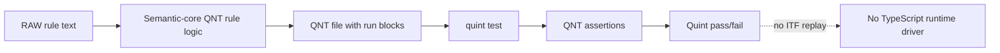

So: semantic core is not a third adapter shape. It is the QNT rule source.
Consumers exercise semantic-core definitions through QNT-only run blocks, MBT
drivers that emit traces and replay through TS, or both. The ITF adapter appears
in the TS MBT harness, because that is where QNT traces cross into TypeScript.

## Counts

Counts from
[`plans/rules-kernel-coverage/qnt-owner-roles.jsonl`](rules-kernel-coverage/qnt-owner-roles.jsonl):

| Official role | Count |
| --- | ---: |
| `semantic-core` | 127 |
| `proof-only` | 61 |
| `mbt-fixture` | 42 |
| `selected-identity-trace` | 9 |
| `bridge` | 9 |

Selected identity split:

| Shape | Count |
| --- | ---: |
| Literal selected-identity projection | 7 |
| Selected identity plus rule-core guard | 2 |

## Current Corpus Wiring

In this guide, **TS/MBT wired** means a `.mbt.qnt` spec is named by a
TypeScript test or test-support file that invokes it through `quint-connect` in
the current repo.

Current repo audit:

| Corpus slice | Count | TS/MBT wired count |
| --- | ---: | ---: |
| All `*.mbt.qnt` files under `packages/` | 258 | 258 |
| `mbt-fixture` owners | 32 | 32 |
| `selected-identity-trace` owners | 9 | 9 |

So the active `.mbt.qnt` corpus is not a pile of orphan specs. The unwired
cases are different shapes:

- `semantic-core` is not TS/MBT replayed as its own file. It participates when
  a consuming QNT file imports it. TS parity exists only when that consumer is a
  `.mbt.qnt` spec referenced by a TypeScript harness.
- `bridge` is a boundary/library role, not a standalone replay role. It is
  wired through a consumer that imports the bridge and compares the
  bridge-shaped projection. Current `bridge` owners are 0/9 `.mbt.qnt`; trace
  replay belongs to importing MBT consumers.
- `proof-only` is QNT-wired, not TS/MBT-wired: `quint test` runs its `run`
  blocks in the opt-in proof lane.
- catalog/coverage rows have no executable wiring.

## Trace And TS Connection By Evidence Type

| Evidence type | Modeled state footprint | MBT ITF trace? | TS/MBT replay? | What crosses from Quint to TS? |
| --- | --- | --- | --- | --- |
| `semantic-core` | Atomic rule state or composite slice state | No MBT ITF trace from the semantic-core file itself. QNT run-block consumers execute it inside Quint; `.mbt.qnt` consumers produce ITF traces. | Only through a `.mbt.qnt` consumer that is run by a `.mbt.test.ts` harness | The importing driver emits trace states derived from semantic-core functions |
| Random/action MBT | Composite slice state | Yes, via `quint run --mbt` | Yes | ITF states plus `mbt::actionTaken`; TS driver replays matching actions |
| Deterministic replay / fixture | Witness state | Yes for current `.mbt.qnt` fixtures; QNT-only for run-block fixtures | Yes for current `.mbt.qnt` fixtures | Fixed or narrow trace states, often expected projections rather than a general algorithm |
| Literal selected-identity trace | Identity-only state | Yes | Yes | Concrete identity/projection facts, not reusable reducer semantics |
| Selected identity with rule-core guard | Identity-only state plus one atomic rule check | Yes | Yes | Concrete identity/projection facts plus one imported rule guard result |
| Bridge | Projection/bridge state | No standalone MBT ITF trace for current bridge owners; 0/9 are `.mbt.qnt` | Through importing `.mbt.qnt` consumers when those consumers are replayed by TS harnesses | Runtime-facing QNT shape consumed by MBT/proof files |
| Proof-only | Atomic rule state or witness state | No MBT ITF trace; `quint test` executes QNT assertions only | No TS/MBT replay for the proof-only owner itself; TS parity belongs to a separate `.mbt.qnt` / `.mbt.test.ts` artifact | QNT assertion pass/fail only |
| Class container / coverage matrix | No executable state | No | No | Nothing executable; catalog/coverage evidence only |

## Modeled State Footprint Scale

| Footprint | Meaning | Cleanroom use |
| --- | --- | --- |
| Whole-system | A single QNT model owns most engine state. This was rejected because execution became too expensive. | Historical context only. Do not expect this shape. |
| Composite slice | A bounded reducer vertical owns real local state and actions. | Strong source for reducer architecture. |
| Atomic rule state | A reusable rule mechanic owns the state needed for that rule. | Strong source for rule semantics; needs a consumer for integration shape. |
| Projection/bridge state | QNT models the shape that crosses from rule facts to runtime-facing facts. | Strong source for interfaces and parity boundaries. |
| Witness state | QNT models only enough state to replay or check one scenario. | Useful regression evidence; weak architecture source. |
| Identity-only state | QNT models selected ids, counts, booleans, or concrete catalog identity. | Useful wiring evidence; poor reducer source. |
| No executable state | Docs, catalog, or coverage rows with no QNT execution state. | Inventory only. |

## Full State Vs Modeled Slice

Full production runtime state means everything the TypeScript runtime may carry
while the app runs. Modeled QNT slice state means only the fields this QNT file
declares, computes, or emits in traces.

In the current forest architecture, each QNT artifact models the fields needed
to state and check its owned obligation. That narrower state is not a flaw by
itself; it is the point of the forest architecture. The risk starts when a
narrow witness is mistaken for a general reducer model.

Rejected whole-system shape:

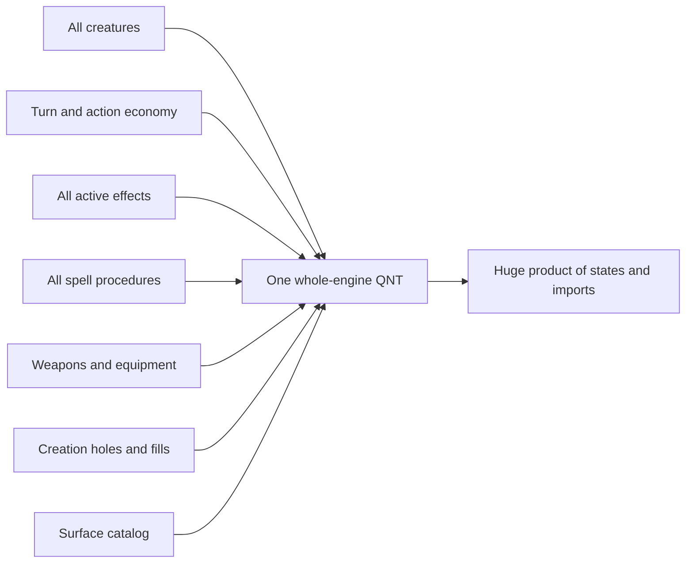

Actual cut line:

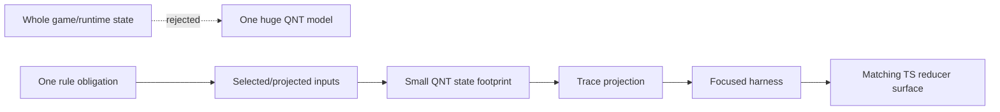

Current forest shape, shown with representative slices:

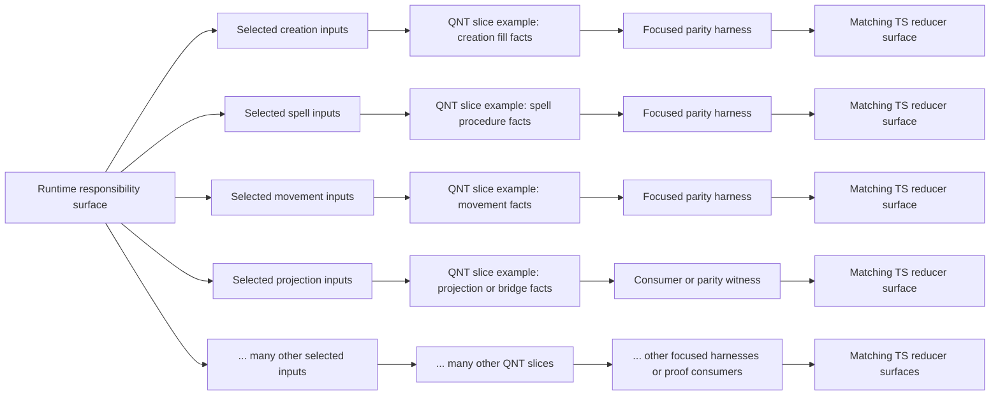

The four named boxes above are examples, not an inventory. The counts section
lists 127 `semantic-core` owners plus 42 `mbt-fixture`, 9
`selected-identity-trace`, and 9 `bridge` owners, and the current repo audit
finds 258 `*.mbt.qnt` files under `packages/`.

Character creation full state vs slice state:

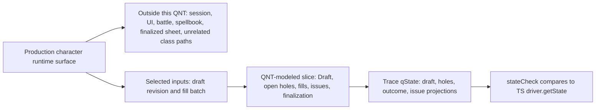

Empowered selected-identity full state vs witness state:

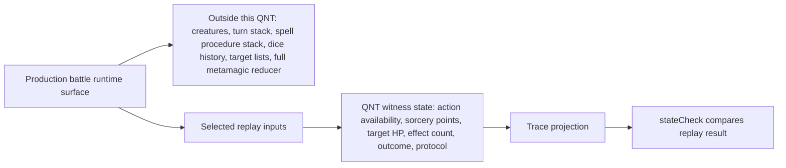

Concrete footprint examples:

| Artifact | Production state outside this QNT | QNT-modeled slice state | Meaning |
| --- | --- | --- | --- |
| `character-creation-runtime-slice.qnt` | Session, battle, spellbook, finalized sheet, unrelated class paths, and most app state | `Draft`, revision, open holes, fills, fill issues, and finalization result | Real creation fill semantics slice, not a whole character engine |
| `character-creation-runtime.mbt.qnt` | Same full runtime plus all unrelated creation flows | `qState` with draft, open holes, finalization, outcome, batch issues, and fill issues | Action MBT over the creation fill slice; good reducer-loop evidence |
| `battle-runtime-sorcerer-metamagic-empowered-selected-identity.mbt.qnt` | Creatures, turns, spell procedure stack, dice history, target lists, effects, resources, and the whole metamagic reducer | booleans for action availability, sorcery points, target HP/effect count, one outcome tag, and witness protocol | Identity/witness-sized state; use it as parity/wiring evidence only. Do not infer the Empowered Spell state machine from these booleans |
| `battle-runtime-spell-bridge.qnt` | Full battle reducer state and concrete spell resolution history | runtime-facing spell profile and projection vocabulary imported from rule-core facts | Bridge footprint; good for interface shape, not a state transition owner |

The visual test is simple: a production field outside the projected inputs, QNT
variables, and ITF trace output is outside this artifact's modeled state
footprint. That is the intended forest design for unrelated state. A
rule-relevant field whose changes never affect the QNT trace marks the artifact
as witness/catalog evidence, not a semantic reducer model.

## 1. Semantic Core

Official owner role: `semantic-core`.

Example:
[`packages/character-creation-runtime/character-creation-runtime-slice.qnt`](../packages/character-creation-runtime/character-creation-runtime-slice.qnt)

Plain English:

- **Semantic-core QNT file** means the QNT file that owns the rule model for an
  obligation. In this example, the file is
  `character-creation-runtime-slice.qnt`.
- **Reusable rule/state logic** means the actual definitions inside that file:
  types, helper functions, and reducer-like functions called by MBT/replay QNT
  files. It is not a second file. It is the useful code inside the
  semantic-core file.
- **Rule-core module** means a reusable QNT rule module. Shared rule-core
  modules live under `packages/shared-algebras/proofs/rule-core/`;
  package-local semantic-core files live beside the runtime package they model.
- **MBT/replay QNT driver** means a QNT file with `init` and actions that uses
  the rule model to produce states or traces for the TypeScript test harness.

Semantic core has no ITF adapter by itself. Consumers execute it in two concrete
ways:

- QNT-only: another QNT file imports the semantic core and uses `run` blocks.
  Example: `character-creation-runtime-slice-tests.qnt` imports the slice and
  calls `fillCreationHoles` inside `quint test`. No TypeScript runtime is
  involved.
- TS/MBT parity: a `.mbt.qnt` driver imports the semantic core, defines `init`
  and `step`, and `quint-connect` replays the generated ITF traces through a
  TypeScript driver. Example: `character-creation-runtime.mbt.qnt` imports the
  slice, and `character-creation-runtime.mbt.test.ts` replays it against the
  production TypeScript `fillCreationHoles`.
- Direct semantic-core file: a pure definition file emits no trace by itself:
  no `init`, no `step`, no `quint run --mbt`, and no ITF replay boundary.
  Another file must import it to create QNT proof execution or MBT trace
  execution.

Concrete example inside `character-creation-runtime-slice.qnt`:

- State vocabulary: `HoleId`, `ChoiceOptionId`, `Draft`, `Fill`,
  `FillBatchResult`.
- Rule checks: `fillIssue`, `fillIssuesForBatch`.
- State transition logic: `applyFill`, `applyAcceptedBatch`,
  `fillCreationHoles`.

The key reducer-like function is `fillCreationHoles`. It computes open holes,
stale revision issues, fill issues, and either rejects without changing the
draft or accepts by applying the fills:

```qnt
pure def fillCreationHoles(draft: Draft, expectedRevision: int, fills: List[Fill]): FillBatchResult = {
  val open = openCreationHoles(draft)
  val batchIssues = if (expectedRevision == draft.revision) Set() else Set(StaleRevision)
  val fillIssues = fillIssuesForBatch(fills, open)
  val issues = { batch: batchIssues, fills: fillIssues }

  if (batchIssues != Set() or fillIssues != Set())
    Rejected({ draft: draft, holes: open, issues: issues, finalization: finalizeDraft(draft) })
  else {
    val nextDraft = applyAcceptedBatch(draft, fills)
    Accepted({ draft: nextDraft, holes: openCreationHoles(nextDraft), finalization: finalizeDraft(nextDraft) })
  }
}
```

`character-creation-runtime.mbt.qnt` then calls this function from its actions:

```qnt
action doFillInitialManifest =
  all {
    openHoles == initialHoleIds,
    recordResult(fillCreationHoles(draft, draft.revision, initialManifestFills)),
  }
```

So the relationship is:

- `character-creation-runtime-slice.qnt` owns the rule.
- `fillCreationHoles` is one reusable rule function inside that file.
- `character-creation-runtime.mbt.qnt` is a driver that calls the rule and
  records the result for comparison with TypeScript.

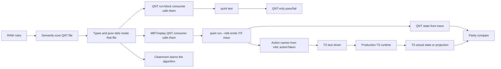

Cleanroom value: high.

Testing value: high for QNT rule checking through proof/run-block consumers.
TS parity value belongs to the MBT driver or replay witness that imports it.

Modeled state footprint: atomic rule state or composite slice state. A
semantic-core file is strong when the rule-relevant fields appear in its types,
function inputs, return records, or state transitions, but it is still
deliberately smaller than the whole runtime.

Quint fit: good. This is what Quint is for.

Misuse warning: do not bypass this with TS-only behavior when the QNT owns the rule.

## 2. Random / Action MBT

Official owner role: no separate owner role named `random/action MBT`; this is
a practical harness shape, not a role label in `qnt-owner-roles.jsonl`.

Example:
[`packages/character-creation-runtime/character-creation-runtime.mbt.qnt`](../packages/character-creation-runtime/character-creation-runtime.mbt.qnt)

This is the shape that has the ITF adapter. The QNT driver is executed by
Quint; the TypeScript test harness does not call QNT functions directly.
Instead, it asks Quint for traces, then replays the action names from those
traces against production TypeScript.

In the character-creation example:

- `character-creation-runtime.mbt.qnt` imports
  `character-creation-runtime-slice.qnt`.
- Its actions call QNT `fillCreationHoles` and record QNT state in `qState`.
- `character-creation-runtime.mbt.test.ts` calls `run({ spec, init, step,
  driver, stateCheck })`.
- The TypeScript driver action with the same name calls production
  `fillCreationHoles`.
- `stateCheck` compares the QNT trace state to `driver.getState()`.

```mermaid
flowchart LR
  RAW[RAW rules] --> Core[Semantic-core QNT file]
  Core --> Driver[QNT MBT driver]
  Driver --> Step[init plus step = any actions]
  Step --> Quint[quint run --mbt]
  Quint --> Trace[ITF trace states]
  Trace --> Action[mbt::actionTaken]
  Trace --> Expected[QNT state from trace]
  Action --> Adapter[quint-connect replay]
  Adapter --> TSDriver[TS driver maps action names to calls]
  TSDriver --> TS[TS production reducer]
  TS --> Actual[TS projected state]
  Expected --> Compare[Compare]
  Actual --> Compare
  Compare --> Cleanroom[Cleanroom sees reducer loop shape]
```

Cleanroom value: high for files classified as real random/action MBT: their
actions call reducer-like QNT functions and derive state. A file that only
writes fixed expected records belongs under deterministic fixture/witness.

Testing value: high. This is real MBT.

Modeled state footprint: composite slice state. It is the state needed to
exercise the reducer vertical and compare with TypeScript, not the whole game
state.

Quint fit: good.

Misuse warning: do not call a fixed replay file random MBT just because the file
name ends in `.mbt.qnt`.

## 3. Deterministic Replay / Fixture

Official owner role in the current coverage report: `mbt-fixture`.

Example:
[`packages/character-creation-runtime/character-creation-class-feature-projections.mbt.qnt`](../packages/character-creation-runtime/character-creation-class-feature-projections.mbt.qnt)

Plain English: a fixture is an example case. It says: "for this exact setup,
expect this exact result." It does not say: "here is the rule for every setup."

That is the difference from semantic core and random/action MBT:

- Semantic core contains reusable rule logic.
- Real random/action MBT calls QNT rule logic to compute changing state across
  a trace.
- A deterministic fixture mostly states the expected result for selected cases.

Hardcoded expected state is common in fixtures, but it is not the definition by
itself. Some deterministic fixtures also contain small guards, input picks, or
projection helpers. The file remains a fixture when the expected result is fixed
case evidence rather than the output of a reusable QNT rule function.

These files exist because not every parity obligation needs a second executable
rule model. For deterministic projection contracts, selected catalog wiring,
or one-case SRD outcomes, a literal witness is cheaper and clearer than
importing a broad reducer closure or reimplementing the rule in the witness.
If the expected projection genuinely depends on mutable state computed by a
reusable QNT reducer, the file should be real action MBT or should import the
semantic core as a computed oracle. If it only writes fixed expected records, it
is not type 2.

Provenance note: these fixtures are not junk tests. Git history shows they were
introduced for rules-kernel parity and coverage closure, and later audited as
portable parity witnesses for non-TS/cleanroom harnesses. The deterministic
replay audit describes them as "QNT-sourced and portable, but not generative."
So their cleanroom value is split:

- high as portable expected-result examples and parity/wiring contracts;
- low as a source for the general reducer algorithm in fixture files that do
  not call reusable semantic-core logic.

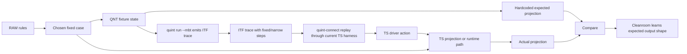

Cleanroom value: high for portable expected-result examples and parity/wiring
contracts; low for deriving the general reducer algorithm.

Testing value: medium. Good regression check for fixed cases.

Modeled state footprint: witness state. It models only the state needed for the
chosen case.

Quint fit: acceptable witness, but not real MBT.

Misuse warning: do not use this as proof that a general reducer algorithm is
correct.

## 4. Literal Selected-Identity Trace

Official owner role: `selected-identity-trace`.

Example:
[`packages/character-creation-runtime/character-creation-fighter-fighting-style-selected-identity.mbt.qnt`](../packages/character-creation-runtime/character-creation-fighter-fighting-style-selected-identity.mbt.qnt)

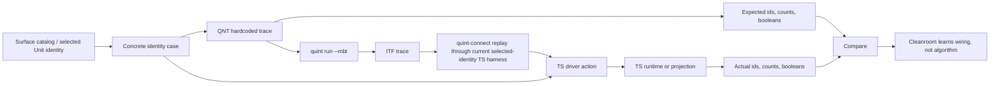

Cleanroom value: low. It says this concrete id must survive.

Testing value: medium for identity regressions.

Modeled state footprint: identity-only state. It is intentionally narrower than
the reducer state.

Quint fit: tolerated witness pattern, not strong modeling.

Misuse warning: do not treat this as proof of reducer logic.

## 5. Selected Identity With Rule-Core Guard

Official owner role: still `selected-identity-trace`.

Examples:

- [`packages/character-sheet-runtime/character-sheet-spellbook-ritual-selected-identity.mbt.qnt`](../packages/character-sheet-runtime/character-sheet-spellbook-ritual-selected-identity.mbt.qnt)
- [`packages/character-sheet-runtime/character-sheet-weapon-mastery-containers-selected-identity.mbt.qnt`](../packages/character-sheet-runtime/character-sheet-weapon-mastery-containers-selected-identity.mbt.qnt)

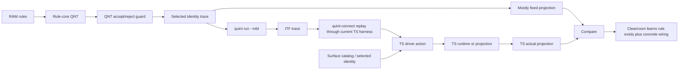

Cleanroom value: medium. Better than pure hardcode because it calls an imported
rule function for accept/reject.

The guard is not the selected-identity file inventing a rule. It calls an
imported QNT rule function and checks whether this one concrete case is accepted
or rejected. The rest of the selected-identity file still records mostly fixed
expected identity/projection fields.

Testing value: medium-high for those cases.

Modeled state footprint: identity-only state plus one atomic rule check. The
imported guard is the QNT rule check used by this case; the selected-identity
file still does not become the reusable rule owner.

Quint fit: acceptable, but the reusable rule lives in the imported core.

Misuse warning: do not mistake the selected-identity file for the rule owner.

## 6. Bridge

Official owner role: `bridge`.

Example:
[`packages/battle-runtime/battle-runtime-spell-bridge.qnt`](../packages/battle-runtime/battle-runtime-spell-bridge.qnt)

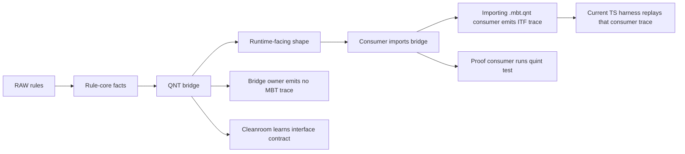

Cleanroom value: medium-high. It teaches how model facts become runtime inputs.

Testing value: the bridge owner is interface evidence; executable parity comes
from named importing proof or MBT consumers.

Modeled state footprint: projection/bridge state. It models the boundary shape,
not the full reducer state.

Quint fit: good when the bridge projects existing QNT facts instead of
duplicating state.

Misuse warning: do not duplicate bridge state in TS when the bridge can project
it.

## 7. Proof-Only

Official owner role: `proof-only`.

Example:
[`packages/battle-runtime/battle-runtime-bardic-inspiration.qnt`](../packages/battle-runtime/battle-runtime-bardic-inspiration.qnt)

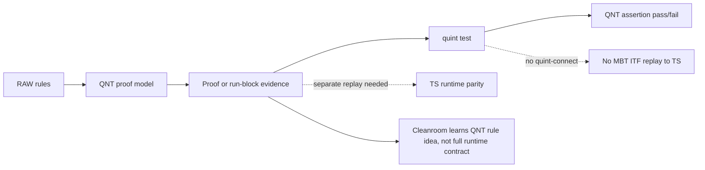

Cleanroom value: medium. It explains QNT-side rule assertions. It does not
define the exact TS reducer integration contract.

Testing value: medium.

Modeled state footprint: atomic rule state or witness state. The difference is
whether the proof file owns reusable rule semantics or only proves a scenario.

For proof-only files, this means QNT-internal testing/proof value. TS parity
belongs to a separate `.mbt.qnt` parity artifact and its `.mbt.test.ts`
harness.

Quint fit: good for proof, weaker as implementation contract.

Misuse warning: do not assume proof-only QNT is connected to TS runtime parity.

## 8. Class Container / Outside Executable Denominator

Official owner role: no. This is not QNT evidence.

Example: class containers in
[`plans/unit-profile-coverage/LEVEL1_2_FULL_SUPPORT.md`](unit-profile-coverage/LEVEL1_2_FULL_SUPPORT.md)

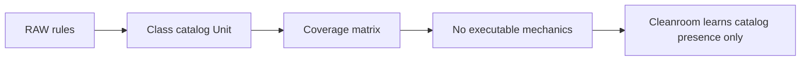

Cleanroom value: low. It says the class exists, not how behavior works.

Testing value: low for reducer behavior.

Modeled state footprint: no executable state.

Quint fit: class/container catalog rows are not executable QNT evidence.
Behavior requires a separate QNT artifact.

Misuse warning: do not count catalog presence as reducer or runtime behavior.

## Practical Reading Order

For cleanroom work, prioritize these in order:

1. `semantic-core`
2. real random/action MBT
3. bridges
4. proof-only files with reusable rule state
5. selected identity with rule-core guard
6. deterministic replay / fixtures
7. literal selected-identity traces
8. class container catalog evidence

Selected-identity and fixtures are useful examples/checks. Reducer-building
guidance comes from their semantic-core-linked rule calls only; hardcoded
projection fields remain witness evidence.

## Classification Checklist

When looking at a `.qnt` or `.mbt.qnt` file, classify it by behavior, not by
filename:

1. Does it define reusable types and pure functions for the rule itself?
   If yes, classify it as a semantic-core/rule-core candidate, then confirm
   against `qnt-owner-roles.jsonl`.
2. Does it have `init`, `step = any { ... }`, and actions that call QNT rule
   functions to derive next state?
   If yes, it is random/action MBT.
3. Does it set `qState'` to fixed ids, counts, or booleans?
   If yes, it is a projection witness or selected-identity trace.
4. Does it set fixed projection fields but first call an imported `apply...`
   rule function?
   If yes, it is selected identity with a rule-core guard.
5. Does it translate one QNT model shape into another runtime-facing shape?
   If yes, it is a bridge.
6. Does it prove or run QNT examples without a TS parity connection?
   If yes, it is proof-only for cleanroom purposes.
