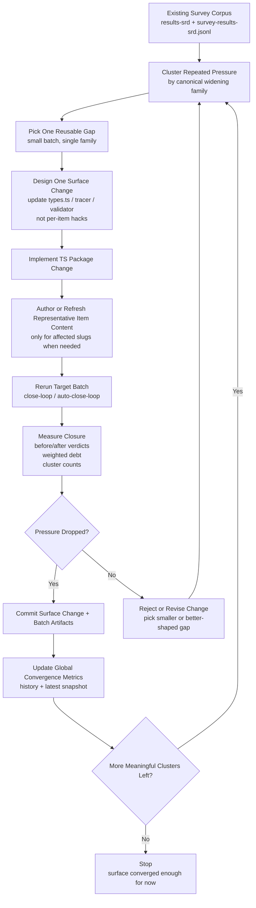

# Surface Convergence Loop

This is the actual convergence loop we want, not the current rerun-only approximation.

It exists to close the missing step:

- identify repeated widening pressure
- apply one reusable TS/package surface change
- rerun the affected items
- keep the change only if pressure drops

## Mermaid

## Rules

- The unit of reusable change is one family-level surface improvement.
- Do not add per-item special cases.
- Do not commit `codex-out.json` or `.output/...` runtime noise.
- Batch commits are valid only after the rerun batch completes.
- If a rerun makes a unit `invalid`, that is evidence against the current surface or authored content, not a reason to commit broken content.
- PHB/XPHB research artifacts stay out of main SRD shipped paths.

## What Step 2 Means

Step 2 is not "rerun again."

Step 2 means:

- change `packages/prototype-content-surface/src/surface/types.ts`
- and/or change tracer/interpreter logic
- and/or change validator support/whitelist when required

The purpose is to make one repeated widening family representable in the surface itself.

## Current Gap

The current loop does:

1. cluster
2. rerun
3. measure
4. commit batch artifacts

It does **not** yet do:

1. cluster
2. change TS surface
3. rerun
4. measure whether the TS change reduced pressure

That missing TS-change stage is the next required implementation step.
