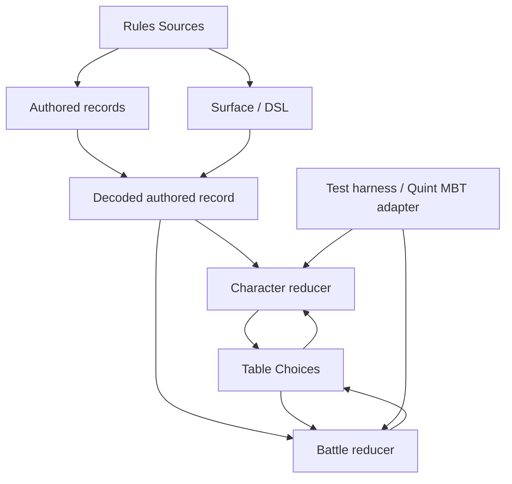
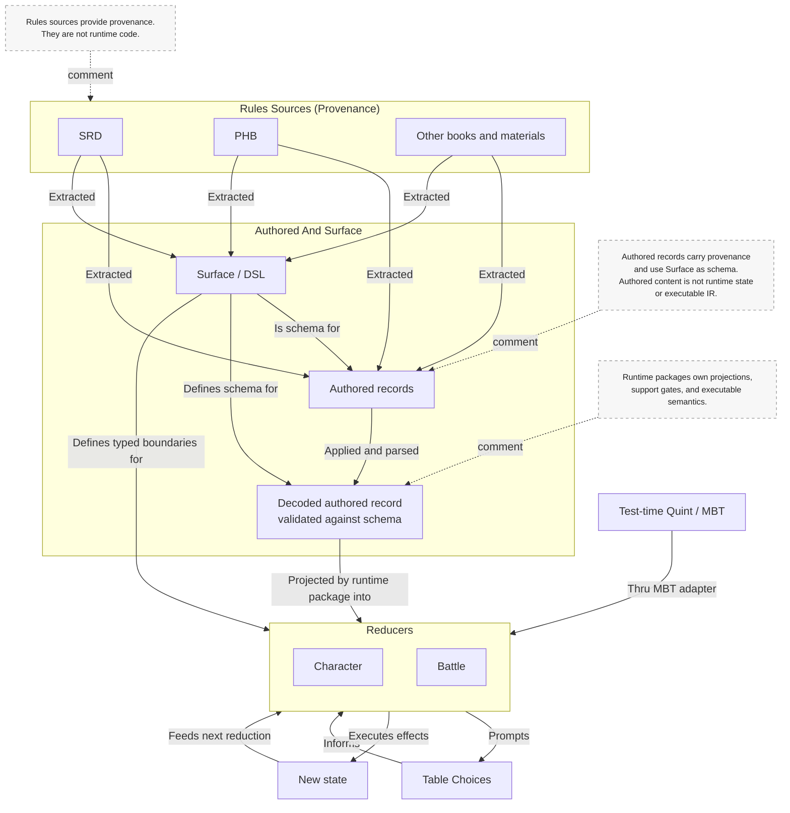
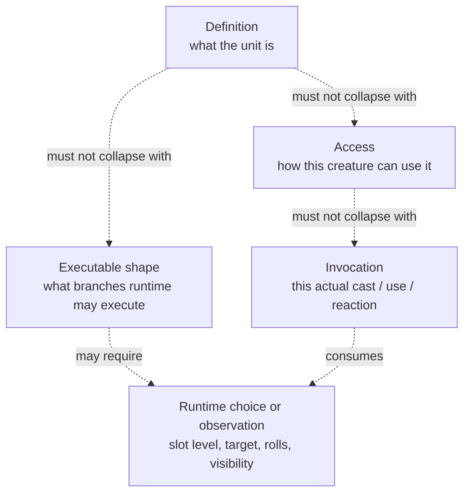

# Surface To Battle Vertical Draft

Curated architectural summary of the vertical from rules sources to reducers.

This file is not the scratchpad. The evolving working diagrams live in
[SURFACE_TO_BATTLE_MANUAL_DIAGRAM.md](/workspace/typescript/dnd/packages/surface/SURFACE_TO_BATTLE_MANUAL_DIAGRAM.md:1).

## Code Anchors

Current important code anchors:

- `packages/core/src/features/spell-registry.ts`
- `packages/core/src/character-sheet-derived.ts`
- `packages/core/src/battle-spell-access.ts`
- `packages/core/src/battle-machine-actions-turn.ts`
- `packages/core/src/projected-action-bridge.ts`

Note:
- `Test harness / Quint MBT adapter` is a test-time lane, not a runtime dependency of reducers.

## Intended Vertical

## Stable Conclusions

- `Surface` is the shared authored-content language and schema.
- `Authored` content is not runtime state. It is source material that conforms to `Surface`.
- Decoded authored records are the validated inputs from which runtime packages derive reducer facts.
- Reducers should consume:
  - runtime-owned execution facts derived from decoded authored records
- Table choices are part of reducer execution, not part of authored content.
- Provenance must stay distinct from structured input and from runtime projection.
- The landed correction slice now has an explicit prompt contract:
  - `discoverAvailableBattlePrompt(state)` derives the current prompt
  - `BattlePromptAnswer` is complete-answer-only
  - answering a prompt can produce either a resolved action or a newly opened follow-up prompt
- The next phase is Quint parity for this discovered prompt/action pattern, not further TS-only drift.

## Conflation Points To Avoid

## Open Rewrite Targets

- Remove any remaining battle-init reconstruction from partial spell ingredients.
- Stop attaching runtime-owned facts too high in the model.
  - Example: save DC should not live on a generic access if only some execution branches need it.
- Remove remaining direct authored-id semantic branching from battle logic.
- Rework `projected-action-bridge.ts` separately after the battle/state entry surface is honest.
